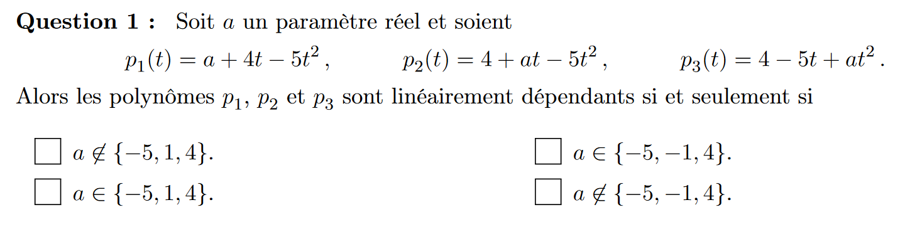

$$a \in \{-5, 1, 4 \}$$
(revoir pk marche pas avec det)
$$\begin{pmatrix}
a & 4 & -5\\
4 & a & -5\\
-4 & -5 & a \\
\end{pmatrix}$$

$$\begin{pmatrix}
a & 4 & -5\\
4-a & a-4 & 0\\
-4 & -5 & a \\
\end{pmatrix}$$

$$\begin{pmatrix}
a+4 & 4 & -5\\
0 & a-4 & 0\\
-9 & -5 & a \\
\end{pmatrix}$$
$$(a-4)(a^2+4a-45)=0$$

$$(a-4)(a^2+4a-45)=0$$
$$(a-4)(a-5)(a+1)$$
4

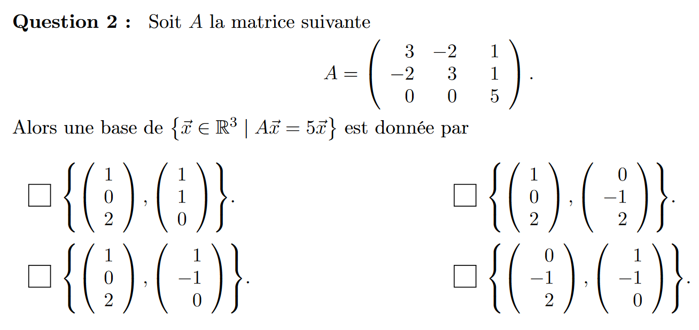
$$\begin{pmatrix}
3 & -2 & 1\\
-2 & 3 & 1\\
0 & 0 & 5 \\
\end{pmatrix}$$

$$\begin{pmatrix}
-2 & -2 & 1\\
0 & 0 & 0\\
0 & 0 & 0 \\
\end{pmatrix}$$
$$\{(1,0,2), (1,-1,0)\}$$
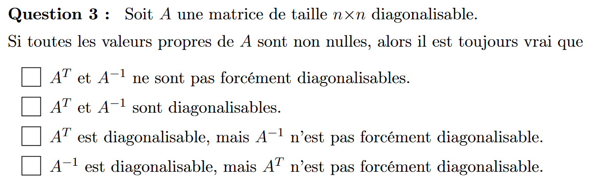
$$A^T et  A^{-1} \text{ ne sont pas diagonalisable }$$
car tout les vecteur nont pas la forcement la bonne multiplicité algébrique
-4
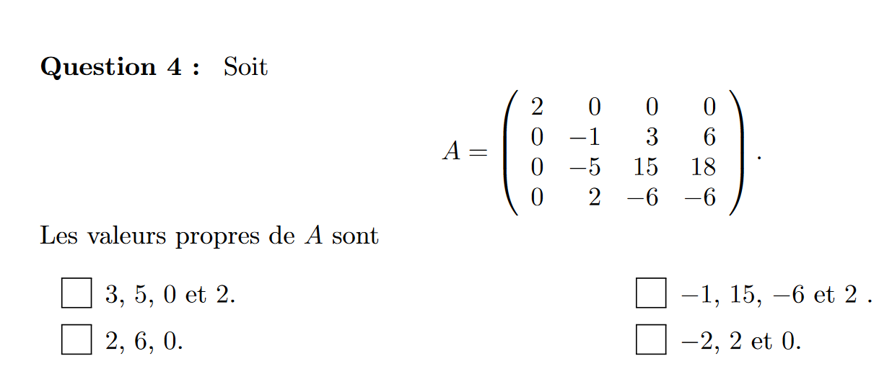

$$\begin{pmatrix}
2 & 0 & 0 & 0\\
0 & -1 & 3 & 6\\
0 & -5 & 15 & 18\\
0 & 2 & -6 & -6\\
\end{pmatrix}$$

$$\begin{pmatrix}
-6 & 0 & 0 & 0\\
0 & -7 & 3 & 6\\
0 & -5 & 9 & 18\\
0 & 2 & -6 & -12\\
\end{pmatrix}$$

$$\begin{pmatrix}
-6 & 0 & 0 & 0\\
0 & -7 & 3 & 0\\
0 & -5 & 9 & 0\\
0 & 2 & -6 & 0\\
\end{pmatrix}$$
6 est une valeur propre

$$\begin{pmatrix}
8 & 0 & 0 & 0\\
0 & 7 & 3 & 6\\
0 & -5 & 21 & 18\\
0 & 2 & -6 & 0\\
\end{pmatrix}$$

$$\begin{pmatrix}
8 & 0 & 0 & 0\\
0 & 7 & 24 & 6\\
0 & -5 & 6 & 18\\
0 & 2 & 0 & 0\\
\end{pmatrix}$$
det non nul
-6 pas valeur propre

-2 pas valeur propre

5 pas valeur propre

donc 2 6 0 sont les valeurs propre.

méthode classique : 
$$\begin{pmatrix}
2-t & 0 & 0 & 0\\
0 & -1-t & 3 & 6\\
0 & -5 & 15-t & 18\\
0 & 2 & -6 & -6-t\\
\end{pmatrix}$$

$$\begin{pmatrix}
2-t & 0 & 0 & 0\\
0 & -1-t & 3 & 0\\
0 & -5 & 15-t & -12+2t\\
0 & 2 & -6 & 6-t\\
\end{pmatrix}$$

$$\begin{pmatrix}
2-t & 0 & 0 & 0\\
0 & -1-t & 3 & 0\\
0 & -1 & 3-t & 0\\
0 & 2 & -6 & 6-t\\
\end{pmatrix}$$

(2-t)(6-t)(t^2-2t+0)
(t-2)(6-t)(t-2)(t)
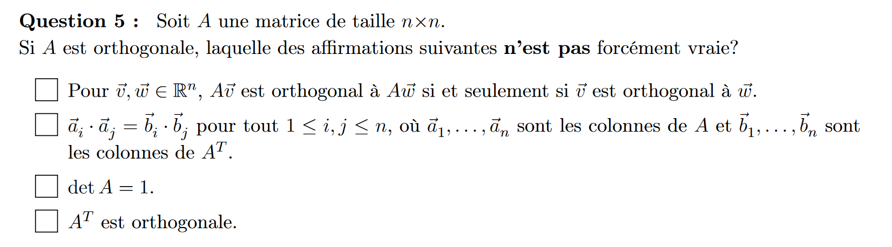
$$det A=1$$

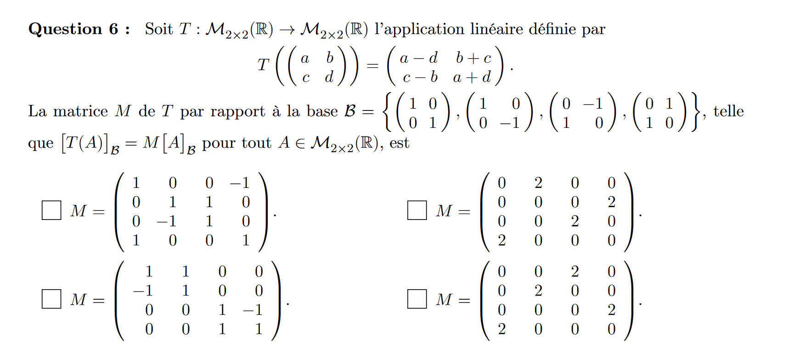
$$\begin{pmatrix}
1 & 0 & 0 & -1\\
0 & 1 & 1 & 0\\
0 & -1 & 1 & 0\\
1 & 0 & 0 & 1\\
\end{pmatrix}$$
$$[Id_{CB}]\begin{pmatrix}
1 & 1 & 0 & 0\\
0 & 0 & -1 & 1\\
0 & 0 & 1 & 1\\
1 & -1 & 0 & 0\\
\end{pmatrix}$$
$$[Id_{BC}]\begin{pmatrix}
1 & 1 & 0 & 0\\
0 & 0 & -1 & 1\\
0 & 0 & 1 & 1\\
1 & -1 & 0 & 0\\
\end{pmatrix}$$

$$\begin{pmatrix}
1 & 1 & 0 & 0\\
-1 & 1 & 0 & 0\\
0 & 0 & 1 & -1\\
0 & 0 & 1 & 1\\
\end{pmatrix}$$

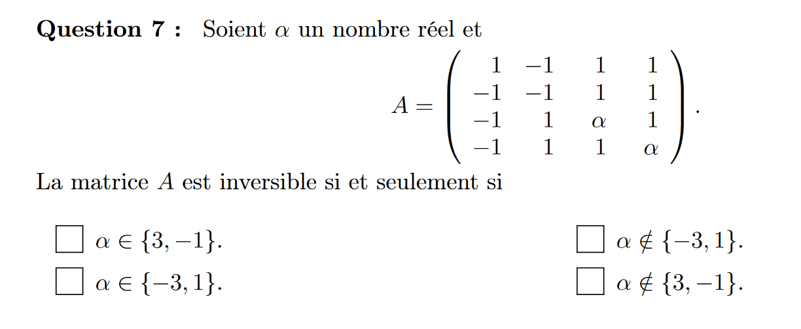
$$\begin{pmatrix}
1 & -1 & 1 & 1\\
-1 & -1 & 1 & 1\\
-1 & 1 & \alpha & 1\\
-1 & 1 & 1 & \alpha\\
\end{pmatrix}$$

$$\begin{pmatrix}
1 & -1 & 1 & 1\\
0 & -2 & 1 & 1\\
0 & 0 & \alpha+1 & 2\\
0 & 0 & 2 & \alpha+1\\
\end{pmatrix}$$

$$\begin{pmatrix}
1 & -1 & 1 & 1\\
0 & -2 & 1 & 1\\
0 & 0 & \alpha+1 & 2\\
0 & 0 & -2\alpha & \alpha-3\\
\end{pmatrix}$$

$$\alpha \not \in \{-3, 1\}$$
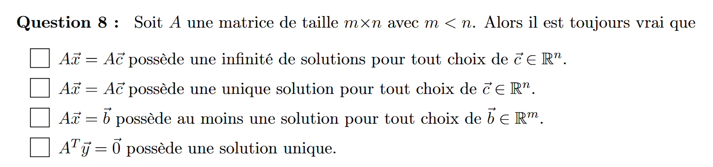

$$A\vec x=A \vec c$$
seul cette afirmation est toujours vrai
3 eme fausse car pas bonne taille

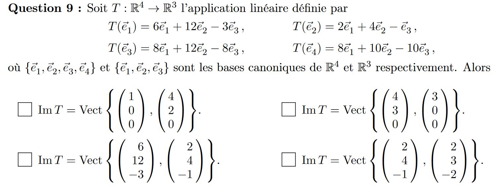
$$\begin{pmatrix}
6 & 2 & 8 & 8\\
12 & 4 & 12 & 10\\
-3 & -1 & -8 & -10\\
\end{pmatrix}$$

$$\begin{pmatrix}
0 & 2 & 0 & 0\\
0 & 7 & 0 & 6\\
0 & 7 & 0 & 16\\
\end{pmatrix}$$

$$Im T = Vect \{(2,4,-1),(2,3,-2)\}$$

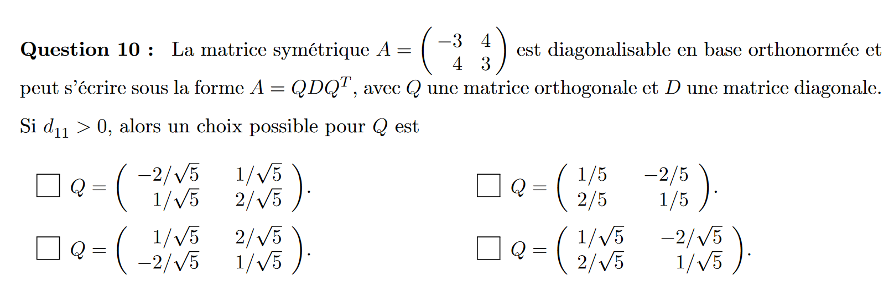

$$$$
(-3-t)(3-t)-16
t^2-25
(t-5)(t+5)
$$D= \begin{pmatrix}
5 & 0\\
0 & -5\\
\end{pmatrix}$$

$$Q=\begin{pmatrix}
-4 & 2\\
0 & 0\\
\end{pmatrix}$$

-2 1 
1 -2

$$Q=\begin{pmatrix}
1/\sqrt5 & -2/\sqrt5\\
2/\sqrt5 & 1/\sqrt5\\
\end{pmatrix}$$
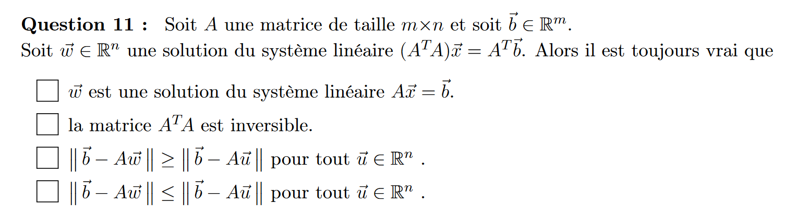
$$||\vec b - A \vec w|| \leq ||\vec b - A \vec u||, \forall  \vec u \in \R^n$$
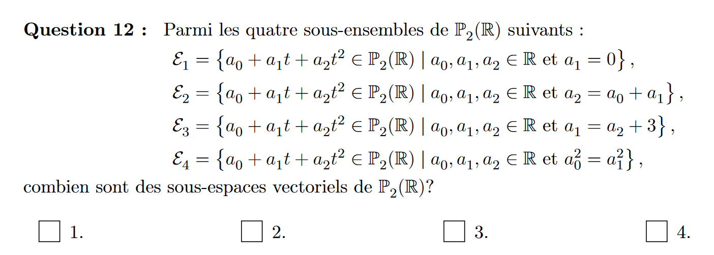
3 sont des sous espace

seul le E3 n'est pas un SEV car il n'as pas de zero
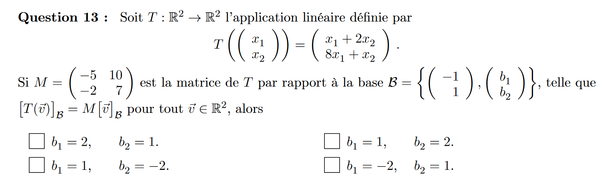
(1 -7)C

(-5 -2)B -> ((5-2(2)=1)(-5-2(1)=-7))

4 17
10 7

$$b_1 = 2, b_2=1$$

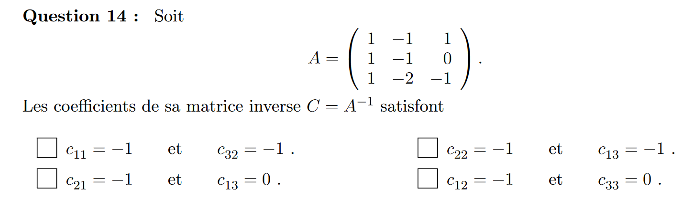

$$\begin{pmatrix}
1 & -1 & 1 & | & 1 & 0 & 0\\
1 & -1 & 0 & | & 0 & 1 & 0\\
1 & -2 & -1 & | & 0 & 0 & 1\\
\end{pmatrix}$$

$$\begin{pmatrix}
1 & -1 & 1 & | & 1 & 0 & 0\\
0 & 0 & -1 & | & -1 & 1 & 0\\
0 & -1 & -2 & | & -1 & 0 & 1\\
\end{pmatrix}$$

$$\begin{pmatrix}
1 & -1 & 1 & | & 1 & 0 & 0\\
0 & 1 & 1 & | & 0 & 1 & -1\\
0 & 0 & -1 & | & -1 & 1 & 0\\
\end{pmatrix}$$

$$\begin{pmatrix}
1 & 0 & 0 & | & -1 & 3 & -1\\
0 & 1 & 0 & | & -1 & 2 & -1\\
0 & 0 & 1 & | & 1 & -1 & 0\\
\end{pmatrix}$$

$$c_{11}= -1 c_{32}=-1$$
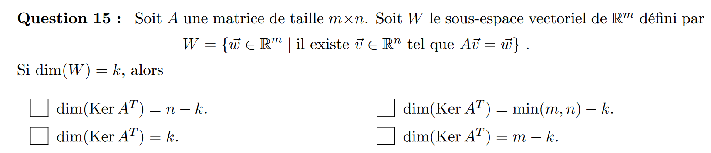
$$dim(Ker A^T)=k$$
pas sur.
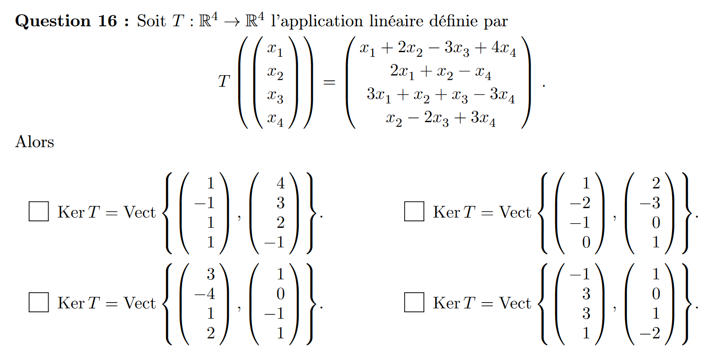
$$\{(1,-2,-1,0), (2,-3,0,1)\}$$
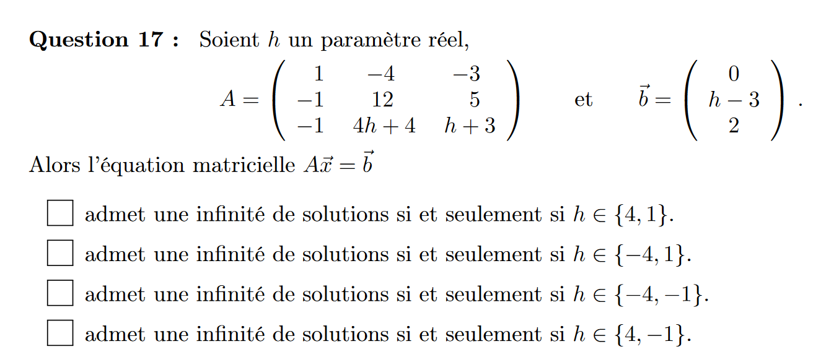
$$\begin{pmatrix}
1 & -4 & -3 & 0\\
-1 & 12 & 5 & h-3\\
-1 & 4h+4 & h+3 & 2 \\
\end{pmatrix}$$
$$\begin{pmatrix}
1 & -4 & -3 & 0\\
0 & 8 & 2 & h-3\\
0 & 4h & h & 2 \\
\end{pmatrix}$$
revoir critere infinité de solution
$$h \in \{4, -1\}$$
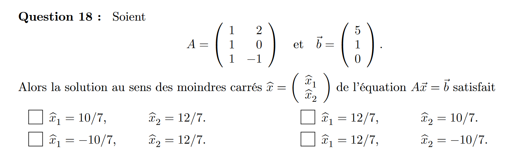
3 1  =  6
1 5  =  10

$$\hat x_1 = 10/7, \hat x_2 = 12/7$$
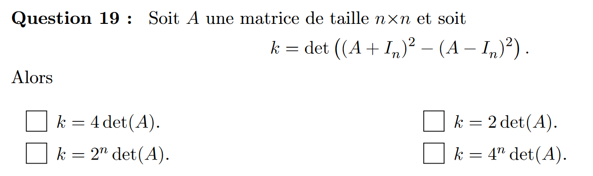
$$(A+I)(A+I)-(A-I)(A-I)$$
$$A^2+AI+IA+I-A^2+AI+IA-I=2AI+2IA$$
$$k=4^n det(A)$$
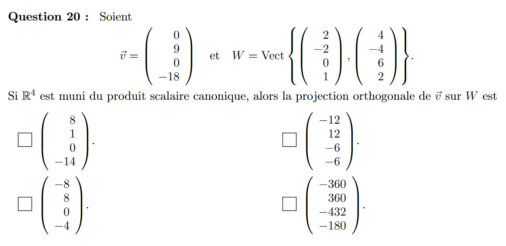
$$0 0 6 0$$
-4  0

$$(-8, 8, 0, -4)$$

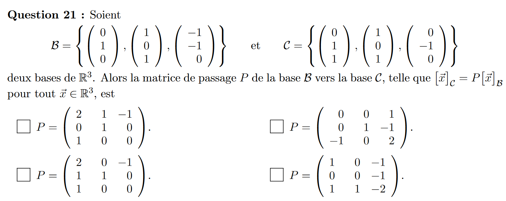

$$\begin{pmatrix}
0 & 0 & 1\\
0 & 1 & -1\\
-1 & 0 & 2\\
\end{pmatrix}$$

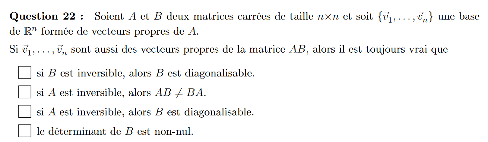

Si A est inversible alors B est diagonalisable

-17

49/66 -> 4.7
