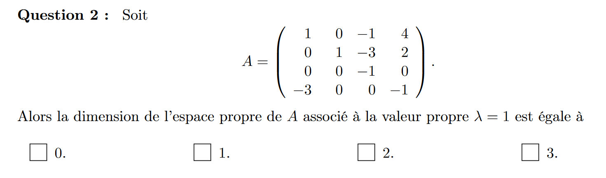
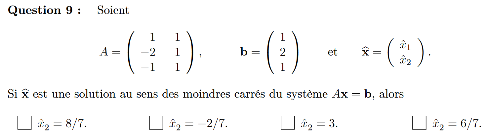

on test les vecteur manuellemnt
1 0 0
0 1 -1
0 -1 1

-3 0 0 0
0 0 0 2
0 0 0 0
0 0 5 0

dimmension espace propr = 1

 1  2 3  1 0 0
 0 1 2   0 1 0
 4 0 -1  0 0 1
 
  1  2 3  1 0 0
 0 1 2   0 1 0
 0 0 1  -4/6 6/6 1/6
 
 b31=-3/2

5 -3
-x³+5x²-5x-3

1 0
2
0
1 -1
l42  = 1 ??? (recheker théorie LU fast)

1 1 -2
0 2 -2
0 1 alpha +6
2alpha + 14=0

alpha = -7 (det = 0 -> rang <3)

u2 -proj u2 sur u1 =1 u1 - proj 1/3 u3

0 1 1
1 1 -1
-4/3 2/3 -2/3

15/10 (0 1 1)  + 16/10 (1 2 0) = 8/5 47/10  15/10

6 -2   -4
-2 3    4
3/14 2/14
2/14 6/14

x2 =8/7

0 0
1 0
0 1
11 -> 0 1 0
01 -> 0 1/2 -1/2

0 0
1 1/2
0 -1/2

c53 = 38

t + 3t²
2t-t²

-1/2
4/2->*5/4-> 5/2
-1+5/4=1/4
h=1/4

orthogonalement diagonalisable

1 k 0
0 k-4 1
0 l -5
-5k+20-l=0
5k+l=20

Faux

Vrai

