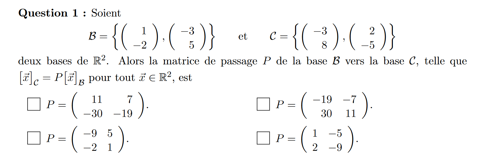
$$\begin{pmatrix}
1 & -3 \\
-2 & 5\\
\end{pmatrix}\begin{pmatrix}
5 & 2\\
8 & 3\\
\end{pmatrix}$$
$$P=\begin{pmatrix}
-19 & -7\\
30 & 11\\
\end{pmatrix}$$
-4
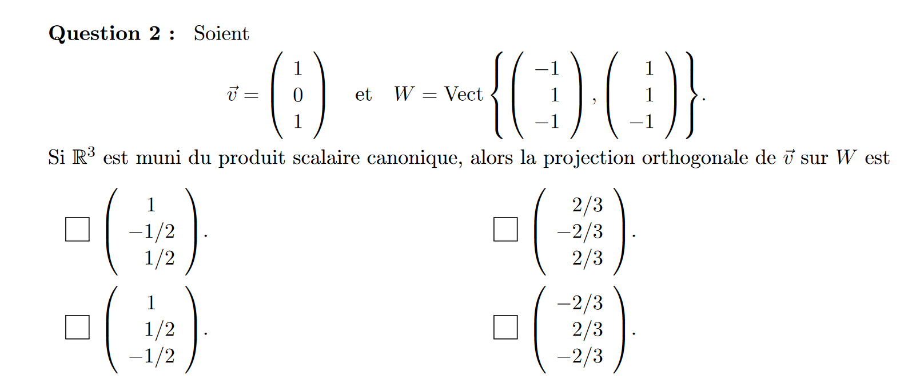
$$(1, 1, -1)-1/3(-1,1,-1)$$
$$(4/3, 2/3, -2/3)$$
2/3
*---*
16/9+4/9+4/9=8/3

1/4
$$-2/3(-1,1,-1)+1/4(4/3, 2/3, -2/3)$$
$$(1, -1/2, 1/2)$$

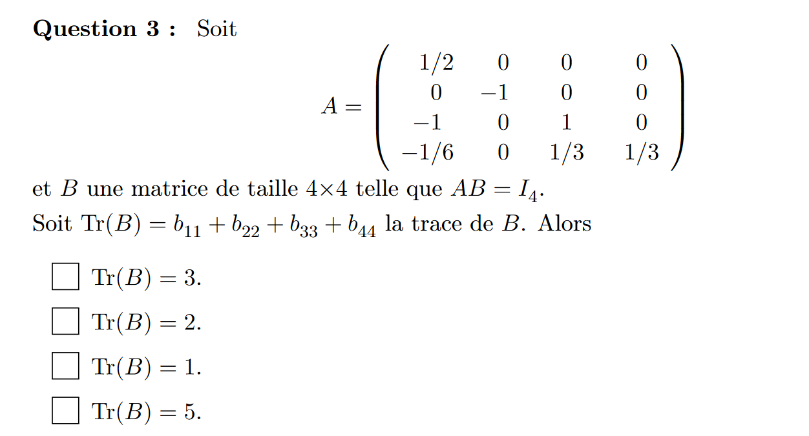

$$(-1/6)-> -6$$
$$$$
$$P=\begin{pmatrix}
-3 & 0 & 0 & 0 \\
0 & 6 & 0 & 0 \\
0 & 0 & -6 & 0 \\
0 & 0 & 0 & -2 \\
\end{pmatrix}$$

comprendre meilleur méthode
$$Tr(B)=5$$
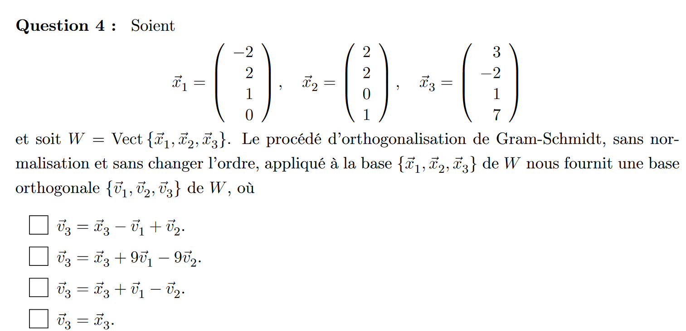
-x1+x2
$$\vec v_3= \vec x_3+\vec v_1-\vec v_2$$
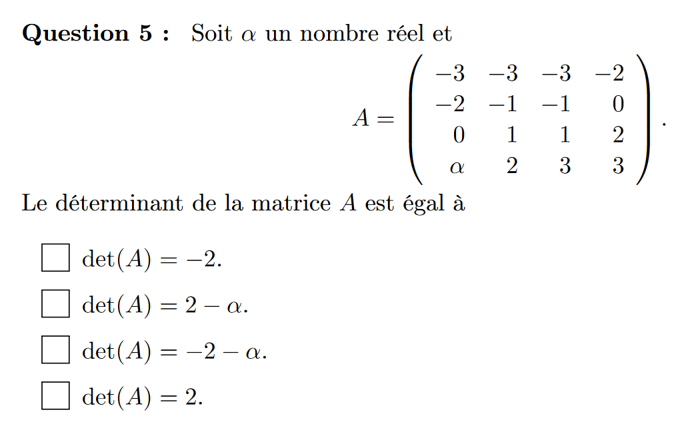
$$P=\begin{pmatrix}
-3 & -3 & -3 & -2 \\
-2 & -1 & -1 & 0 \\
0 & 1 & 1 & 2 \\
\alpha & 2 & 3 & 3 \\
\end{pmatrix}$$

$$P=\begin{pmatrix}
-3 & -3 & 0 & -2 \\
-2 & -1 & 0 & 0 \\
0 & 1 & 0 & 2 \\
\alpha & 2 & 1 & 3 \\
\end{pmatrix}$$

$$P=\begin{pmatrix}
-3 & -2 & 0 & 0 \\
-2 & -1 & 0 & 0 \\
0 & 1 & 0 & 2 \\
\alpha & 2 & 1 & 3 \\
\end{pmatrix}$$
-1*2(-1)=2
$$det(A)=2$$
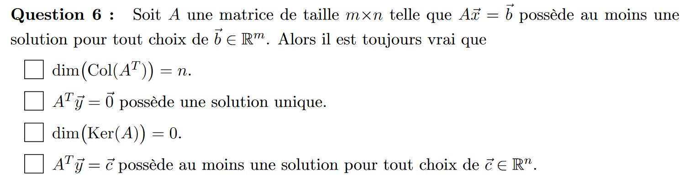
n>m
premiere fausse car max dimmensuin = n peut etre moins
3eme fausse. possible d'avoir noyeu non nul

$$A^T \vec y=\vec c$$
-4 vérifier théroie
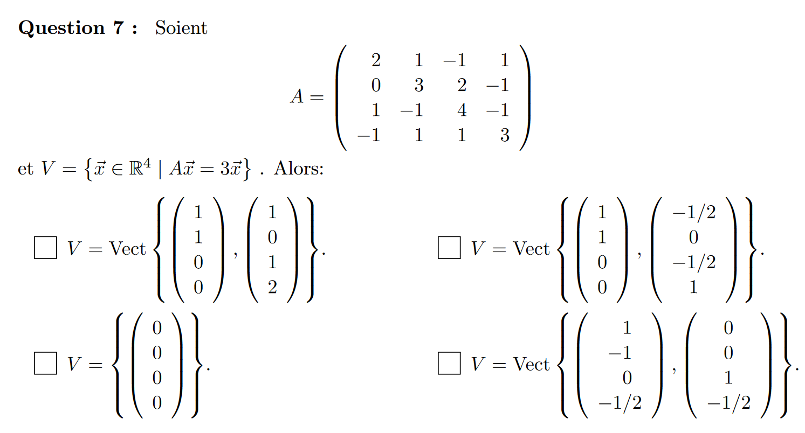
$$A=\begin{pmatrix}
2 & 1 & -1 & 1 \\
0 & 3 & 2 & -1 \\
1 & -1 & 4 & -1 \\
-1 & 1 & 1 & 3 \\
\end{pmatrix}$$
$$A=\begin{pmatrix}
-1 & 1 & -1 & 1 \\
0 & 0 & 2 & -1 \\
1 & -1 & 1 & -1 \\
-1 & 1 & 1 & 0 \\
\end{pmatrix}$$
$$A=\begin{pmatrix}
-1 & 1 & 1 & 0 \\
0 & 0 & 2 & -1 \\
0 & 0 & 0 & 0 \\
0 & 0 & 0 & 0 \\
\end{pmatrix}$$
$$V=Vect\{(1,1,0,0),(1,0,1,2)\}$$
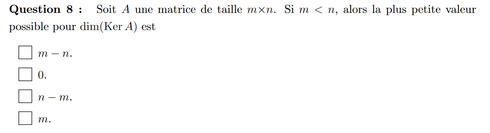
$$dim(KerA)=n-m$$
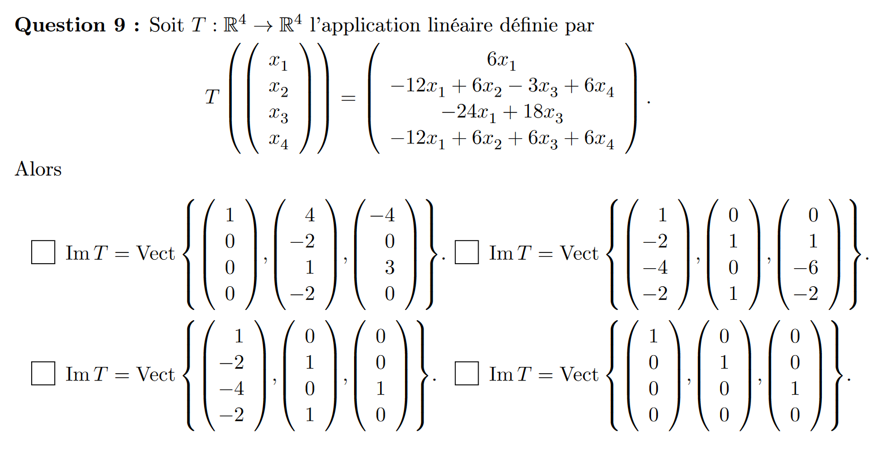
$$A=\begin{pmatrix}
6 & 0 & 0 & 0 \\
-12 & 6 & -3 & 6 \\
-24 & 0 & 18 & 0 \\
-12 & 6 & 6 & 6 \\
\end{pmatrix}$$
$$A=\begin{pmatrix}
1 & 0 & 0 & 0 \\
0 & 1 & 0 & 0 \\
-4 & 0 & 2 & 0 \\
0 & 1 & 1& 0 \\
\end{pmatrix}$$
$$Vect\{(1,-2,-4,-2),(0,1,0,1), (0,1,-6,-2)\}$$
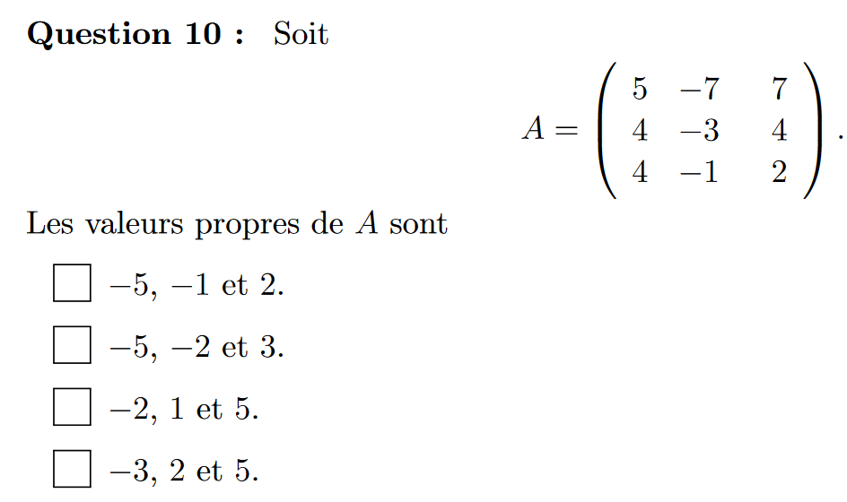
Tr(A)=4
det(A)=-10

$$A=\begin{pmatrix}
5 & -7 & 7  \\
4 & -3 & 4  \\
4 & -1 & 2 \\
\end{pmatrix}$$

$$A=\begin{pmatrix}
5 & -7 & 0  \\
0 & -3 & 1  \\
0 & -1 & 1 \\
\end{pmatrix}$$
$$A=\begin{pmatrix}
5 & -7 & 0  \\
0 & -2 & 1  \\
0 & 0 & 1 \\
\end{pmatrix}$$
$$-2, 1, 5$$
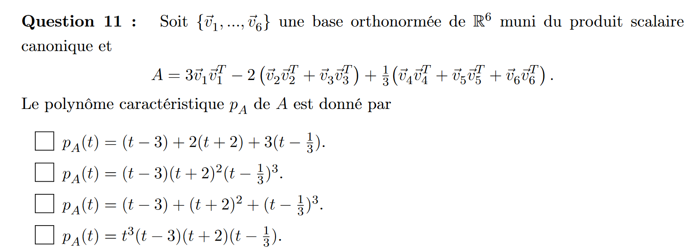
$$A=3|v_1|^2-2(|v_2|^2+|v_3|^2)$$
mettre dans une matrice ça donne les valeur caractéristique-> valeur propre sur la diagonal
-> -t
$$P_A(t)=(t-3)(t+2)^2(t-\frac{1}{3})^3$$

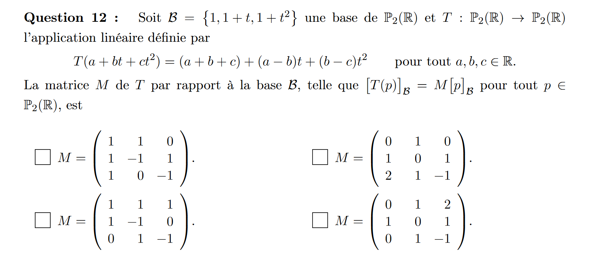
$$M_C=\begin{pmatrix}
1 & 1 & 1  \\
1 & -1 & 0  \\
0 & 1 & -1 \\
\end{pmatrix}$$
$$[Id]_{CB}=\begin{pmatrix}
1 & 1 & 1  \\
0 & 1 & 0  \\
0 & 0 & 1 \\
\end{pmatrix}$$
$$[Id]=\begin{pmatrix}
1 & 0 & 0 & | & 1 & -1 & -1  \\
0 & 1 & 0 & | & 0 & 1 & 0  \\
0 & 0 & 1 & | & 0 & 0 & 1 \\
\end{pmatrix}$$
$$[Id]_{BC}=\begin{pmatrix}
 1 & -1 & -1  \\
 0 & 1 & 0  \\
 0 & 0 & 1 \\
\end{pmatrix}$$
$$M_B=\begin{pmatrix}
1 & 2 & 2  \\
1 & 0 & 1  \\
0 & 1 & -1 \\
\end{pmatrix}$$
$$M_B=\begin{pmatrix}
0 & 1 & 2  \\
1 & 0 & 1  \\
0 & 1 & -1 \\
\end{pmatrix}$$
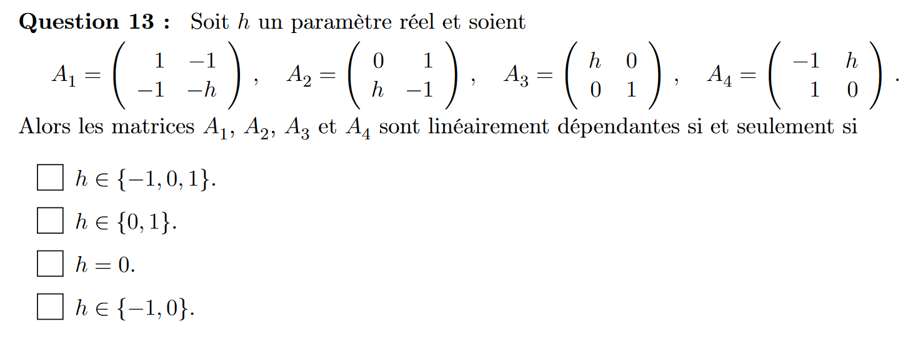
$$\begin{pmatrix}
1 & -1 & -1 & -h  \\
0 & 0 & h & -1   \\
h & 0 & 0 & 1  \\
-1 & h & 1 & 0 \\
\end{pmatrix}$$
$$\begin{pmatrix}
1 & -1 & 0 & -h  \\
0 & 0 & 0 & -2   \\
h & 0 & h & 1  \\
-1 & h & 0 & 0 \\
\end{pmatrix}$$

$$h=\{0,1\}$$
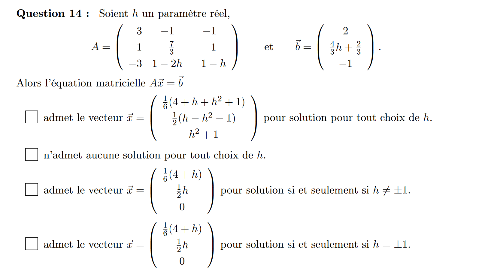
$$\begin{pmatrix}
3 & -1 & -1 & 2  \\
1 & \frac{7}{3} & 1 & 4/3h+2/3  \\
-3 & 1-2h & 1-h & -1  \\
\end{pmatrix}$$
$$\begin{pmatrix}
3 & -1 & -1 & 2  \\
0 & 2 & 1 & h  \\
0 & 2h & h & 1  \\
\end{pmatrix}$$
$$h  = \pm 1$$
refaire
-4
(total -12)
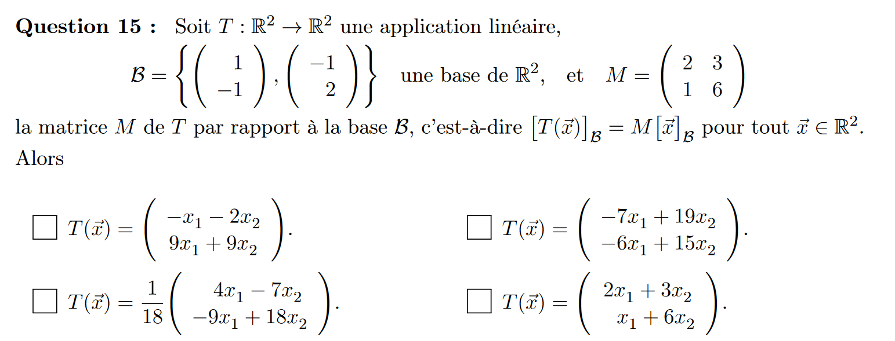
$$[Id]_{CB}\begin{pmatrix}
1 & -1 \\
-1 & 2 \\
\end{pmatrix}$$
$$M_B\begin{pmatrix}
2 & 3 \\
1 & 6 \\
\end{pmatrix}$$
$$[Id]_{BC}\begin{pmatrix}
2 & 1 \\
1 & 1 \\
\end{pmatrix}$$

$$M_c\begin{pmatrix}
7 & 5 \\
8 & 7 \\
\end{pmatrix}$$
$$M_c\begin{pmatrix}
-1 & -2 \\
9 & 9 \\
\end{pmatrix}$$
$$T(\vec x)=\begin{pmatrix}
-1\vec x_1-2\vec x_2 \\
9\vec x_1+ 9\vec x_2 \\
\end{pmatrix}$$
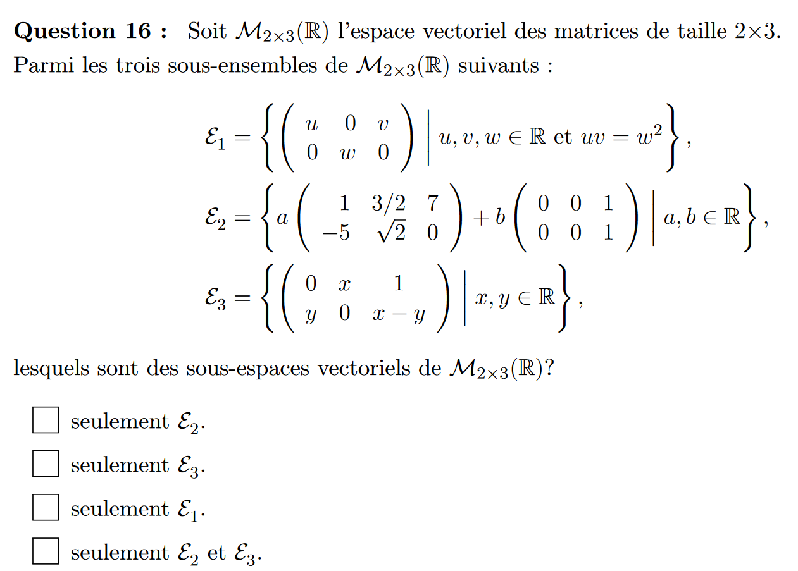
x1-x2
y1-y2
(x1-y1)-(x2-y2)
seulement E2 et E3
-16 ... comprendre non inéaire x-y
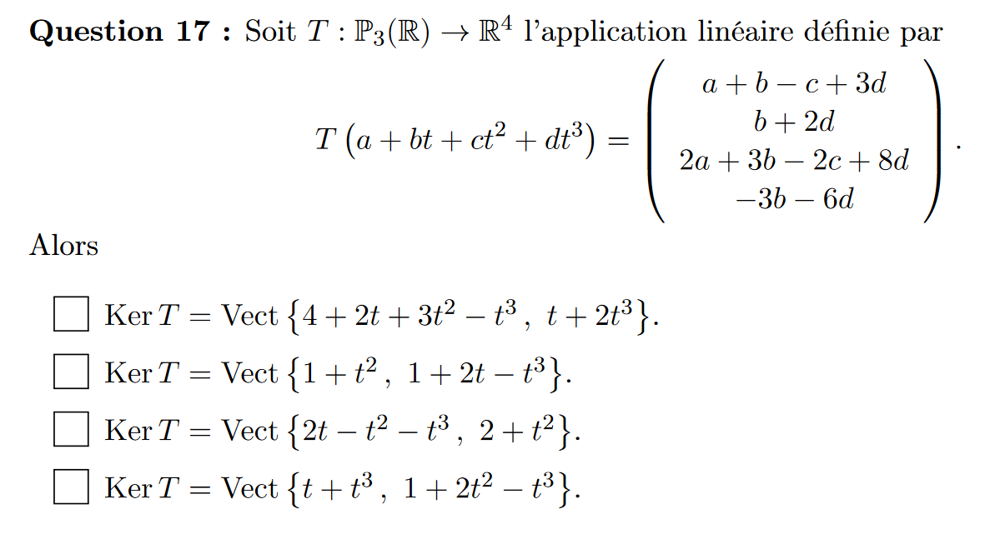
$$\begin{pmatrix}
1 & 1 & -1 & 3 \\
0 & 1 & 0 & 2 \\
2 & 3 & -2 & 8 \\
0 & -3 & 0 & -6 \\
\end{pmatrix}$$
$$\begin{pmatrix}
1 & 0 & -1 & 1 \\
0 & 1 & 0 & 2 \\
0 & 0 & 0 & 0 \\
0 & 0 & 0 & 0 \\
\end{pmatrix}$$
$$Ket(T)=Vect\{(1+t^2), (1+2t-t^3)\}$$

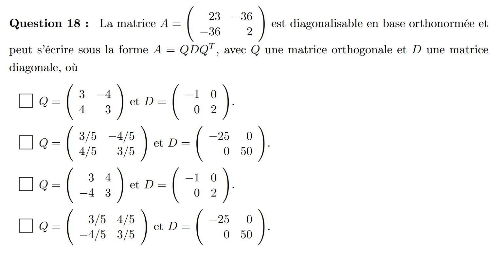
$$Q=\begin{pmatrix}
3/5 & 4/5 \\
-4/5 & 3/5 \\
\end{pmatrix}D=\begin{pmatrix}
-25 & 0 \\
0 & 50 \\
\end{pmatrix}$$
23 -36
-36 2
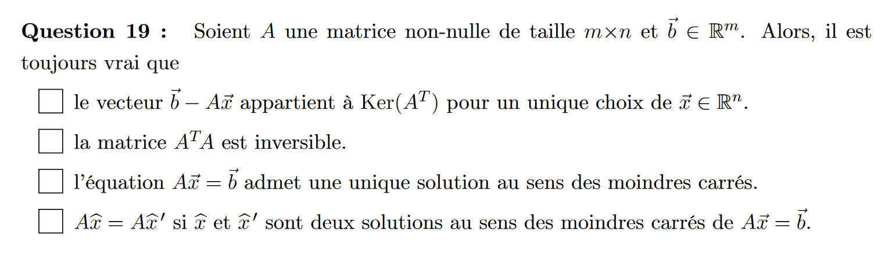
l'équation Ax = b admet une unique solution au sens des moindre carrés
-20 comprendre pk faux
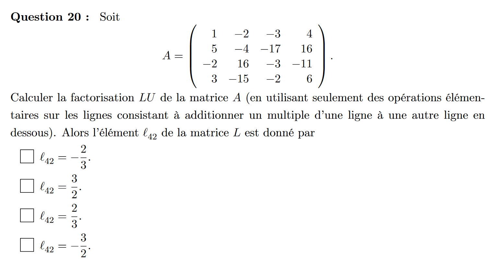
$$\begin{pmatrix}
1 & -2 & -3 & 4 \\
5 & -4 & -17 & 16 \\
-2 & 16 & -3 & -11 \\
3 & -15 & -2 & 6 \\
\end{pmatrix}$$
$$U=\begin{pmatrix}
1 & -2 & -3 & 4 \\
0 & 6 & -2 & -4 \\
0 & 12 & -9 & -3 \\
0 & -9 & 7 & -6 \\
\end{pmatrix}$$
$$\begin{pmatrix}
1 & 0 & 0 & 0 \\
5 & 1 & 0 & 0 \\
-2 & 0 & 1 & 0 \\
3 & -3/2 & 0 & 1 \\
\end{pmatrix}$$

$$l_{42}=-3/2$$
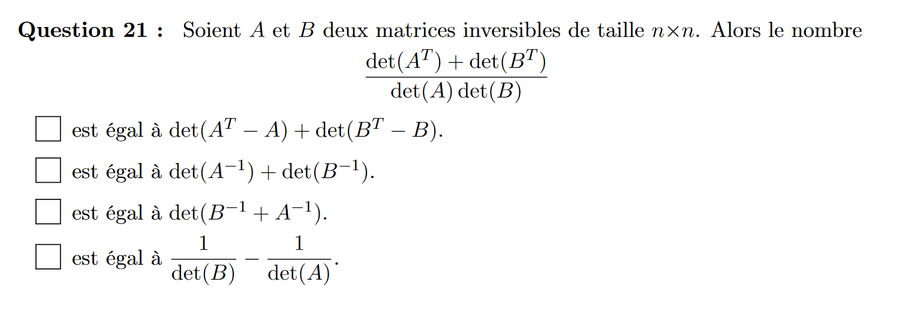
(a+b)/ab=(1/a+1/b)=
$$= det(B^{-1}+A^{-1})$$
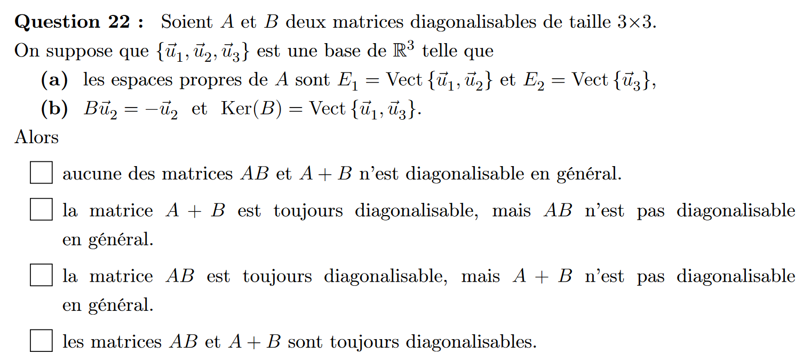
AB toujours diagonalisable
A+B toujours diagonalisable
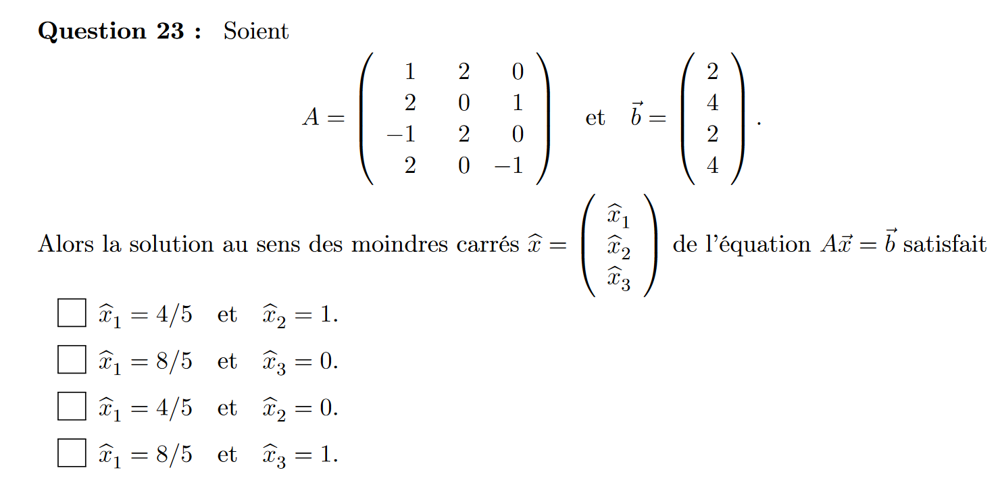
$$\begin{pmatrix}
10 & 0 & 0 \\
0 & 8 & 0 \\
0 & 0 & 4 \\
\end{pmatrix}\begin{pmatrix}
16/10\\
1\\
0\\
\end{pmatrix}=\begin{pmatrix}
16\\
8\\
0\\
\end{pmatrix}$$
$$\hat x_1=8/5, \hat x_3=1$$

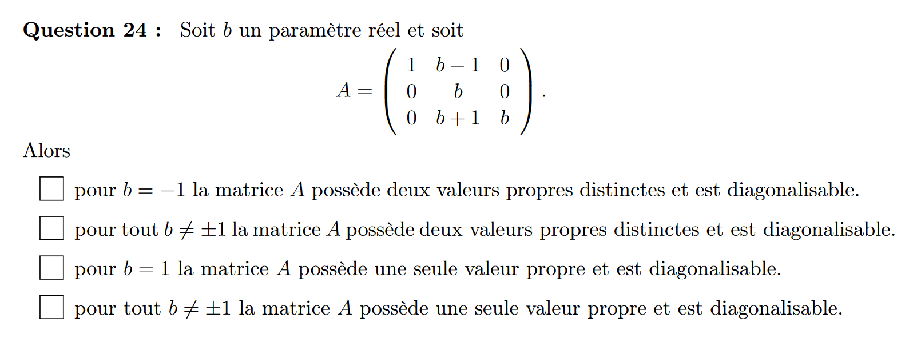
$$\begin{pmatrix}
1-t & b-1 & 0 \\
0 & b-t & 0 \\
0 & b+1 & b-t \\
\end{pmatrix}$$
$$(1-t)(b-t)^2$$

$$\begin{pmatrix}
1-t & 0 & 0 \\
0 & 1-t & 0 \\
0 & 2 & 1-t \\
\end{pmatrix}$$
$$(1-t)^3$$
1 pas diago

$$\begin{pmatrix}
1-t & -2 & 0 \\
0 & -1-t & 0 \\
0 & 0 & -1-t \\
\end{pmatrix}$$
$$(1-t)(1+t)^2$$
1 a un vecteur propre
2 -2 0
-1 a deux vecteur propre

POUR B =-1 la matrice est diagonalisable et et possede 2 valeur propre distincte

72 pts -28 = 4.055