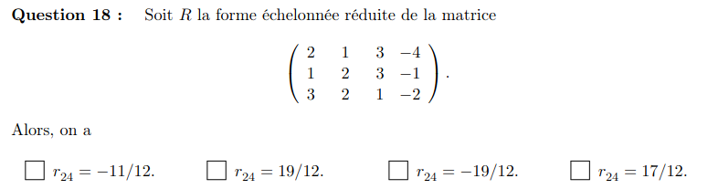
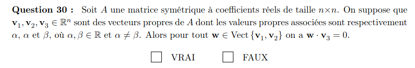
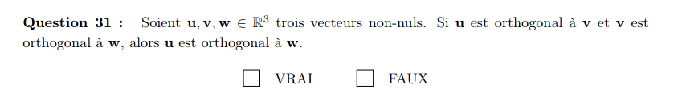
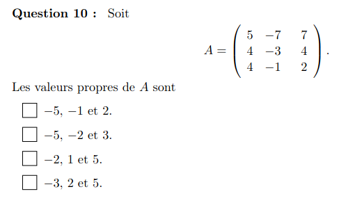
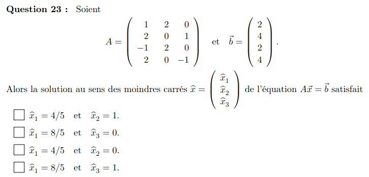

2020

vérifier manuellement  les 4 matrices telle que le produit avec v1 v2 et v3 donne leurs valeurs propres donc  on trouve :
$$A= \begin{pmatrix}
1 & 0 & 0\\
0 & 1 & -1\\
0 & -1 & 1\\
\end{pmatrix}$$

on soustrait la valeurs propre a A et on échellonne.
on fait attentioni au collones de zero
$$A-I=\begin{pmatrix}
-3 & 0 & 0 & -2\\
0 & 0 & -2 & 0\\
0 & 0 & 0 & 4\\
0 & 0 & 0 & 2\\
\end{pmatrix}\begin{pmatrix}
0\\
a\\
0\\
0\\
\end{pmatrix}=0$$
la dimmension = 1

on inverse manuellement la matrices. ça prend du temps
$$A=\begin{pmatrix}
1 & 2 & 3 & | & 1 & 0 & 0\\
0 & 1 & 2& | & 0 & 1 & 0\\
4 & 0 & -1& | & 0 & 0 & 1\\
\end{pmatrix}$$
$$A=\begin{pmatrix}
1 & 0 & -1 & | & 1 & -2 & 0\\
0 & 1 & 2& | & 0 & 1 & 0\\
0 & 0 & 1& | & -4/3 & 8/3 & 1/3\\
\end{pmatrix}$$
$$A=\begin{pmatrix}
1 & 0 & 0 & | & -1/3 & 2/3 & 1/3\\
0 & 1 & 0 & | & 8/3 & -13/3 & -2/3\\
0 & 0 & 1 & | & -4/3 & 8/3 & 1/3\\
\end{pmatrix}$$
$$b_{23}=-2/3$$

on calcule le determinant avec -t sur la diagonale
$$A= \begin{pmatrix}
1-t & 0 & -1\\
4 & 1-t & 2\\
0 & 1 & 3-t\\
\end{pmatrix}$$
$$A= \begin{pmatrix}
1-t & 0 & -1\\
4 & 1-t & 2\\
0 & 1 & 3-t\\
\end{pmatrix}$$
soit sarrus soit introduction de zero
$$-2(1-t)-4+(1-t)(1-t)(3-t)$$

on regarde lecoeef du premier et dernier terme pour gagner du temps
$$-\lambda^3+5\lambda ^2-5\lambda-3$$
on vérifie
$$-t^3+5t^2-5t-3$$

méthode rapide de factorisation LU
on note dans la matrice L (identité carré les cooefficient de combien on enleve)
$$A= \begin{pmatrix}
1 & 2 & 0 & 1\\
2 & 3 & 1 & 0\\
0 & 1 & 2 & 4\\
1 & 0 & 3 & 2\\
\end{pmatrix}$$
$$L= \begin{pmatrix}
1 & 0 & 0 & 0\\
2 & 1 & 0 & 0\\
0 & 0 & 1 & 0\\
1 & 0 & 0 & 1\\
\end{pmatrix}$$
$$U= \begin{pmatrix}
1 & 2 & 0 & 1\\
0 & -1 & 1 & -2\\
0 & 1 & 2 & 4\\
0 & -2 & 3 & 1\\
\end{pmatrix}$$
$$L= \begin{pmatrix}
1 & 0 & 0 & 0\\
2 & 1 & 0 & 0\\
0 & -1 & 1 & 0\\
1 & 2 & 0 & 1\\
\end{pmatrix}$$
$$U= \begin{pmatrix}
1 & 2 & 0 & 1\\
0 & -1 & 1 & -2\\
0 & 0 & 3 & 2\\
0 & 0 & 1 & 5\\
\end{pmatrix}$$
$$L= \begin{pmatrix}
1 & 0 & 0 & 0\\
2 & 1 & 0 & 0\\
0 & -1 & 1 & 0\\
1 & 2 & 1/3 & 1\\
\end{pmatrix}$$
$$U= \begin{pmatrix}
1 & 2 & 0 & 1\\
0 & -1 & 1 & -2\\
0 & 0 & 3 & 2\\
0 & 0 & 0 & 13/3\\
\end{pmatrix}$$

ATTENTION AU SIGNE INVERSE ET A FINIR LES LIGNES

rang= dimmension espace arrivé
donc collones linéairemetn dépendante pour <3

$$A= \begin{pmatrix}
1 & 1 & 3\\
1 & 3 & 4\\
-2 & -4 & \alpha\\
\end{pmatrix}$$
$$A= \begin{pmatrix}
1 & 1 & 3\\
0 & 2 & 1\\
0 & -2 & 6+\alpha\\
\end{pmatrix}$$
$$A= \begin{pmatrix}
1 & 1 & 3\\
0 & 2 & 1\\
0 & 0 & 7+\alpha\\
\end{pmatrix}$$
$$si \alpha = -7$$
alors rang < 3

vérifier si base orthogonale et normale des propositions.
si toutes conditions alors gramschmidt
pas orthogonal
orthogonal
pas orthognal
pas orthogonal
on vérifier que la base orthognal est bien l'autre.
(meme pas besoin car R3 et 3 vecteur indépendant
donc on as 
0    1    -4/3
1    1     2/3
1   -1    -2/3

on regarde si on as des vecteur orthogonaux qui engendre le meme espaceque u1 et u2 (les deux premier vecteu de la base trouvé avant car leurs combinaison linéaire donne u1 et u2)
puis on fait la projection du vecteur sur chaque vecteur de la base et on recombine
-4
2
-2
comme vecteur perpendiculaire a la projection
$$proj_v(u)=\frac{\braket{u,v}}{\braket{v,v}}v$$
projection orthogonale de u sur v
3/2(0,1,1)+(5/3)(1,1,-1)=(5/3, 19/6, -1/6)
$$A= \begin{pmatrix}
5/3\\
19/6\\
-1/6\\
\end{pmatrix}$$

on applique la formule des moindre carré
$$A^T A \hat x=A^Tb$$
3 -1   a  -2
-2 3   b  4
3/7 1/7    -2/7
2/7 3/7    8/7

$$\hat x_2 = 8/7$$

pareil mais en plus long et chiant
$$A^T A \hat x=A^Tb$$
$$\begin{pmatrix}
10 & 8 & 7\\
8 & 9 & 12\\
7 & 12 & 21\\
\end{pmatrix}\begin{pmatrix}
x\\
y\\
z\\
\end{pmatrix}=\begin{pmatrix}
4\\
6\\
9\\
\end{pmatrix}$$
$$\begin{pmatrix}
10 & 8 & 7 & 4\\
8 & 9 & 12 & 6 \\
7 & 12 & 21 & 9\\
\end{pmatrix}=\begin{pmatrix}
x\\
y\\
z\\
\end{pmatrix}=$$
$$\begin{pmatrix}
1 & -3 & -9 & -3 \\
0 & 38 & 97 & 34\\
0 & 33 & 84 & 30\\
\end{pmatrix}=\begin{pmatrix}
x\\
y\\
z\\
\end{pmatrix}=$$
$$\begin{pmatrix}
1 & -3 & -9 & -3 \\
0 & 5 & 13 & 4\\
0 & 0 & -1 & 2\\
\end{pmatrix}=\begin{pmatrix}
x=\\
y=6\\
z=-2\\
\end{pmatrix}=$$
on check si des combinaison de collones évidente.
on inverse la matrice

$$[Id]_{CB}\begin{pmatrix}
1 & 0 \\
1 & 1 \\
\end{pmatrix}$$
$$[Id]_{C_pD}\begin{pmatrix}
1 & 0 & 0 \\
0 & 1 & 1 \\
0 & 1 & -1 \\
\end{pmatrix}$$
$$[Id]_{C_pC}\begin{pmatrix}
0 & 0\\
1 & 0\\
0 & 1\\
\end{pmatrix}$$
$$[Id]_{DC_p}[Id]_{C_pC}[Id]_{CB}$$
$$[Id]_{DC_p}\begin{pmatrix}
1 & 0 & 0 & | & 1 & 0 & 0 \\
0 & 1 & 0 & | & 0 & 1/2 & 1/2 \\
0 & 0 & 1& | & 0 & 1/2 & -1/2 \\
\end{pmatrix}$$
$$[Id]_{DC_p}\begin{pmatrix}
 1 & 0 & 0 \\
0 & 1/2 & 1/2 \\
0 & 1/2 & -1/2 \\
\end{pmatrix}$$
$$[Id]_{DC_p}[Id]_{C_pC}[Id]_{CB}=$$
$$\begin{pmatrix}
0 & 0\\
1 & 1/2\\
0 & -1/2\\
\end{pmatrix}$$

$$C_{53}=A_{L5}B_C3=4+7+27=38$$

$$Bb=Y$$
$$\begin{pmatrix}
1 & 1\\
1 & -1\\
1 & 0\\
\end{pmatrix}\begin{pmatrix}
b_0\\
b_x\\
\end{pmatrix}=\begin{pmatrix}
2\\
5\\
3\\
\end{pmatrix}$$
$$B^TBb=B^TY$$
$$\begin{pmatrix}
3 & 0\\
0 & 2\\
\end{pmatrix}\begin{pmatrix}
b_0\\
b_x\\
\end{pmatrix}=\begin{pmatrix}
10\\
-3\\
\end{pmatrix}$$
10/3 pour le b_0 car on peut éliminer 2 solution
$$\begin{pmatrix}
3 & 0\\
0 & 2\\
\end{pmatrix}\begin{pmatrix}
10/3\\
-3/2\\
\end{pmatrix}=\begin{pmatrix}
10\\
-3\\
\end{pmatrix}$$

$$\begin{pmatrix}
-1 & 0 & 2 & | & 1 & 0 & 0\\
1 & 2 & -1& | & 0 & 1 & 0\\
0 & -1 & 3& | & 0 & 0 & 1\\
\end{pmatrix}$$

$$\begin{pmatrix}
1 & 0 & 0 & | & -1+2/7 & 2/7 & 2/7\\
0 & 1 & 0& | & 1/2-1/14 & 1/2-1/14 & -1/14\\
0 & 0 & 1& | & 1/7 & 1/7 & 2/7\\
\end{pmatrix}$$

$$\begin{pmatrix}
-5/7 & 2/7 & 2/7\\
6/14 & 6/14& -1/14\\
1/7 & 1/7 & 2/7\\
\end{pmatrix}\begin{pmatrix}
0\\
1\\
-8\\
\end{pmatrix}=-15/7$$

$$\begin{pmatrix}
1 & 4 & 9 & -2\\
3 & 2 & 1 & 0\\
1 & 1 & 2 & 1\\
2 & 1 & -1 & 0\\
\end{pmatrix}$$

$$\begin{pmatrix}
3 & 6 & 13 & 0\\
3 & 2 & 1 & 0\\
1 & 1 & 2 & 1\\
2 & 1 & -1 & 0\\
\end{pmatrix}$$
$$(-1)\begin{pmatrix}
29 & 19 & 0 \\
5 & 3 & 0 \\
2 & 1 & -1\\
\end{pmatrix}$$
$$(-1)(-1)\begin{pmatrix}
29 & 19 \\
5 & 3 \\
\end{pmatrix}=87-95=-8$$

-1/2

-1          1/4=h
-1/2 5/4*2    =2
-2         0.5=2h
-2         -2

$$ h=1/4$$

bien faire le dessin pour se rendre compte quil y a rien a faire a par ecrire la matrice
$$\begin{pmatrix}
1 & 2 &4 \\
3 & 0 & 1\\
0 & 1 & 3\\
\end{pmatrix}$$
donc 
$$p_{12}=2$$

$$\begin{pmatrix}
2 & 1 & 3 & -4 \\
1 & 2 & 3 & -1 \\
3 & 2 & 1 & -2 \\
\end{pmatrix}$$
$$\begin{pmatrix}
1 & 2 & 3 & -1 \\
0 & -3 & -3 & -2 \\
0 & -4 & -8 & 1 \\
\end{pmatrix}$$
$$\begin{pmatrix}
1 & 2 & 3 & -1 \\
0 & 1 & 5 & -3 \\
0 & 0 & 1 & -11/12 \\
\end{pmatrix}$$
$$\begin{pmatrix}
1 & 2 & 0 & -1+33/12 \\
0 & 1 & 0 & -3+55/12 \\
0 & 0 & 1 & -11/12 \\
\end{pmatrix}$$
$$\begin{pmatrix}
1 & 0 & 0 & 5-77/12 \\
0 & 1 & 0 & -3+55/12 \\
0 & 0 & 1 & -11/12 \\
\end{pmatrix}$$
$$r_{24}=19/12$$

est inversible et sont inverse orthogonalement diagonalisaeble car elle est symmétrique

on soustrait la valeur propre et on veux que le determinantn soit nul
$$\begin{pmatrix}
-5 & k & 0 \\
5 & -4 & 1\\
0 & l & -5\\
\end{pmatrix}$$
$$\begin{pmatrix}
-5 & k & 0 \\
5 & 1 & 1\\
0 & l-25 & -5\\
\end{pmatrix}$$
$$\begin{pmatrix}
-5 & k & 0 \\
0 & 1+k & 1\\
0 & l-25 & -5\\
\end{pmatrix}$$
$$-5(1+k)+(25-l)$$
$$20=l+5k$$

2019

2018

2017

