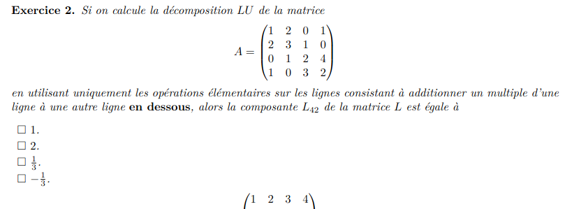

Quizz

$$\begin{pmatrix}
1 & 3 & 4 & 5\\
2 & 1 & 4 & 6\\
4 & 7 & 1 & 0\\
-1 & -3 & 7 & 11\\
\end{pmatrix}$$
$$\begin{pmatrix}
1 & 3 & 4 & 5\\
0 & -5 & 18 & 28\\
0 & -5 & 29 & 44\\
0 & 0 & 11 & 16\\
\end{pmatrix}$$ 

$$\begin{pmatrix}
1 & 3 & 4 & 5\\
0 & -5 & 18 & 28\\
0 & 0 & 11 & 16\\
0 & 0 & 0 & 0\\
\end{pmatrix}$$ 

possède au moins une solution pour a dans {2;-2}

$$\begin{pmatrix}
1 & 2 & 0 & 1 & 1 & 0 & 0 & 0 \\
2 & 3 & 1 & 0 & 0 & 1 & 0 & 0 \\
0 & 1 & 2 & 4 & 0 & 0 & 1 & 0 \\
1 & 0 & 3 & 2 & 0 & 0 & 0 & 1 \\
\end{pmatrix}$$ 
$$\begin{pmatrix}
1 & 2 & 0 & 1 & 1 & 0 & 0 & 0 \\
0 & -1 & 1 & -2 & -2 & 1 & 0 & 0 \\
0 & 0 & 3 & 2 & -2 & 1 & 1 & 0 \\
0 & 0 & 1 & 5 & 3 & -2 & 0 & 1 \\
\end{pmatrix}$$ 
$$\begin{pmatrix}
1 & 2 & 0 & 1 & 1 & 0 & 0 & 0 \\
0 & -1 & 1 & -2 & -2 & 1 & 0 & 0 \\
0 & 0 & 3 & 2 & -2 & 1 & 1 & 0 \\
0 & 0 & 0 & 13/3 & 3+4/3 & -2-1/3 & -1/3 & 1 \\
\end{pmatrix}$$
-1/3

$$\begin{pmatrix}
1 & 2 & 3 & 4 & 1 & 0 & 0 & 0 \\
1 & 3 & 3 & 3 & 0 & 1 & 0 & 0 \\
0 & 1 & 1 & 0 & 0 & 0 & 1 & 0 \\
1 & 2 & 3 & 6 & 0 & 0 & 0 & 1 \\
\end{pmatrix}$$ 
$$\begin{pmatrix}
1 & 2 & 3 & 4 & 1 & 0 & 0 & 0 \\
0 & 1 & 0 & -1 & -1 & 1 & 0 & 0 \\
0 & 1 & 1 & 0 & 0 & 0 & 1 & 0 \\
0 & 0 & 0 & 2 & -1 & 0 & 0 & 1 \\
\end{pmatrix}$$
$$\begin{pmatrix}
1 & 2 & 3 & 4  & 1 & 0 & 0 & 0 \\
0 & 1 & 0 & -1 & -1 & 1 & 0 & 0 \\
0 & 0 & 1 & 1  & 1 & -1 & 1 & 0 \\
0 & 0 & 0 & 2  & -1 & 0 & 0 & 1 \\
\end{pmatrix}$$ 
$$\begin{pmatrix}
1 & 0 & 0 & 0  & 1.5 & 1 & -3 & -1.5 \\
0 & 1 & 0 & 0 & -1.5 & 1 & 0 & 0.5 \\
0 & 0 & 1 & 0  & 1.5 & -1 & 1 & -0.5 \\
0 & 0 & 0 & 1  & -0.5 & 0 & 0 & 0.5 \\
\end{pmatrix}$$ 

-3/2

faux

vrai

Vrai

critère du SEV
$$\begin{pmatrix}
0 & 0 & 0 \\
0 & 0 & 0 \\
\end{pmatrix}*\begin{pmatrix}
1 & 2 \\
3 & 4 \\
0 & 1 \\
\end{pmatrix}=\begin{pmatrix}
0 & 0 \\
0 & 0 \\
\end{pmatrix}$$

$$(\lambda \begin{pmatrix}
a & b & c \\
d & e & f \\
\end{pmatrix}+\begin{pmatrix}
u & v & w \\
x & y & z \\
\end{pmatrix})*\begin{pmatrix}
1 & 2 \\
3 & 4 \\
0 & 1 \\
\end{pmatrix}=\begin{pmatrix}
\lambda(a+3b) & \lambda(2a+4b+c) \\
\lambda(d+3e) &  \lambda(2d+4e+f) \\
\end{pmatrix}+\begin{pmatrix}
\lambda(u+3v) & \lambda(2u+4v+w) \\
\lambda(x+3y) &  \lambda(2x+4y+z) \\
\end{pmatrix}=\lambda A*T+B*T$$
b)
$$\begin{pmatrix}
1 & 0 & 0 \\
0 & 0 & 0 \\
\end{pmatrix})*\begin{pmatrix}
1 & 2 \\
3 & 4 \\
0 & 1 \\
\end{pmatrix}=\begin{pmatrix}
1 & 2 \\
0 &  0 \\
\end{pmatrix}$$

$$\begin{pmatrix}
0 & 1 & 0 \\
0 & 0 & 0 \\
\end{pmatrix})*\begin{pmatrix}
1 & 2 \\
3 & 4 \\
0 & 1 \\
\end{pmatrix}=\begin{pmatrix}
3 & 4 \\
0 &  0 \\
\end{pmatrix}$$

$$\begin{pmatrix}
0 & 0 & 1 \\
0 & 0 & 0 \\
\end{pmatrix})*\begin{pmatrix}
1 & 2 \\
3 & 4 \\
0 & 1 \\
\end{pmatrix}=\begin{pmatrix}
0 & 1 \\
0 &  0 \\
\end{pmatrix}$$

$$\begin{pmatrix}
0 & 0 & 0 \\
1 & 0 & 0 \\
\end{pmatrix})*\begin{pmatrix}
1 & 2 \\
3 & 4 \\
0 & 1 \\
\end{pmatrix}=\begin{pmatrix}
0 & 0 \\
1 & 2 \\
\end{pmatrix}$$

$$\begin{pmatrix}
0 & 0 & 0 \\
0 & 1 & 0 \\
\end{pmatrix})*\begin{pmatrix}
1 & 2 \\
3 & 4 \\
0 & 1 \\
\end{pmatrix}=\begin{pmatrix}
0 & 0 \\
3 & 4 \\
\end{pmatrix}$$

$$\begin{pmatrix}
0 & 0 & 0 \\
0 & 0 & 1 \\
\end{pmatrix})*\begin{pmatrix}
1 & 2 \\
3 & 4 \\
0 & 1 \\
\end{pmatrix}=\begin{pmatrix}
0 & 0 \\
0 &  1 \\
\end{pmatrix}$$

la base canonique des matrices 4x4 est une base de W
car ils engendre W et sont linaéirement indépendant entre eux.
c)
la dimmension de W est 4 car sa base contient 4 vecteur linéairement indédant qui eux meme peuvent etre construire a partir de l'application de la matrice de transformation a la base canonique des matrice 2x3
d)
la base canonique des matrices 2x3