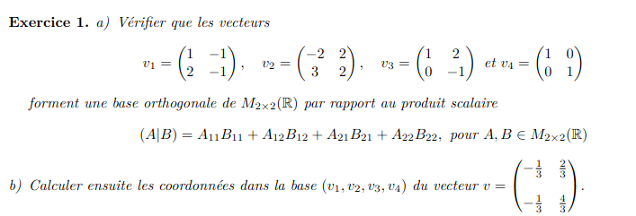
a)
$$v_1 * v_2=(-2-2+6-2)=0$$
$$v_1 * v_3=(1-2+0+1)=0$$
$$v_1 * v_4=(1+0+0-1)=0$$
$$v_2 * v_3=(-2+4+0-2)=0$$
$$v_2 * v_4=(-2+0+0+2)=0$$
$$v_3 * v_4=(1+0+0-1)=0$$
b)
$$proj_v(u)=\frac{\braket{u,v}}{\braket{v,v}}*v$$

$$proj_{v_1}(u)=\frac{\braket{u,v_1}}{\braket{v_1,v_1}}=$$
$$proj_{v_1}(u)=\frac{-3}{7}=$$

$$proj_{v_2}(u)=\frac{\braket{u,v_2}}{\braket{v_2,v_2}}=$$
$$proj_{v_2}(u)=\frac{11/3}{21}=$$

$$proj_{v_3}(u)=\frac{\braket{u,v_3}}{\braket{v_3,v_3}}=$$
$$proj_{v_3}(u)=\frac{-1/3}{6}=$$

$$proj_{v_4}(u)=\frac{\braket{u,v_4}}{\braket{v_4,v_4}}=$$
$$proj_{v_4}(u)=\frac{-5/3}{2}=$$

$$v_b=(-3/7,11/63,-1/18,-5/6)$$ 
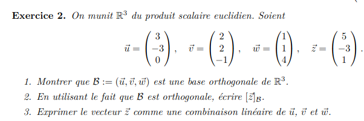
1)
$$\vec u * \vec v = 6-6+0=0$$
$$\vec u * \vec w = 3-3+0=0$$
$$\vec v * \vec w = 2+2-4=0$$
2)
$$[\vec z]_b=(4/3,1/3,1/3)$$
3)
$$[\vec z]_b=(4/3 \vec u+1/3 \vec v+1/3 \vec w)$$
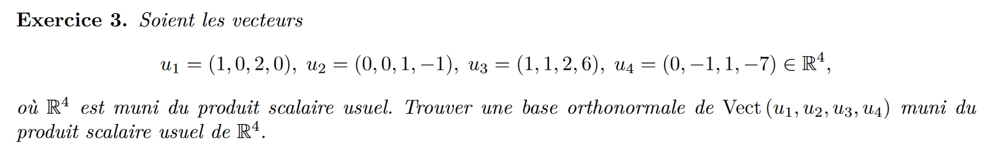
$$\begin{pmatrix}
1 & 0  & 1 & 0 \\
0 & 0  & 1 & -1 \\
2 & 1 & 2 & 1 \\
0 & -1  & 6 & -7 \\
\end{pmatrix} $$
$$\begin{pmatrix}
1 & 0  & 0 & 0 \\
0 & 1  & 0 & 0 \\
0 & 0 & 1 & 0  \\
2 & 6  & -1 & 0 \\
\end{pmatrix} $$
(-2,0,0,1)
(0,-6,0,1)
(0,0,1,1)

(0,0,1,1)
(0,-6,0,1)-1/2(0,0,1,1)=(0,-6,-1/2,1/2)
(-2,0,0,1)-(1/2)(0,0,1,1)-(1/73)(0,-6,-1/2,1/2)=(-2, 12/73, -72/146, 72/146)

Base :
$$(0,0,1/sqrt(2),1/sqrt(2)), (0,-12/\sqrt{146},-1\sqrt{146},1\sqrt{146}), (-292/\sqrt{96208}, 24/\sqrt{96208}, -72/\sqrt{96208}, 72/\sqrt{96208})$$
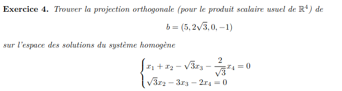
$$\begin{pmatrix}
1 & 0  & 0 & 0 \\
0 & 1  & -\sqrt3 & -\sqrt3*2/3 \\
\end{pmatrix} $$
$$Im=vect(0,0,-2/3,1),(0,\sqrt3*2/3,0,1)$$
$$proj_S(b)=-9/13*(0,0,-2/3,1)+9/7(0,\sqrt3*2/3,0,1)$$
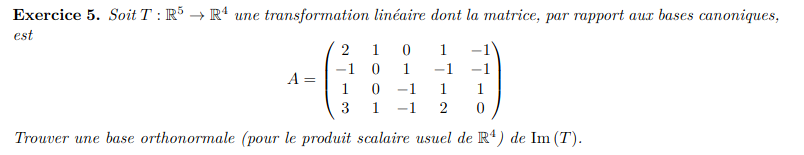
$$\begin{pmatrix}
2 & 1  & 0 & 1 & -1 \\
-1 & 0  & 1 & -1 & -1 \\
1 & 0  & -1 & 1 & 1 \\
3 & 1  & -1 & 2 & 0 \\
\end{pmatrix} $$

$$\begin{pmatrix}
0 & 1  & 0 & 0 & 0 \\
-1 & 0  & 0 & 0 & 0 \\
1 & 0  & 0 & 0 & 0 \\
1 & 1  & 0 & 0 & 0 \\
\end{pmatrix} $$
$$Im(T)=vect((0,-1,1,1), (1,0,0,1))$$
$$\perp = (1,0,0,1)-1/3(0,-1,1,1)=(1,1/3,-1/3,2/3)$$
$$B_{\perp}=((0,-1,1,1), (1,1/3,-1/3,2/3))$$
$$B_{\perp||1||}=((0,-1/\sqrt3,1/\sqrt3,1/\sqrt3),\sqrt{3/5}(1,1/3,-1/3,2/3))$$

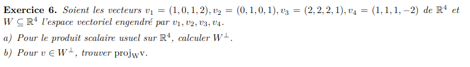
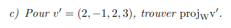
a)

(0,0,0,1)
(0,1,0,0)
(1,0,1,0)

$$W^{\perp}= (1,0,-1,0)$$
b)
$$(0,0,0,0)$$
c)
$$v' \in W \implies proj_w(v')=v'=(2,-1,2,3)$$
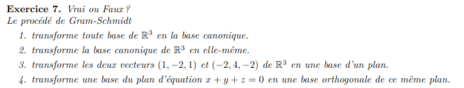
1) Faux
2) Vrai
3) Faux
4) Vrai

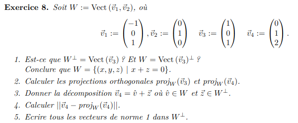
1) Oui, Oui, vrai aussi grace au tricks noté des vecteur perp = contrainte
2)
$$proj_W(v_3)=(0,0,0)$$
$$proj_W(v_4)=(-1,1,1)$$
3)
$$v_4=(-1,1,1)+(1,0,1)$$
4)
$$||v_4-proj_w(v_4)||=||(1,0,1)||=\sqrt{2}$$
5)
$$(1/\sqrt2,0,1/\sqrt2)$$
$$(-1/\sqrt2,0,-1/\sqrt2)$$
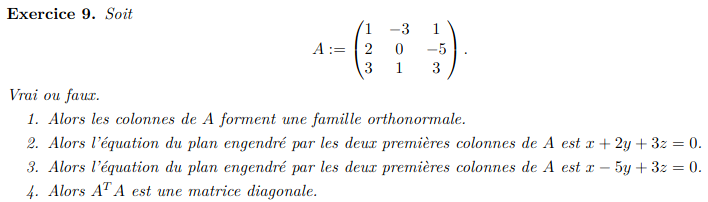
1) faux
2) faux
3) Vrai
4) Vrai

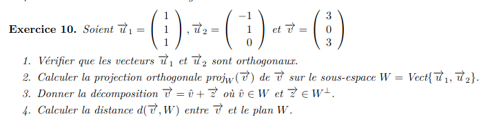
1)
$$u_1 * u_2 = -1+1+0=0$$
2)
$$proj_W(\vec v)=2 \vec u_1-3/2 \vec u_2=(7/2, 1/2,2)$$
3) 
$$W^{\perp}=u_1 \times u_2=(-1, -1, 2)$$
$$\vec v = (7/2, 1/2,2) + 1/2(-1,-1, 2)$$
4)
$$||(3,0,3) - (7/2, 1/2,2) ||=||(-1/2,-1/2,1)||=\sqrt{3/2}$$
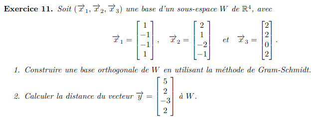
$$(1,-1,-1,1), (2,1,-2,-1), (2,2,0,2)$$
$$(1,-1,-1,1)$$
$$(2,1,-2,-1)-1/2*(1,-1,-1,1)=(3/2, 3/2, -3/2, -3/2)=(1,1,-1,-1)$$
$$ (2,2,0,2)-1/2(1,-1,-1,1)-1/2*(1,1,-1,-1)=(1, 2,1,2)$$

$$B_{\perp}=\{(1,-1,-1,1), (1,1,-1,-1),(1, 2,1,2) \}$$
$$proj_W(y)=(2, 2,1)$$
$$(5,1,-3,2)$$
$$||(5,1,-3,2)-(5,2,-3,2)||=1$$