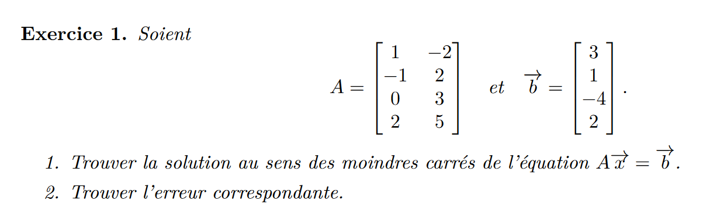
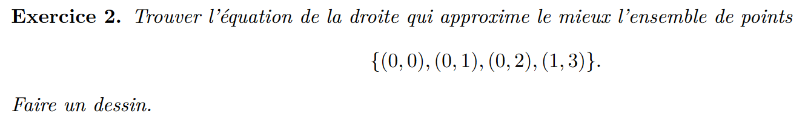
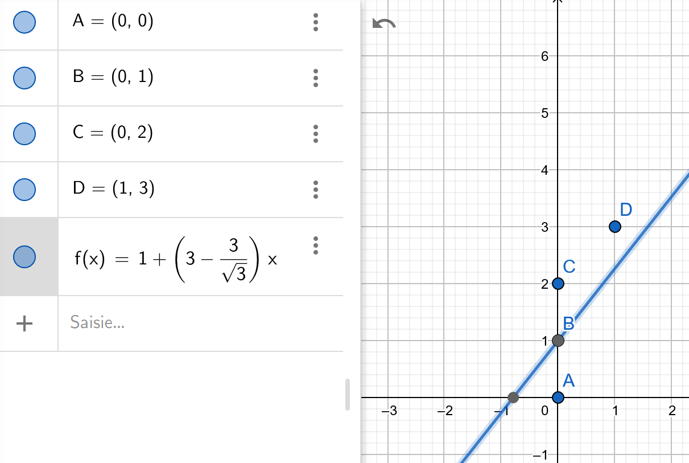
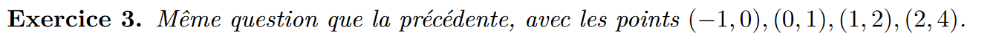
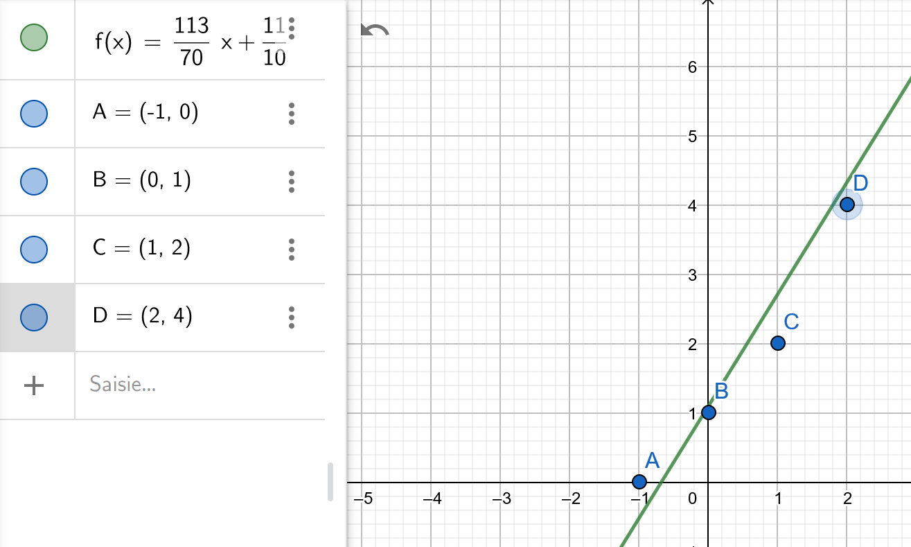
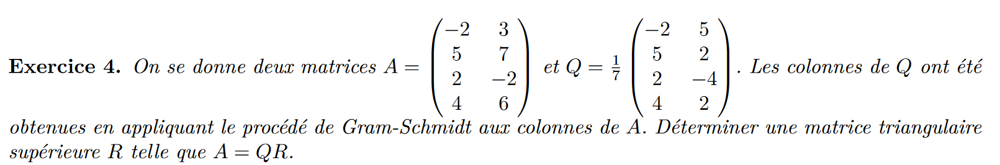
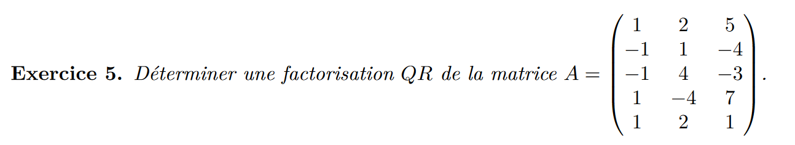
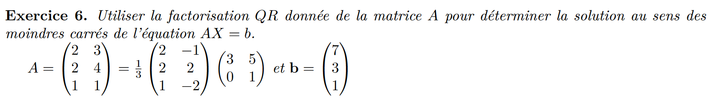

1)
$$(-2, 2, 3, 5)-(1,-1,0,2)=(-3, 3, 3, 3)$$
$$Q=\begin{pmatrix}
1 & -3 \\
-1 & 3 \\
0 & 3 \\
2 & 3 \\
\end{pmatrix}$$
$$R=\begin{pmatrix}
6 & 6 \\
0 & 36 \\
\end{pmatrix}$$
$$\begin{pmatrix}
1 & -1 & 0 & 2 \\
-3 & 3 & 3 & 3 \\
\end{pmatrix}\begin{pmatrix}
1 & -3 \\
-1 & 3 \\
0 & 3 \\
2 & 3 \\
\end{pmatrix} \begin{pmatrix}
x\\
y \\
\end{pmatrix} =\begin{pmatrix}
1 & -1 & 0 & 2 \\
-3 & 3 & 3 & 3 \\
\end{pmatrix}\begin{pmatrix}
3 \\
1 \\
-4 \\
2 \\
\end{pmatrix} $$

$$\begin{pmatrix}
6 & 6 \\
0 & 36 \\
\end{pmatrix} \begin{pmatrix}
x\\
y \\
\end{pmatrix} =\begin{pmatrix}
6 \\
-12 \\
\end{pmatrix} $$

$$\begin{pmatrix}
1/6 & -1/36 \\
0 & 1/36 \\
\end{pmatrix} \begin{pmatrix}
6 \\
-12 \\
\end{pmatrix} =\begin{pmatrix}
4/3\\
-1/3 \\
\end{pmatrix} $$

2)

$$\begin{pmatrix}
1 & -2 \\
-1 & 2 \\
0 & 3 \\
2 & 5 \\
\end{pmatrix} \begin{pmatrix}
4/3\\
-1/3 \\
\end{pmatrix} =\begin{pmatrix}
2 \\
-2 \\
-1 \\
1 \\
\end{pmatrix} $$
$$||\begin{pmatrix}
2 \\
-2 \\
-1 \\
1 \\
\end{pmatrix} -\begin{pmatrix}
3 \\
1 \\
-4 \\
2 \\
\end{pmatrix}||=||\begin{pmatrix}
-1 \\
-3\\
3 \\
-1 \\
\end{pmatrix}||=\sqrt{20}$$
erreur  = racine(20)

$$X\beta=y$$
$$\begin{pmatrix}
0 & 1\\
0 & 1\\
0 & 1\\
1 & 1\\
\end{pmatrix}\begin{pmatrix}
\beta_1 \\
\beta_0 \\
\end{pmatrix}=\begin{pmatrix}
0\\
1\\
2\\
3\\
\end{pmatrix}$$
$$Q=\begin{pmatrix}
0 & 1/\sqrt(3)\\
0 & 1/\sqrt(3)\\
0 & 1/\sqrt(3)\\
1 & 0\\
\end{pmatrix}$$
$$R=\begin{pmatrix}
1 & 1\\
0 & 3/\sqrt(3)\\
\end{pmatrix}$$
$$R^{-1}=\begin{pmatrix}
1 & -1\\
0 & \sqrt(3)/3\\
\end{pmatrix}$$
$$\beta= R^{-1}Q^Ty$$
$$\begin{pmatrix}
1 & -1\\
0 & \sqrt(3)/3\\
\end{pmatrix}\begin{pmatrix}
3\\
3/\sqrt{3}\\
\end{pmatrix}=\begin{pmatrix}
3-3/\sqrt{3}\\
1\\
\end{pmatrix}$$
$$y=1+(3-3/\sqrt{3})x$$

ATTENTION A METTRE LES VECTEUR COLLONE DE AX+B DANS LE BON ORDRE
$$X\beta=y$$
$$\begin{pmatrix}
-1 & 1\\
0 & 1\\
1 & 1\\
2 & 1\\
\end{pmatrix}\begin{pmatrix}
\beta_1 \\
\beta_0 \\
\end{pmatrix}=\begin{pmatrix}
0\\
1\\
2\\
4\\
\end{pmatrix}$$
$$v_1=x_1$$ 
$$v_2=x_2-\frac{\braket{u_2, v_1}}{||v_1||^2}v_1$$
$$(1,1,1,1)-1/3(-1,0,1,2) =(4/3, 1, 2/3, 1/3)$$
$$14/9+9/9+4/9+1/9=\sqrt(28)/3$$
$$Q=\begin{pmatrix}
-1/\sqrt6 & 4/\sqrt(28)\\
0 & 3/\sqrt(28)\\
1/\sqrt6 & 2/\sqrt(28)\\
2/\sqrt6 & 1/\sqrt(28)\\
\end{pmatrix}$$

$$R=\begin{pmatrix}
\sqrt6 & 1/3*\sqrt6\\
0 & 5/\sqrt{7}\\
\end{pmatrix}$$
$$R^{-1}=\begin{pmatrix}
1/\sqrt6 & -1/15*\sqrt7\\
0 & \sqrt7/5\\
\end{pmatrix}$$
$$\beta= R^{-1}Q^Ty$$

$$\begin{pmatrix}
1/\sqrt6 & -1/15*\sqrt7\\
0 & \sqrt7/5\\
\end{pmatrix}\begin{pmatrix}
-1/\sqrt6 & 4/\sqrt(28)\\
0 & 3/\sqrt(28)\\
1/\sqrt6 & 2/\sqrt(28)\\
2/\sqrt6 & 1/\sqrt(28)\\
\end{pmatrix}\begin{pmatrix}
0\\
1\\
2\\
4\\
\end{pmatrix}=\begin{pmatrix}
1/\sqrt6 & -1/15*\sqrt7\\
0 & \sqrt7/5\\
\end{pmatrix}\begin{pmatrix}
10/\sqrt6\\
 11/2\sqrt{7}\\
\end{pmatrix}=\begin{pmatrix}
113/70\\
11/1\\
\end{pmatrix}$$

$$y=113/70+11/10$$

$$\begin{pmatrix}
-1 & 1\\
0 & 1\\
1 & 1\\
2 & 1\\
\end{pmatrix} \begin{pmatrix}
113/70\\
11/10\\
\end{pmatrix} =\begin{pmatrix}
-36/70 \\
11/10 \\
190/70 \\
303/70 \\
\end{pmatrix} $$

$$R=\begin{pmatrix}
7 & 7\\
0 & 7\\
\end{pmatrix}$$

$$\begin{pmatrix}
1 & 2 & 5\\
-1 & 1 & -4\\
-1 & 4 & -3\\
1 & -4 & 7\\
1 & 2 & 1\\
\end{pmatrix}$$
$$v_2=x_2-\frac{\braket{u_2, v_1}}{||v_1||^2}v_1$$
$$(1, -1, -1, 1, 1)/\sqrt{5}$$
$$(2, 1, 4, -4, 2)+5/5(1, -1, -1, 1, 1)=(3,0,3,-3,3)/6$$
$$(5, -4, -3, 7, 1)-4(1, -1, -1, 1, 1)+3(3,0,3,-3,3)=(10,0, 10, -6, 6)/\sqrt{272}$$
$$Q= \begin{pmatrix}
1 & 1/2 & 10/\sqrt{272}\\
-1 & 0 & 0\\
-1 & 1/2 & 10/\sqrt{272}\\
1 & -1/2 &  -6/\sqrt{272}\\
1 & 1/2 & 6/\sqrt{272}\\
\end{pmatrix}$$

$$R= \begin{pmatrix}
5/\sqrt{5} & -5/\sqrt{5} & 20/\sqrt{5}\\
0 & 6 & -2\\
0 & 0 & -16/\sqrt{272}\\
\end{pmatrix}$$

$$\begin{pmatrix}
1/3 & -5\\
0 & 1 \\
\end{pmatrix}\begin{pmatrix}
2/3 & 2/3 & 1/3\\
-1/3 & 2/3 & -2/3\\
\end{pmatrix}\begin{pmatrix}
7\\
3\\
1\\
\end{pmatrix}=\begin{pmatrix}
1/3 & -5\\
0 & 1 \\
\end{pmatrix}\begin{pmatrix}
7\\
-1\\
\end{pmatrix}=\begin{pmatrix}
22/3\\
-1\\
\end{pmatrix}$$