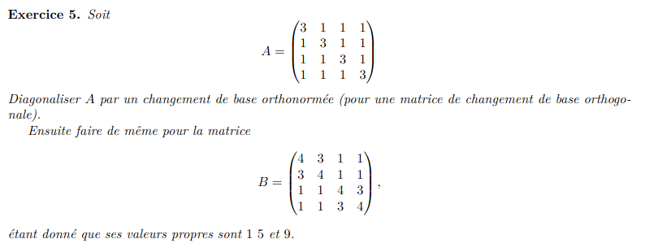
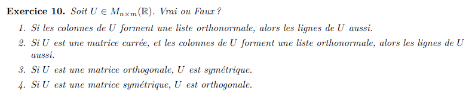

AB: Vrai
AC: Faux

$$\frac{1}{5}\begin{pmatrix}
3 & 4 & \gamma \\
\alpha & -3 & 0 \\
0 & \beta & \sigma \\
\end{pmatrix}$$

$$\begin{pmatrix}
3*4 & 4\gamma & 3\gamma \\
-3*\alpha & 0 & 0 \\
0 & \beta*\sigma & 0 \\
\end{pmatrix}$$
$$\gamma = 0$$
$$\alpha=4$$
$$ \beta=0$$
$$\sigma=\pm 5$$
la matrice doit etre simmétrique et le produit d'une collone avec elle meme =1 (pas oublier le coeef devant la matrice)

$$A=\frac{1}{7}\begin{pmatrix}
2 & 5 & 2 & 4 \\
-5 & 2 & -4 & 2 \\
-2 & 4 & 2 & -5 \\
-4 & -2 & 5 & 2 \\
\end{pmatrix}$$
est orthogonal
$$A^{-1}=A^T=\frac{1}{7}\begin{pmatrix}
2 & -5 & -2 & -4 \\
5 & 2 & 4 & -2 \\
2 & -4 & 2 & 5 \\
4 & 2 & -5 & 2 \\
\end{pmatrix}$$

$$B=\begin{pmatrix}
0 & \frac{1}{\sqrt2} & 0 & \frac{-1}{\sqrt3} \\
1 & 0 & 0 & \frac{-1}{\sqrt3}  \\
0 & \frac{1}{\sqrt2} & 0 & \frac{1}{\sqrt3}  \\
0 & 0 & 1 & 0 \\
\end{pmatrix}$$
B n'est PAS orthogonal

$$A=\begin{pmatrix}
1 & -1 & 1 \\
0 & 1 & 2 \\
-1 & -1 & 1 \\
0 & 1 & 0 \\
\end{pmatrix}$$
le produit de toutes les combinaison de collones est nul

$$U=\begin{pmatrix}
1/\sqrt{2} & -1/2 & 1\sqrt{6} \\
0 & 1/2 & 2/\sqrt{6} \\
-1/\sqrt{2} & -1/2 & 1\sqrt{6} \\
0 & 1/2 & 0 \\
\end{pmatrix}$$

$$A=\begin{pmatrix}
3 & 1 & 1 & 1 \\
1 & 3 & 1 & 1 \\
1 & 1 & 3 & 1 \\
1 & 1 & 1 & 3 \\
\end{pmatrix}$$

$$A=\begin{pmatrix}
3-t & 1 & 1 & 1 \\
1 & 3-t & 1 & 1 \\
1 & 1 & 3-t & 1 \\
1 & 1 & 1 & 3-t \\
\end{pmatrix}$$

$$A=\begin{pmatrix}
0 & -8+6t-t^2 & t-2 & t-2 \\
1 & 3-t & 1 & 1 \\
0 & t-2 & 2-t & 0 \\
0 & t-2 & 0 & 2-t \\
\end{pmatrix}$$

$$A=\begin{pmatrix}
0 & -12+8t-t^2 & 0 & 0 \\
1 & 3-t & 1 & 1 \\
0 & t-2 & 2-t & 0 \\
0 & t-2 & 0 & 2-t \\
\end{pmatrix}$$
(-12+8t-t^2)(2-t)(2-t)
-(12-8t+t^2)(2-t)(2-t)
-(t-6)(t-2)(t-2)(t-2)

$$A=\begin{pmatrix}
3-t & 1 & 1 & 1 \\
1 & 3-t & 1 & 1 \\
1 & 1 & 3-t & 1 \\
1 & 1 & 1 & 3-t \\
\end{pmatrix}$$
$$E_6 : $$
$$A=\begin{pmatrix}
-3 & 1 & 1 & 1 \\
1 & -3 & 1 & 1 \\
1 & 1 & -3 & 1 \\
1 & 1 & 1 & -3 \\
\end{pmatrix}$$

$$A=\begin{pmatrix}
1 & -11 & 5 & 5 \\
0 & 8 & -4 & -4 \\
0 & 12 & -8 & -4 \\
0 & 12 & -4 & -8 \\
\end{pmatrix}$$

$$A=\begin{pmatrix}
1 & 0 & 0 & -1 \\
0 & 1 & 0 & -1 \\
0 & 0 & 1 & -1 \\
0 & 0 & 0 & 0 \\
\end{pmatrix}$$
$$(1,1,1,1)$$
$$E_2 :$$
$$A=\begin{pmatrix}
1 & 1 & 1 & 1 \\
0 & 0 & 0 & 0 \\
0 & 0 & 0 & 0 \\
0 & 0 & 0 & 0 \\
\end{pmatrix}$$
$$(1,-1,0,0)$$
$$(1,0,-1,0)$$
$$(1,0,0,-1)$$

$$A_c=[Id]_{CB}A_B[Id]_{BC}=\begin{pmatrix}
1/2 & 1/\sqrt2 & 1/\sqrt2 & 1/\sqrt2 \\
1/2 & -1/\sqrt2 & 0 & 0 \\
1/2 & 0 & -1/\sqrt2 & 0 \\
1/2 & 0 & 0 & -1/\sqrt2 \\
\end{pmatrix}\begin{pmatrix}
6 & 0 & 0 & 0 \\
0 & 2 & 0 & 0 \\
0 & 0 & 2 & 0 \\
0 & 0 & 0 & 2 \\
\end{pmatrix}\begin{pmatrix}
1/2 & 1/2 & 1/2 & 1/2 \\
1/\sqrt2 & -1/\sqrt2 & 0 & 0 \\
1/\sqrt2 & 0 & -1/\sqrt2 & 0 \\
1/\sqrt2 & 0 & 0 & -1/\sqrt2 \\
\end{pmatrix}$$

$$B=\begin{pmatrix}
9 & 20 & 12 \\
-12 & 15 & -16 \\
-20 & 0 & 15 \\
\end{pmatrix}$$
1)
$$v_1 * v_2=9*20-12*15+0=0$$
$$v_2 * v_3=12*20-16*15+0=0$$
$$v_1 * v_3=9*12+12*16-20*15=0$$
2)
$$||v_1||=\sqrt{81+144+400}=\sqrt{625}=25$$
$$||v_2||=\sqrt{225+400}=\sqrt{625}=25$$
$$||v_3||=\sqrt{144+225+256}=\sqrt{625}=25$$
3)
$$B^TB=\begin{pmatrix}
625 & 0 & 0 \\
0 & 625 & 0 \\
0 & 0 & 625 \\
\end{pmatrix}$$
4)
$$B^TBB^T=625*\begin{pmatrix}
9 & -12 & -20 \\
20 & 15 & 0 \\
12 & -16 & 15 \\
\end{pmatrix}$$
5)
oui, 
\begin{pmatrix}
625 & 0 & 0 \\
0 & 625 & 0 \\
0 & 0 & 625 \\
\end{pmatrix}$$
6)
$$U=\begin{pmatrix}
1 & 0 & 0 \\
0 & 1 & 0 \\
0 & 0 & 1 \\
\end{pmatrix}$$

1)
on montre que si l'espace ligne est orthogonal, alors l'espace collone l'est aussi.
donc si la norme de chaque vecteur collone est 1, celles des collones doit aussie etre de 1
2)
par définition sont determinant =+- 1 
donc ses valeurs propre ne peuvent etre que + ou - 1
3)
$$U=\frac{1}{100}\begin{pmatrix}
36 & 48 & -80 \\
-80 & 60 & 0 \\
48 & 64 & 60 \\
\end{pmatrix}$$
$$v_1 * v_2=36*48-80*60+48*64=0$$
$$v_2 * v_3=-80*48+60*64=0$$
$$v_1 * v_3=-80*36+60*48=(2*2*2*3*2*2*5*2*3)-(2*2*2*2*5*2*2*3*3)=0$$

$$det(U-I)=\frac{1}{100}\begin{pmatrix}
-64 & 48 & -80 \\
-80 & -40 & 0 \\
48 & 64 & -40 \\
\end{pmatrix}=0$$

$$det(U-I)=\frac{1}{100}\begin{pmatrix}
0 & 0 & 0 \\
-80 & -40 & 0 \\
48 & 64 & -40 \\
\end{pmatrix}=0$$

a)
C, est une matrice diagonal
b)
B l'application est linéaire
c)
B Si... alors KerA est nul

a) B la matrice A est diagonalisable ortogonalement
b) 
symmétrique donc 
D les valeurs propre de A sont des nombre entier -> faux

2 1 x ->y=4/3
1 2 y ->x=1/3
$$A \hat X = proj_W(b)$$
quand b n'est pas solutions. on trouve ainsi la solution la plus proche.
méthode plus rapide :
$$A^TAX=A^Tb$$
pour avoir une solutions des moindre carré (solutions la plus proche)
$$B: \hat x_2=4/3$$

A est symmétrique

1) Vrai
2) Vrai
3) Faux
4) Vrai

$$A=\begin{pmatrix}
1 & 0 \\
0 & -3 \\
\end{pmatrix}$$
$$A^TA=\begin{pmatrix}
1 & 0 \\
0 & 9 \\
\end{pmatrix}$$
$$\sigma =1, 3$$

$$B=\begin{pmatrix}
\sqrt6 & 1 \\
0 & \sqrt6 \\
\end{pmatrix}$$
$$B^TB=\begin{pmatrix}
6 & \sqrt6 \\
\sqrt6 & 7 \\
\end{pmatrix}$$
$$(6-t)(7-t)-6=t^2-13t+36=(t-9)(t-4)$$
$$\sigma =2, 3$$
$$$$

$$Z^TZ=\begin{pmatrix}
1 & -2 & 2 \\
-1 & 2 & -2 \\
\end{pmatrix}\begin{pmatrix}
1 & -1 \\
-2 & 2 \\
2 & -2 \\
\end{pmatrix}=\begin{pmatrix}
9 & -9 \\
-9 & 9 \\
\end{pmatrix}$$

$$Det(Z^TZ)=\begin{pmatrix}
9-t & -9 \\
-9 & 9-t \\
\end{pmatrix}$$
$$(9-t)(9-t)-81$$
$$-t^2-18+81-81$$
$$t^2+18$$
$$(t-3i\sqrt2)(t+3i\sqrt2)$$
$$\sigma = \{\sqrt{3i\sqrt2}, -\sqrt{3i\sqrt2}\}$$
