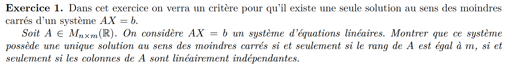

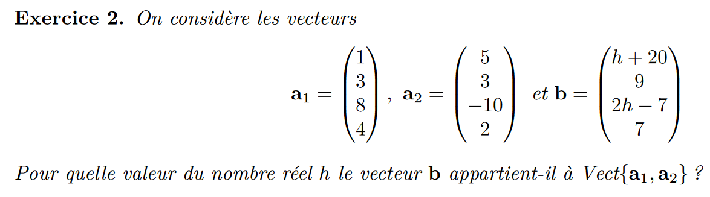

$$\begin{pmatrix}
1 \\
3 \\
8 \\
4 \\
\end{pmatrix}\begin{pmatrix}
4 \\
0 \\
-18 \\
-2 \\
\end{pmatrix}=\begin{pmatrix}
h+20 \\
9 \\
2h-7 \\
7 \\
\end{pmatrix}$$

$$\begin{pmatrix}
4*2.5=10 \\
0 \\
-18*2.5=-45 \\
-2*2.5=-5\\
\end{pmatrix}=\begin{pmatrix}
h+17 \\
0 \\
2h-31 \\
-5 \\
\end{pmatrix}$$
$$h=-7$$

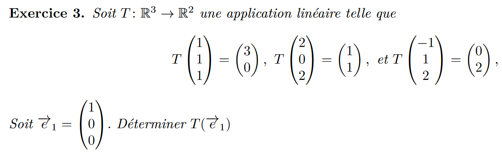

$$\begin{pmatrix}
1 & 2 & -1 & | & 1 & 0 & 0 \\
1 & 0 & 1 & | & 0 & 1 & 0 \\
1 & 2 & 2 & | & 0 & 0 & 1 \\
\end{pmatrix}$$
$$\begin{pmatrix}
1 & 2 & -1 & | & 1 & 0 & 0 \\
0 & -2 & 2 & | & -1 & 1 & 0 \\
0 & 0 & 3 & | & -1 & 0 & 1 \\
\end{pmatrix}$$
$$\begin{pmatrix}
1 & 0 & 0 & | & 1/3 & 1 & -1/3 \\
0 & 1 & 0 & | & 1/2-1/3 & -1/2 & 1/3 \\
0 & 0 & 1 & | & -1/3 & 0 & 1/3 \\
\end{pmatrix}$$
$$\vec {e_1}_B = (1/3, 1/6, -1/3) $$
$$\vec {e_1}_B = (7/6, -1/2) $$

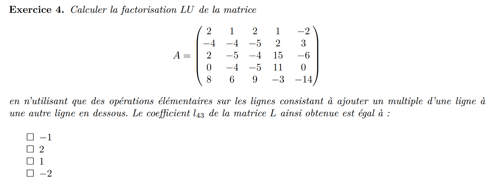

$$\begin{pmatrix}
2 & 1 & 2 & 1 & -2 \\
-4 & -4 & -5 & 2 & 3 \\
2 & -5 & -4 & 15 & -6 \\
0 & -4 & -5 & 11 & 0 \\
8 & 6 & 9 & -3 & -14 \\
\end{pmatrix}$$

$$\begin{pmatrix}
2 & 1 & 2 & 1 & -2 \\
0 & -2 & -1 & 4 & -1 \\
0 & -6 & -6 & 14 & -4 \\
0 & -4 & -5 & 11 & 0 \\
0 & 2 & 1 & -7 & -6 \\
\end{pmatrix}$$

3 + 2t(t + 1) + 
2(t − 1)(t + 1)

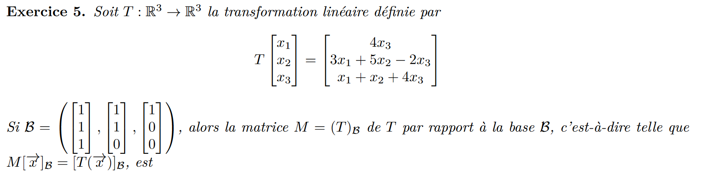

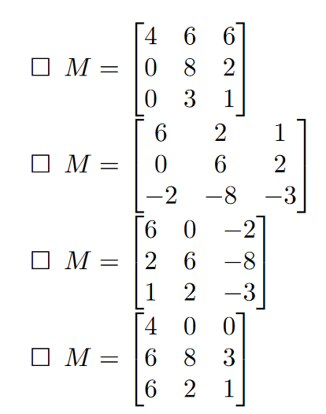

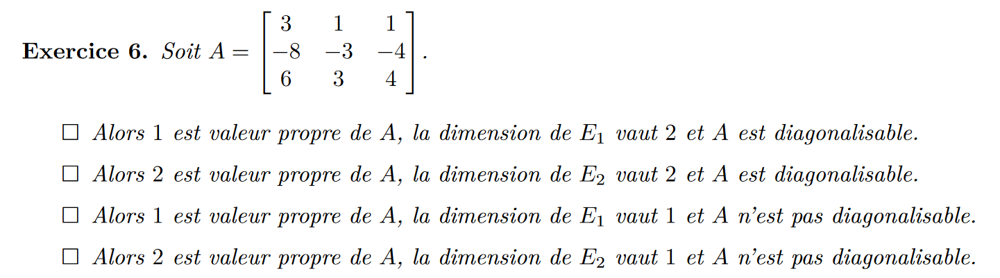

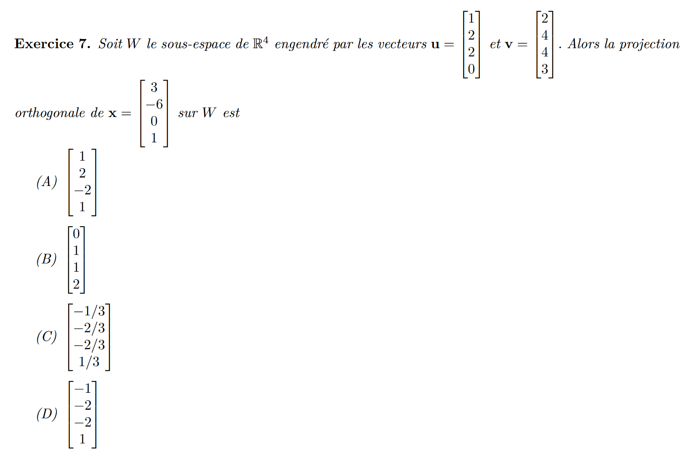

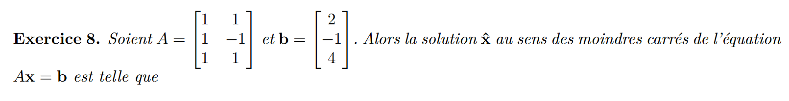

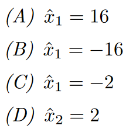

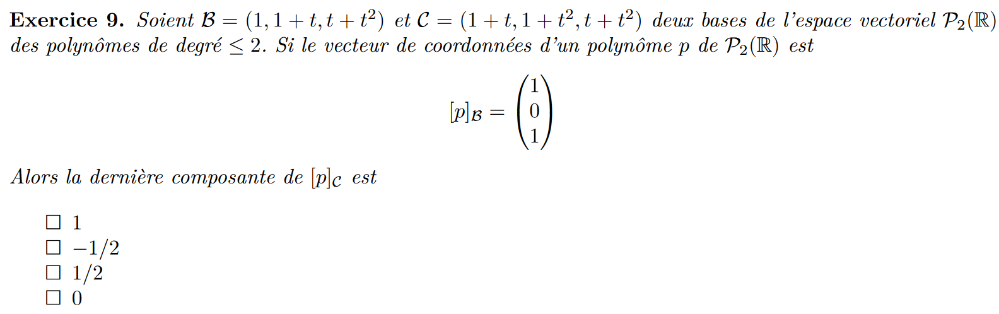

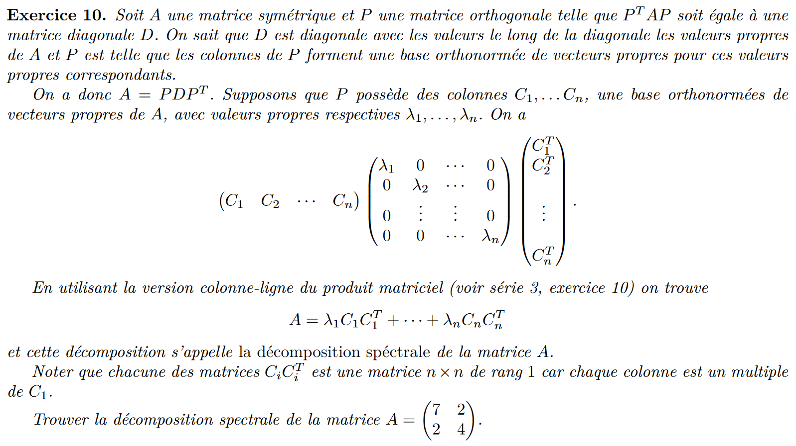

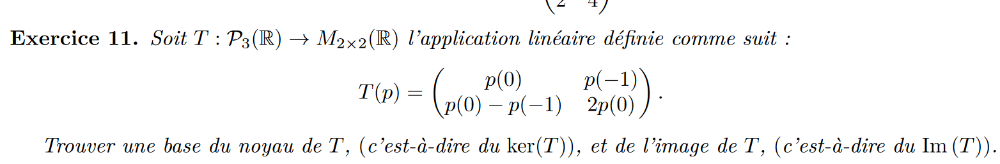

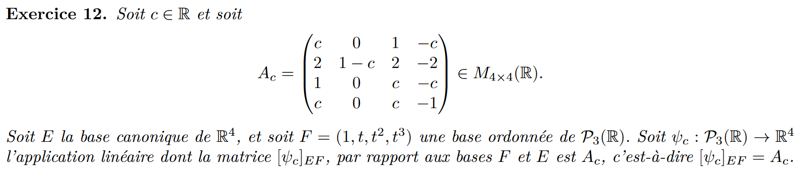

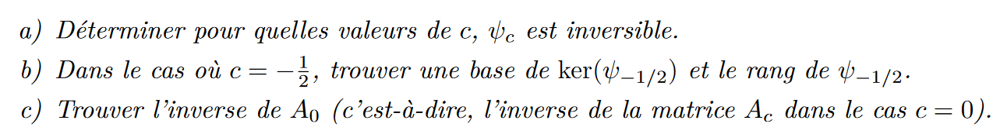

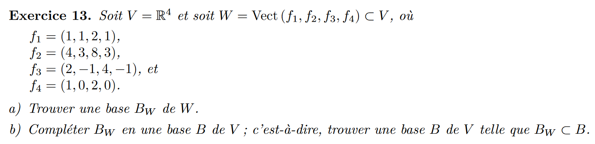

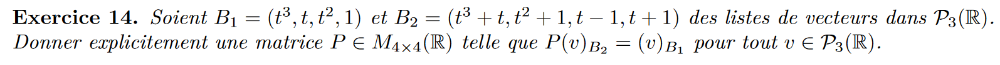

