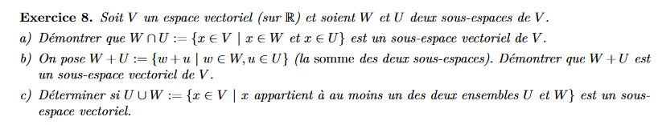

# Série 3

$$
A=\begin{pmatrix}
  3 & -7 \\
  -6 & 13 \\
\end{pmatrix} 
$$

$$
A'=\frac{1}{39-42}\begin{pmatrix}
  13 & 7 \\
  6 & 3 \\
\end{pmatrix} 
$$

$$
A'B=\frac{1}{-3}\begin{pmatrix}
  13 & 7 \\
  6 & 3 \\
\end{pmatrix}\begin{pmatrix}
  -4\\
  1 \\
\end{pmatrix}=\begin{pmatrix}
  15\\
  7 \\
\end{pmatrix}
$$

D pas inverslble car pas nxn

$$
C=\begin{pmatrix}
  1 & 0 & 0 & 0 \\
  2 & 5 & 0 & 0 \\
  3 & 6 & 8 & 0 \\
  4 & 7 & 9 & 10 \\
\end{pmatrix} 
$$

$$
C^{-1}=\begin{pmatrix}
  1 & 0 & 0 & 0 \\
  0 & 1 & 0 & 0 \\
  0 & 0 & 1 & 0 \\
  0 & 0 & 0 & 1 \\
\end{pmatrix} 
$$

$$
C=\begin{pmatrix}
  1 & 0 & 0 & 0 \\
  0 & 5 & 0 & 0 \\
  0 & 6 & 8 & 0 \\
  0 & 7 & 9 & 10 \\
\end{pmatrix} 
$$

$$
C^{-1}=\begin{pmatrix}
  1 & 0 & 0 & 0 \\
  -2 & 1 & 0 & 0 \\
  -3 & 0 & 1 & 0 \\
  -4 & 0 & 0 & 1 \\
\end{pmatrix} 
$$

$$
C=\begin{pmatrix}
  1 & 0 & 0 & 0 \\
  0 & 1 & 0 & 0 \\
  0 & 0 & 8 & 0 \\
  0 & 0 & 9 & 10 \\
\end{pmatrix} 
$$

$$
C^{-1}=\begin{pmatrix}
  1 & 0 & 0 & 0 \\
  -2/5 & 1/5 & 0 & 0 \\
  -3 & -6/5 & 1 & 0 \\
  -4 & -7/5 & 0 & 1 \\
\end{pmatrix} 
$$

$$
C=\begin{pmatrix}
  1 & 0 & 0 & 0 \\
  0 & 1 & 0 & 0 \\
  0 & 0 & 1 & 0 \\
  0 & 0 & 0 & 10 \\
\end{pmatrix} 
$$

$$
C^{-1}=\begin{pmatrix}
  1 & 0 & 0 & 0 \\
  -2/5 & 1/5 & 0 & 0 \\
  -3/8 & -6/40 & 1/8 & 0 \\
  -4+27/8 & -7/5+54/40 & -6/8 & 1 \\
\end{pmatrix} 
$$

$$
C=\begin{pmatrix}
  1 & 0 & 0 & 0 \\
  0 & 1 & 0 & 0 \\
  0 & 0 & 1 & 0 \\
  0 & 0 & 0 & 1 \\
\end{pmatrix} 
$$

$$
C^{-1}=\begin{pmatrix}
  1 & 0 & 0 & 0 \\
  -2/5 & 1/5 & 0 & 0 \\
  -3/8 & -6/40 & 1/8 & 0 \\
  -4/10+27/80 & -1/200 & -3/40 & 1/10 \\
\end{pmatrix} 
$$

$$
B=\begin{pmatrix}
  1 & 2 & 3 & 4 \\
  0 & 5 & 6 & 7 \\
  0 & 0 & 8 & 9 \\
  0 & 0 & 0 & 10 \\
\end{pmatrix} 
$$

$$
B^{-1}=\begin{pmatrix}
  1 & 0 & 0 & 0 \\
  0 & 1 & 0 & 0 \\
  0 & 0 & 1 & 0 \\
  0 & 0 & 0 & 1 \\
\end{pmatrix} 
$$

$$
B=\begin{pmatrix}
  1 & 2 & 3 & 0 \\
  0 & 5 & 6 & 0 \\
  0 & 0 & 8 & 0 \\
  0 & 0 & 0 & 1 \\
\end{pmatrix} 
$$

$$
B^{-1}=\begin{pmatrix}
  1 & 0 & 0 &  -4/10 \\
  0 & 1 & 0 &  -7/10 \\
  0 & 0 & 1 & -9/10 \\
  0 & 0 & 0 & 1/10 \\
\end{pmatrix} 
$$

$$
B=\begin{pmatrix}
  1 & 2 & 0 & 0 \\
  0 & 5 & 0 & 0 \\
  0 & 0 & 1 & 0 \\
  0 & 0 & 0 & 1 \\
\end{pmatrix} 
$$

$$
B^{-1}=\begin{pmatrix}
  1 & 0 & -3/8 &  -4/10+27/80 \\
  0 & 1 & -1/8 &  -7/10+54/80 \\
  0 & 0 & 1/8 & -9/80 \\
  0 & 0 & 0 & 1/10 \\
\end{pmatrix} 
$$

$$
B=\begin{pmatrix}
  1 & 2 & 0 & 0 \\
  0 & 1 & 0 & 0 \\
  0 & 0 & 1 & 0 \\
  0 & 0 & 0 & 1 \\
\end{pmatrix} 
$$

$$
B^{-1}=\begin{pmatrix}
  1 & 0 & -3/8 &  -4/10+27/80 \\
  0 & 1/5 & -1/40 &  -2/400 \\
  0 & 0 & 1/8 & -9/80 \\
  0 & 0 & 0 & 1/10 \\
\end{pmatrix} 
$$

$$
B=\begin{pmatrix}
  1 & 0 & 0 & 0 \\
  0 & 1 & 0 & 0 \\
  0 & 0 & 1 & 0 \\
  0 & 0 & 0 & 1 \\
\end{pmatrix} 
$$

$$
B^{-1}=\begin{pmatrix}
  1 & -2/5 & -3/8+1/20 &  -4/10+27/80+1/100 \\
  0 & 1/5 & -1/40 &  -2/400 \\
  0 & 0 & 1/8 & -9/80 \\
  0 & 0 & 0 & 1/10 \\
\end{pmatrix} 
$$

$$
B=\begin{pmatrix}
  1 & 0 & 0 & 0 \\
  0 & 1 & 0 & 0 \\
  0 & 0 & 1 & 0 \\
  0 & 0 & 0 & 1 \\
\end{pmatrix} 
$$

$$
B^{-1}=\begin{pmatrix}
  1 & -2/5 & -13/40 &  -23/400 \\
  0 & 1/5 & -1/40 &  -1/200 \\
  0 & 0 & 1/8 & -9/80 \\
  0 & 0 & 0 & 1/10 \\
\end{pmatrix} 
$$

$$
A=\begin{pmatrix}
  1 & 3 & 0 & -1 \\
  0 & 1 & -2 & -1 \\
  2 & -6 & 3 & 2 \\
  3 & 5 & 8 & -3 \\
\end{pmatrix} 
$$

$$
A^{-1}=\begin{pmatrix}
  1 & 0 & 0 & 0 \\
  0 & 1 & 0 & 0 \\
  0 & 0 & 1 & 0 \\
  0 & 0 & 0 & 1 \\
\end{pmatrix} 
$$

$$
A=\begin{pmatrix}
  1 & 3 & 0 & -1 \\
  0 & 1 & -2 & -1 \\
  0 & -12 & 3 & 4 \\
  0 & -4 & 8 & -6 \\
\end{pmatrix} 
$$

$$
A^{-1}=\begin{pmatrix}
  1 & 0 & 0 & 0 \\
  0 & 1 & 0 & 0 \\
  -2 & 0 & 1 & 0 \\
  -3 & 0 & 0 & 1 \\
\end{pmatrix} 
$$

$$
A=\begin{pmatrix}
  1 & 3 & 0 & -1 \\
  0 & 1 & -2 & -1 \\
  0 & 0 & -21 & -8 \\
  0 & 0 & 0 & -10 \\
\end{pmatrix} 
$$

$$
A^{-1}=\begin{pmatrix}
  1 & 0 & 0 & 0 \\
  0 & 1 & 0 & 0 \\
  -2 & 12 & 1 & 0 \\
  -3 & 4 & 0 & 1 \\
\end{pmatrix} 
$$

$$
A=\begin{pmatrix}
  1 & 3 & 0 & -1 \\
  0 & 1 & -2 & -1 \\
  0 & 0 & -21 & -8 \\
  0 & 0 & 0 & 1 \\
\end{pmatrix} 
$$

$$
A^{-1}=\begin{pmatrix}
  1 & 0 & 0 & 0 \\
  0 & 1 & 0 & 0 \\
  -2 & 12 & 1 & 0 \\
  3/10 & -4/10 & 0 & -1/10 \\
\end{pmatrix} 
$$

$$
A=\begin{pmatrix}
  1 & 3 & 0 & 0 \\
  0 & 1 & -2 & 0 \\
  0 & 0 & -21 & 0 \\
  0 & 0 & 0 & 1 \\
\end{pmatrix} 
$$

$$
A^{-1}=\begin{pmatrix}
  1 & 0 & 0 & -1/10 \\
  0 & 1 & 0 & -1/10 \\
  -2 & 12 & 1 & -8/10 \\
  3/10 & -4/10 & 0 & -1/10 \\
\end{pmatrix} 
$$

$$
A=\begin{pmatrix}
  1 & 3 & 0 & 0 \\
  0 & 1 & -2 & 0 \\
  0 & 0 & 1 & 0 \\
  0 & 0 & 0 & 1 \\
\end{pmatrix} 
$$

$$
A^{-1}=\begin{pmatrix}
  1 & 0 & 0 & -1/10 \\
  0 & 1 & 0 & -1/10 \\
  2/21  & -12/21  & -1/21  & 8/210 \\
  3/10 & -4/10 & 0 & -1/10 \\
\end{pmatrix} 
$$

$$
A=\begin{pmatrix}
  1 & 3 & 0 & 0 \\
  0 & 1 & 0 & 0 \\
  0 & 0 & 1 & 0 \\
  0 & 0 & 0 & 1 \\
\end{pmatrix} 
$$

$$
A^{-1}=\begin{pmatrix}
  1 & 0 & 0 & -1/10 \\
  4/21 & 1-24/21 & -2/21 & 16/210-1/10 \\
  2/21  & -12/21  & -1/21  & 8/210 \\
  3/10 & -4/10 & 0 & -1/10 \\
\end{pmatrix} 
$$

$$
A=\begin{pmatrix}
  1 & 0 & 0 & 0 \\
  0 & 1 & 0 & 0 \\
  0 & 0 & 1 & 0 \\
  0 & 0 & 0 & 1 \\
\end{pmatrix} 
$$

$$
A^{-1}=\begin{pmatrix}
  1-12/21 & -3+24/7 & 2/7 & -1/10+15/210 \\
  4/21 & 1-24/21 & -2/21 & -5/210 \\
  2/21  & -12/21  & -1/21  & 8/210 \\
  3/10 & -4/10 & 0 & -1/10 \\
\end{pmatrix} 
$$

$$
A=\begin{pmatrix}
  1 & 0 & 0 & 0 \\
  0 & 1 & 0 & 0 \\
  0 & 0 & 1 & 0 \\
  0 & 0 & 0 & 1 \\
\end{pmatrix} 
$$

$$
A^{-1}=\begin{pmatrix}
  9/21 & 3/7 & 2/7 & -1/35 \\
  4/21 & -3/21 & -2/21 & -1/42 \\
  2/21  & -4/7  & -1/21  & 4/105 \\
  3/10 & -2/5 & 0 & -1/10 \\
\end{pmatrix} 
$$

$$
A=\begin{pmatrix}
  0 & 0 & 0 & 1 \\
  0 & 0 & 1 & 1 \\
  0 & 1 & 1 & 1 \\
  1 & 1 & 1 & 1 \\
\end{pmatrix} 
$$
$$
A^{-1}=\begin{pmatrix}
  1 & 0 & 0 & 0 \\
  0 & 1 & 0 & 0 \\
  0 & 0 & 1 & 0 \\
  0 & 0 & 0 & 1 \\
\end{pmatrix} 
$$
$$
A=\begin{pmatrix}
  0 & 0 & 0 & 1 \\
  0 & 0 & 1 & 0 \\
  0 & 1 & 1 & 0 \\
  1 & 1 & 1 & 0 \\
\end{pmatrix} 
$$
$$
A^{-1}=\begin{pmatrix}
  1 & 0 & 0 & 0 \\
  -1 & 1 & 0 & 0 \\
  -1 & 0 & 1 & 0 \\
  -1 & 0 & 0 & 1 \\
\end{pmatrix} 
$$
$$
A=\begin{pmatrix}
  1 & 0 & 0 & 0 \\
  0 & 1 & 0 & 0 \\
  0 & 0 & 1 & 0 \\
   0 & 0 & 0 & 1 \\
\end{pmatrix} 
$$
$$
A^{-1}=\begin{pmatrix}
  -1 & -1 & -1 & 1 \\
  -1 & -1 & 1 & 0 \\
  -1 & 1 & 0 & 0 \\
   1 & 0 & 0 & 0 \\
\end{pmatrix} 
$$

$$
B=\begin{pmatrix}
  0 & 0 & 1 & 0 \\
  0 & 0 & 0 & 1 \\
  1 & 0 & a & b \\
  0 & 1 & c & d \\
\end{pmatrix} 
$$
$$
B^{-1}=\begin{pmatrix}
  1 & 0 & 0 & 0 \\
  0 & 1 & 0 & 0 \\
  0 & 0 & 1 & 0 \\
  0 & 0 & 0 & 1 \\
\end{pmatrix} 
$$
$$
B=\begin{pmatrix}
  1 & 0 & 0 & 0 \\
  0 & 1 & 0 & 0 \\
  0 & 0 & 1 & 0 \\
  0 & 0 & 0 & 1 \\
\end{pmatrix} 
$$
$$
B^{-1}=\begin{pmatrix}
  -a & -b & 1 & 0 \\
  -c & -d & 0 & 1 \\
  1 & 0 & 0 & 0 \\
  0 & 1 & 0 & 0 \\
\end{pmatrix} 
$$

$$
A=\begin{pmatrix}
  3 & -7 & 2 \\
  -3 & 5 & 1 \\
  6 & -4 & 0 \\
\end{pmatrix} 
$$
$$
B=\begin{pmatrix}
  -7 \\
  5  \\
  2  \\
\end{pmatrix} 
$$

$$
U=\begin{pmatrix}
  3 & -7 & 2 \\
  -3 & 5 & 1 \\
  6 & -4 & 0 \\
\end{pmatrix} 
$$
$$
U=\begin{pmatrix}
  3 & -7 & 2 \\
  0 & -2 & 3 \\
  0 & 10 & -4 \\
\end{pmatrix} 
$$
L2=L2+L1
L3=L3-2L1
$$
U=\begin{pmatrix}
  3 & -7 & 2 \\
  0 & -2 & 3 \\
  0 & 0 & 11 \\
\end{pmatrix} 
$$
L3=L3+5L2
$$
L=\begin{pmatrix}
  1 & 0 & 0 \\
  -1 & 1 & 0 \\
  2 & 0 & 1 \\
\end{pmatrix}\begin{pmatrix}
  1 & 0 & 0 \\
  0 & 1 & 0 \\
  0 & -5 & 1 \\
\end{pmatrix} =
\begin{pmatrix}
  1 & 0 & 0 \\
  -1 & 1 & 0 \\
  2 & -5 & 1 \\
\end{pmatrix} 
$$

$$ 
LU=\begin{pmatrix}
  1 & 0 & 0 \\
  -1 & 1 & 0 \\
  2 & -5 & 1 \\
\end{pmatrix}  \begin{pmatrix}
  3 & -7 & 2 \\
  0 & -2 & 3 \\
  0 & 0 & 11 \\
\end{pmatrix} =\begin{pmatrix}
  3 & -7 & 2 \\
  -3 & 5 & 1 \\
  6 & -4 & 0 \\
\end{pmatrix} 
$$

LY=B
$$
L=\begin{pmatrix}
  1 & 0 & 0 \\
  -1 & 1 & 0 \\
  2 & -5 & 1 \\
\end{pmatrix}\begin{pmatrix}
  -7\\
  -2\\
  6\\
\end{pmatrix} =\begin{pmatrix}
  -7 \\
  5  \\
  2  \\
\end{pmatrix} 
$$

$$
UX=Y
$$

$$
U=\begin{pmatrix}
  3 & -7 & 2 \\
  0 & -2 & 3 \\
  0 & 0 & 11 \\
\end{pmatrix} 
\begin{pmatrix}
  17/11\\
  20/11\\
  6/11\\
\end{pmatrix}
=
\begin{pmatrix}
  -7\\
  -2\\
  6\\
\end{pmatrix}
$$
$$
X=\begin{pmatrix}
  3\\
  4\\
  -6\\
\end{pmatrix}or
\begin{pmatrix}
  17/11\\
  20/11\\
  6/11\\
\end{pmatrix}
$$

$$ 
A=\begin{pmatrix}
  2 & -6 & 6\\
  -4 & 5 & -7\\
  3 & 5 & -1\\
  -6 & 4 & -8\\
  8 & -3 & 9\\
\end{pmatrix}
$$

$$ 
A=\begin{pmatrix}
  2 & -6 & 6\\
  0 & -7 & 5\\
  0 & 14 & -10\\
  0 & -20 & 16\\
  0 & 21 & -15\\
\end{pmatrix}
$$
$$ 
A=\begin{pmatrix}
   1 & 0 & 0 & 0 & 0 \\
   2 & 1 & 0 & 0 & 0 \\
   -1.5 & 0 & 1 & 0 & 0 \\
   3 & 0 & 0 & 1 & 0 \\
   -4 & 0 & 0 & 0 & 1 \\
\end{pmatrix}
$$

$$ 
A=\begin{pmatrix}
  2 & -6 & 6\\
  0 & -7 & 5\\
  0 & 0 & 0\\
  0 & 0 & 0\\
  0 & 0 & 0\\
\end{pmatrix}
$$
$$ 
A=\begin{pmatrix}
   1 & 0 & 0 & 0 & 0 \\
   2 & 1 & 0 & 0 & 0 \\
   2.5 & 2 & 1 & 0 & 0 \\
   3-40/7 & -20/7 & 0 & 1 & 0 \\
   2 & 3 & 0 & 0 & 1 \\
\end{pmatrix}
$$

$$ 
U=\begin{pmatrix}
  2 & -6 & 6\\
  0 & -7 & 5\\
  0 & 0 & 0\\
  0 & 0 & 0\\
  0 & 0 & 0\\
\end{pmatrix}
$$
$$ 
L'=\begin{pmatrix}
   1 & 0 & 0 & 0 & 0 \\
   2 & 1 & 0 & 0 & 0 \\
   2.5 & 2 & 1 & 0 & 0 \\
   3-40/7 & -20/7 & 0 & 1 & 0 \\
   2 & 3 & 0 & 0 & 1 \\
\end{pmatrix}
$$
$$ 
L=\begin{pmatrix}
   1 & 0 & 0 & 0 & 0 \\
   -2 & 1 & 0 & 0 & 0 \\
   -2.5 & -2 & 1 & 0 & 0 \\
   -3+40/7 & 20/7 & 0 & 1 & 0 \\
   -2 & -3 & 0 & 0 & 1 \\
\end{pmatrix}
$$
LY=B
UX=Y
$$B=\begin{pmatrix}
   1 \\
   0  \\
   -2 \\
   0 \\
   1 \\
\end{pmatrix}$$
LY=B

$$LY=B\implies\begin{pmatrix}
   1 & 0 & 0 & 0 & 0 \\
   -2 & 1 & 0 & 0 & 0 \\
   -2.5 & -2 & 1 & 0 & 0 \\
   19/7 & 20/7 & 0 & 1 & 0 \\
   -2 & -3 & 0 & 0 & 1 \\
\end{pmatrix}\begin{pmatrix}
  1 \\
   2  \\
  4.5  \\
  -59/7  \\
  9  \\
\end{pmatrix}=\begin{pmatrix}
   1 \\
   0  \\
   -2 \\
   0 \\
   1 \\
\end{pmatrix}$$

UX=Y
$$ 
U=\begin{pmatrix}
  2 & -6 & 6\\
  0 & -7 & 5\\
  0 & 0 & 0\\
  0 & 0 & 0\\
  0 & 0 & 0\\
\end{pmatrix}\begin{pmatrix}
   \\
     \\
    \\
\end{pmatrix}=\begin{pmatrix}
  1 \\
   2  \\
  4.5  \\
  -59/7  \\
  9  \\
\end{pmatrix}
$$
Pas de solution

$$LY=B\implies\begin{pmatrix}
   1 & 0 & 0 & 0 & 0 \\
   -2 & 1 & 0 & 0 & 0 \\
   -2.5 & -2 & 1 & 0 & 0 \\
   19/7 & 20/7 & 0 & 1 & 0 \\
   -2 & -3 & 0 & 0 & 1 \\
\end{pmatrix}\begin{pmatrix}
  0 \\
   1  \\
  0  \\
  -6/7  \\
  0  \\
\end{pmatrix}=\begin{pmatrix}
   0 \\
   1  \\
   -2 \\
   2 \\
   -3 \\
\end{pmatrix}$$

$$\begin{pmatrix}
  2 & -6 & 6\\
  0 & -7 & 5\\
  0 & 0 & 0\\
  0 & 0 & 0\\
  0 & 0 & 0\\
\end{pmatrix}\begin{pmatrix}
    \\
    \\
    \\
\end{pmatrix}=
\begin{pmatrix}
  0 \\
   1  \\
  0  \\
  0  \\
  0  \\
\end{pmatrix}
$$
$$
z=\frac{1+7y}{5},
x=3y+\frac{6+42y}{10}
$$
.

a) h=5/2
b) h différent de 2
c) Vrai Vrai Faux Faux
d) Faux Vrai Vrai Faux
e) Vrai Faux Faux Faux
f) Vrai
g)Faux car pas d'élément neutre

$$
A=\begin{pmatrix}
  3 & -4 \\
  -5 & 1 \\
\end{pmatrix}
$$

$$
B=\begin{pmatrix}
  7 & 4 \\
  5 & k \\
\end{pmatrix}

$$

$$
AB=BA=\begin{pmatrix}
  7 & 4 \\
  5 & k \\
\end{pmatrix}\begin{pmatrix}
  3 & -4 \\
  -5 & 1 \\
\end{pmatrix}=\begin{pmatrix}
  3 & -4 \\
  -5 & 1 \\
\end{pmatrix}\begin{pmatrix}
  7 & 4 \\
  5 & k \\
\end{pmatrix}=\begin{pmatrix}
  1 & -24->k=9 \\
  -30 & -11 \\
\end{pmatrix}
$$
k doit etre égal a 9
$$
\begin{pmatrix}
  1 & 2 \\
  3 & 6 \\
\end{pmatrix}
\begin{pmatrix}
  3 & -8 \\
  2 & 3 \\
\end{pmatrix}=
\begin{pmatrix}
 7  & -2 \\
  21 & -6 \\
\end{pmatrix}
$$
$$
\begin{pmatrix}
  1 & 2 \\
  3 & 6 \\
\end{pmatrix}
\begin{pmatrix}
  5 & 2 \\
  1 & -2 \\
\end{pmatrix}=
\begin{pmatrix}
  7 & -2 \\
  21 & -6 \\
\end{pmatrix}
$$

$$
\begin{pmatrix}
  1 & 2 \\
  3 & 6 \\
\end{pmatrix}
\begin{pmatrix}
  a & b \\
  c & d \\
\end{pmatrix}=
\begin{pmatrix}
  a+2c=7 & b+2d=-2 \\
  3a+6c=21 & 3b+6d=-6 \\
\end{pmatrix}
$$

a) critère sur SEV

$$
W \subset V 

$$

$$
U \subset V 

$$

$$
x,y \in W \cap U, \lambda x+y \in W,  

$$

$$
z,w \in W \cap U, \mu z+w \in U,  

$$

$$
\lambda x+y, \mu z+w \in W \cap U, \gamma(\lambda x+y)+\mu z+w \in V,  \gamma, \lambda, \mu \in \R

$$

b)

$$
W \subset V 

$$

$$
U \subset V 

$$

$$
x,y \in W, \lambda x+y \in W+ U,  

$$

$$
z,w \in U, \mu z+w \in W + U,  

$$

$$
\lambda x+y, \mu z+w \in W + U, \gamma(\lambda x+y)+\mu z+w \in V,  \gamma, \lambda, \mu \in \R

$$

c)

$$
U \cup W \text{ n'est pas un SEV car } \exist \lambda \in \R,\exist w \in W,\exist u \in U, \lambda w+u \not \in U \cup W

$$

$$
A_{m \times n}=\begin{pmatrix}
  1 & 0 & 0  \\
  0 & 1 & 0  \\
  0 & 0 & 1  \\
  0 & 0 & 0  \\
\end{pmatrix} 
$$

$$
B_{n \times p}=\begin{pmatrix}
  0 & 1 & 0 & 0 \\
  0 & 0 & 1 & 0 \\
  0 & 0 & 0 & 10 \\
\end{pmatrix} 
$$

$$
AB=C_1L_1+ C_2L_2+C_3L_3+ C_4L_4

$$

$$
AB=\{\forall i,j : c_{ij}=\sum^n_{k=1}a_{ik}b_{kj}\}

$$