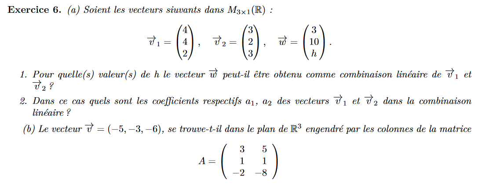
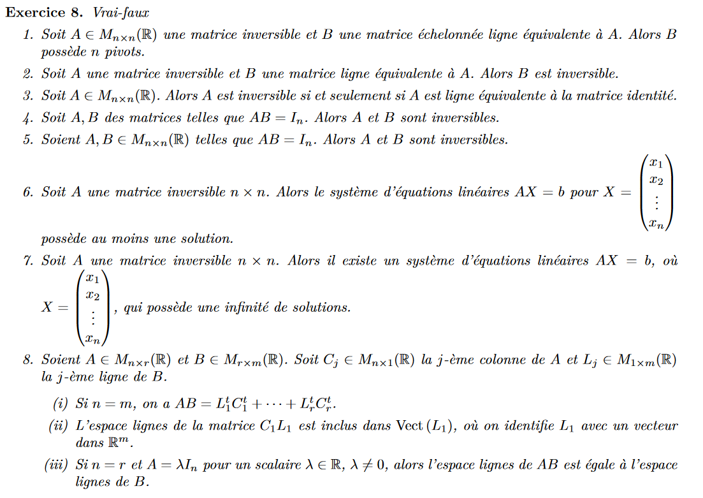

Série 4

a) 
$$ (\lambda a-\lambda b) $$
Inverse un axe de la dimmension, c'est une transformation linéaire donc VRAI
b)
$$ (\lambda a+(-\lambda) a) =(\lambda x,\lambda^2y)+(-\lambda x,\lambda^2y)=(0,2\lambda ^2y)$$
$$ (\lambda a+(\lambda) a) =(\lambda x,\lambda^2y)+(\lambda x,\lambda^2y)=(2\lambda x,2\lambda ^2y)$$
c'ette opération réstreite l'axe y a sa partie positive donc l'espace n'est plus bijectif -> FAUX

a) vrai
b) Vrai
c) FAUX (entier naturel, donc pas de négatif ni de réel mais a-b donne négatif)
d) Vrai
(x+a)(x+b)(x+c)(x+d)(x+e)(x+f)(x+g)(x+h)(x+1)

1) FAUX car de terme nul
2) VRAI
3) FAUX car ne passe pas par zero
4) VRAI
5) FAUX car cerlce donc pas plan ni droite
6) VRAI

dim(A)+dim(B)-dim(A AND B)=2+1-0=3
comme dim(R^3)=3 ils sont égaux

1) Vect((1,0,0),(0,1,0)) (un plan passant par zero)
2) Vect((1,0,0,0),(0,1,0,0),(0,0,1,0))

1)

on trouve les parametre a et b tel que a*v1 + b*v2 = w
4a=3-3b
4a+2b=10

b=-7
a=6
on déduis h
6*2-7*3=12-21=h
h=-9

2) les parametre sont 6 et -7

b)
3a+5b=-5
a+b=-3
-2a-8b=-6

a=-5
b=2
-2a-8b=-6
Oui il se trouve dans le plan engendré par les collones de la matrice

L1=(1,0,0,0)+(0,2,3,0)+4*(0,0,0,1)
L2=(0,2,3,0)
L3=(0,0,0,1)

(1,0,0)
(0,1,0)
(0,0,1)
qui est de R^3

1) Vrai car si ligne équivalente et que A inversible alors B inversible et inversible = n pivot
2) Vrai
3) Vrai
4) Faux (matrice non carré * transposé = 1)
(1,0)(1
        ,0)
5) Vrai
6) Vrai
7) Faux
8) 

Non ils ne sont pas linéairement dépendant car ils ne sont pas combinaison linéaire les un des autres

1) Vect(S)=P(R)
2) dim(S)=dim(P(R))
3) on montre que les vecteur de S sont linéairement indépendant (trivial) Dim(S)=3 =Dim(P2)

Oui ils sont linéairement dépendant car Dim(vecCol(M))=3 mais il y as 4 vecteur (principe des tirroir)

Non les vecteur sont linéaireemnt indépandant

on montre que tout t il n'existe pas de a,b ans R*
tel que a*sin^2(t)-b*cos(t)=0

les vecteurs v1 v2 v3 sont linéairement dépandant peu importe la valeur de h in R car v1 et v2 sont linéairement dépandant

Vrai
Fuax Pouquoi zero est dépandant de lui meme ??? 0 est combinaison linéaire de lui meme mais 1 est aussi combinaison linéaire de lui meme
Vrai
Faux
Faux
Vrai

$$2x-3t-y+11z=0 $$ 
$$2t-x-7z=0 $$ 

$$
A =\begin{pmatrix}
  2 & -1 & 11 & -3 \\
  -1 & 0 & -7 & 2 \\
  0 & 1 & 3 & -1 \\
  1 & -3 & -2 & 1 \\
\end{pmatrix}
$$

$$
A =\begin{pmatrix}
 1 & -3 & -2 & 1 \\
  0 & 5 & 15 & -5 \\
  0 & -3 & -9 & 3 \\
  0 & 1 & 3 & -1 \\
\end{pmatrix}
$$

$$
A =\begin{pmatrix}
 1 & 0 & 7 & -2 \\
  0 & 1 & 3 & -1 \\
  0 & 0 & 0 & 0 \\
  0 & 0 & 0 & 0 \\
\end{pmatrix}
$$

x=2t-7z
y=t-3z

Dim(2)