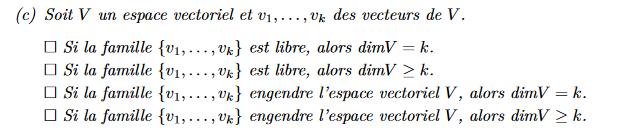

Dim(H)=3
(3 vecteur linéairement indépendant)

$$
\begin{pmatrix}
3 & 2 & -3 & 1 & 0 \\
1 & 2 & 0 & 1 & 0\\
2 & 0 & 1 & 1 & 0\\
2 & 4 & -4 & 1 & 0\\
\end{pmatrix}
$$

$$
\begin{pmatrix}
1 & 2 & 0 & 1 & 0\\
0 & -4 & -3 & -2 & 0 \\
0 & 0 & 4 & 1 & 0\\
0 & 0 & 0 & 0 & 0\\
\end{pmatrix}
$$
Dim(3) -> Dim(S)=1
$$
\begin{pmatrix}
1 & 0 & 0 & 0 & 3\\
0 &1& 0 & 0 &  4 \\
0 & 0 & 1 & 0 & -6\\
0 & 0 & 0 & 0 & 0\\
\end{pmatrix}
$$

$$B_{S}={(3,4,-6,0)} $$
(l'espace est une droite)

$$ \begin{pmatrix}
1 & -1 & 2 & 0\\
0 &5& -5 & -1  \\
0 & 1 & -2 & 2 \\
0 & 0 & 0 & -1\\
\end{pmatrix}  $$

$$ \begin{pmatrix}
1 & -1 & 2 & 0\\
0 & 1 & -2 & 2 \\
0 & 0 & 5 & -11  \\
0 & 0 & 0 & -1\\
\end{pmatrix}  $$
$$D \not \in Vect(A,B,C) $$

$$ \begin{pmatrix}
1 & -1 & 2 & 0\\
3 & 2 & 1 & -1\\
0 & 1 & -2 & 2\\
1 & 5 & -5 & 1\\
\end{pmatrix} $$

$$ \begin{pmatrix}
1 & -1 & 2 & 0\\
0 & 5 & -5 & -1\\
0 & 1 & -2 & 2\\
0 & 6 & -7 & 1\\
\end{pmatrix} $$

$$ \begin{pmatrix}
1 & -1 & 2 & 0\\
0 & 1 & -2 & 2\\
0 & 0 & 5 & -11\\
0 & 0 & 5 & -11\\
\end{pmatrix} $$

$$ E \in Vect(A,B,C) $$

a)
$$B_{M_{2\times 2}(\R)}=\begin{pmatrix}
1 & 0 \\
0 & 0 \\
\end{pmatrix} \begin{pmatrix}
0 & 1 \\
0 & 0 \\
\end{pmatrix}  \begin{pmatrix}
0 & 0 \\
1 & 0 \\
\end{pmatrix} \begin{pmatrix}
0 & 0 \\
0 & 1 \\
\end{pmatrix} $$

$$B'_{M_{2\times 2}(\R)}=\begin{pmatrix}
1 & 1 \\
0 & 0 \\
\end{pmatrix} \begin{pmatrix}
0 & 1 \\
0 & 1 \\
\end{pmatrix}  \begin{pmatrix}
0 & 0 \\
1 & 1 \\
\end{pmatrix} \begin{pmatrix}
0 & 0 \\
1 & 0 \\
\end{pmatrix} $$

$$B_{P}={(1,0,0,...),(0,x,0,...),(0,0,x^2,...), ...}$$
$$B'_{P}={(1,0,0,...),(1,x,0,...),(0,x,x^2,...), ...}$$

$$B_{P(2)}={(1,0,0),(0,x,0),(0,0,x^2),}$$
$$B'_{P(2)}={(1,0,0),(1,x,0),(0,x,x^2)}$$

$$B_{\R^4}={(1,0,0),(0,x,0),(0,0,x^2),}$$
$$B'_{\R^4}={(1,0,0),(1,x,0),(0,x,x^2)}$$

Base : 
$$ \begin{pmatrix}
1 & 0 & 0 \\
1 & 1 & 0 \\
\end{pmatrix} $$

$$ \begin{pmatrix}
1 & 1 & 0 \\
0 & 1 & 0 \\
\end{pmatrix} $$

$$ \begin{pmatrix}
1 & 0 & 0 \\
0 & 1 & 0 \\
\end{pmatrix} $$

$$ \begin{pmatrix}
1 & 1 & 0 \\
0 & 0 & 0 \\
\end{pmatrix} $$

$$ \begin{pmatrix}
0 & 0 & 0 \\
0 & 0 & 1 \\
\end{pmatrix} $$

$$ \begin{pmatrix}
0 & 0 & 1 \\
0 & 0 & 0 \\
\end{pmatrix} $$

A) 
indépendante
Non  il n'engendre pas R^3
B)
Dépendante
Non il n'engendre pas R^3
C)
dépendante
oui il engendre R^3

$$A=\begin{pmatrix}
3 & 2 & 5 & -1 & 2 \\
4 & -1 & 2 & 3 & -3 \\
-2 & 3 & -1 & 1 & 4 \\
5& -2 & 2 & 1 & 2 \\
\end{pmatrix} $$

$$A=\begin{pmatrix}
1 & -1/4 & 2/4 & 3/4 & -3/4 \\
0 & 11/4 & 5-6/4 & -1-9/4 & 2+9/4 \\
0 & 3-2/4 & 0 & 1+6/4 & 4-6/4 \\
0 & 5/4-2 & 2-10/4 & 1+15/4 & 2-15/4 \\
\end{pmatrix} $$

$$A=\begin{pmatrix}
1 & -1/4 & 2/4 & 3/4 & -3/4 \\
0 & 1/4 & 14/4 & -23/4 & 7/4 \\
0 & 10/4 & 0 & 10/4 & 10/4 \\
0 & -3/4 & -2/4 & 19/4 & -7/4 \\
\end{pmatrix} $$

$$A=\begin{pmatrix}
1 & -1/4 & 2/4 & 3/4 & -3/4 \\
0 & 1/4 & 14/4 & -23/4 & 7/4 \\
0 & 0 & -35 & 60 & -18/4 \\
0 & 0 & 10 & 50/4 & -28/4 \\
\end{pmatrix} $$

$$A=\begin{pmatrix}
1 & -1/4 & 2/4 & 3/4 & -3/4 \\
0 & 1/4 & 14/4 & -23/4 & 7/4 \\
0 & 0 & 0 & 60+175/4 & -18/4-98/4 \\
0 & 0 & 10 & 12.5 & -28/4 \\
\end{pmatrix} $$
Dim(LA)=4

$$B=\begin{pmatrix}
2 & -1 & -1 & 4 & -1 & 2 \\
-3 & 2 & 1 & -3 & -2 & -3 \\
4 & 3 & -4 & 2 & 0 & 5 \\
5 & 1 & 0 & -3 & 4 & -2 \\
\end{pmatrix} $$

$$B=\begin{pmatrix}
2 & -1 & -1 & 4 & -1 & 2 \\
-3 & 2 & 1 & -3 & -2 & -3 \\
4 & 3 & -4 & 2 & 0 & 5 \\
5 & 1 & 0 & -3 & 4 & -2 \\
\end{pmatrix} $$

$$B=\begin{pmatrix}
2 & -1 & -1 & 4 & -1 & 2 \\
0 & 0.5 & -0.5 & 3 & -3.5 & 0 \\
0 & 5 & -2 & -6 & 2 & 1 \\
0 & 3.5 & -2.5 & -13 & 6.5 & -7 \\
\end{pmatrix} $$

$$B=\begin{pmatrix}
2 & -1 & -1 & 4 & -1 & 2 \\
0 & 0.5 & -0.5 & 3 & -3.5 & 0 \\
0 & 0 & 1 & -38 & 38 & -7 \\
0 & 0 & 0 & 78 & 77 & 1 \\
\end{pmatrix} $$

DIM(B) =4

$$B=\begin{pmatrix}
1 & 1 & a & b \\
-1 & 2 & b & c \\
-2 & -1 & c & a \\
\end{pmatrix} $$

$$B=\begin{pmatrix}
1 & 0 & -c-a & -a-b \\
0 & 1 & (b+a)/3 & (c+b)/3 \\
0 & 0 & a-(b+a)/3+c+a & b-(c+b)/3+a+b \\
\end{pmatrix} $$
a-(b+a)/3+c+a = 0
b-(c+b)/3+a+b = 0

5a+3c=b
5b+3a =c

5a+3c=b
c peut prendre nimporte quelle valeurs réelle. -2a=c a=b
-2a=c
2b=c

$$B=\begin{pmatrix}
1 & 0 & 0 & -1 \\
0 & 1 & 0 & 1 \\
0 & 0 & 2 & -3 \\
2 & 0 & -2 & 5 \\
\end{pmatrix} $$
L3=L3-L1
L4=L4-2*L1
$$B=\begin{pmatrix}
1 & 0 & 0 & -1 \\
0 & 1 & 0 & 1 \\
0 & 0 & 2 & -2 \\
0 & 0 & -2 & 7 \\
\end{pmatrix} $$
L4=L4+L3
$$B=\begin{pmatrix}
1 & 0 & 0 & -1 \\
0 & 1 & 0 & 1 \\
0 & 0 & 2 & -2 \\
0 & 0 & 0 & 5 \\
\end{pmatrix} $$
L3=1/2*L3
L4=1/5*L5
$$B=\begin{pmatrix}
1 & 0 & 0 & 0 \\
0 & 1 & 0 & 0 \\
0 & 0 & 1 & 0 \\
0 & 0 & 0 & 1 \\
\end{pmatrix} $$
L1=L1+L4
L2=L2-L4
L3=L3+L4
$$B^{-1}=\begin{pmatrix}
1/2 & 0 &  1/4 & 1/4 \\
1/2 & 1 & -1/4 & -1/4 \\
-3/4 & 0 & 7/8 & 3/8 \\
-1/2 & 0 & 1/4 & 1/4 \\
\end{pmatrix} $$
$$B=\begin{pmatrix}
1 & 0 & 0 & -1 \\
0 & 1 & 0 & 1 \\
0 & 0 & 2 & -3 \\
2 & 0 & -2 & 5 \\
\end{pmatrix} $$
$$p=\begin{pmatrix}
0\\
1 \\
0 \\
0 \\
\end{pmatrix} $$

$$V=\begin{pmatrix}
0.5\\
1 \\
-1/4 \\
-1/4 \\
\end{pmatrix} $$

BX=V
X=B'V

1)
$$V=\begin{pmatrix}
1 & -4 & 3\\
5 & 2 & -2 \\
4 & -7 & 0 \\
\end{pmatrix} $$

$$V=\begin{pmatrix}
1 & 5 & 4\\
-4 & 2 & -7 \\
3 & -2 & 0 \\
\end{pmatrix}\begin{pmatrix}
3\\
0 \\
-1 \\
\end{pmatrix}=\begin{pmatrix}
-1\\
-5 \\
9 \\
\end{pmatrix} $$
2)
$$v^{-1}=V^{-1}\times \begin{pmatrix}
10\\
-9\\
1 \\
\end{pmatrix}=\begin{pmatrix}
1\\
1\\
1 \\
\end{pmatrix}$$

1)
$$1+2t+3t^2 $$
2)
$$F=\begin{pmatrix}
1 & 0 & 1\\
1 & 1 & 0\\
1 & 2 & 1\\
\end{pmatrix}$$

$$F^{-1}=\begin{pmatrix}
0.5 & 1 & -0.5\\
-0.5 & 0 & 0.5\\
0.5 & -1 &  0.5\\
\end{pmatrix}$$

$$t=\begin{pmatrix}
7\\
4\\
1\\
\end{pmatrix}->\begin{pmatrix}
2\\
6\\
-1\\
\end{pmatrix}$$

Les polynome sont indépendant
(combinaison linéaire mais t WTF ?)

A et C composé de 5 vecteur
(une contrainte qui reduit la dimmension de 1)

Si la famille [...] est libre, alors dimV >= k
Si la famille [...] engrendre V, alors dimV = k

a) Vrai
b) Vrai
c) faux (peut etre le vecteur nul)
d) faux
e) Faux (v1 differet de v2=v3=v4)

$$i={\begin{pmatrix}
0 \\
1  \\
0  \\
\end{pmatrix},\begin{pmatrix}
0 \\
1  \\
4  \\
\end{pmatrix},\begin{pmatrix}
4 \\
1  \\
0  \\
\end{pmatrix}} $$

$$ii={\begin{pmatrix}
1 \\
0  \\
1  \\
\end{pmatrix},\begin{pmatrix}
0 \\
1  \\
1  \\
\end{pmatrix},\begin{pmatrix}
1 \\
-3  \\
0  \\
\end{pmatrix}} $$

iii) pas possible car a-b, b-c, c-a interdépandant...

iv) pas un espace = R^4 vectorielle car il y as le zero

---
si on comprend le problème en disant qu'il ne doit exister qu'un sel a,b,c pour chaque cas, i) est faux car pas moyen d'avoir un vecteur nul
ii) est faut car pas de vecteur nul
iii) est vrai et ne contient que le vecteur nul
iv) c=2a    a=-3/4b -> -9/4b+b=0-> b=0=a=c

$$A=\begin{pmatrix}
1 & 2 & 3 & 0 & 1 & -1 \\
0 & -2 & 1 & 1 & 0 & -1 \\
0 & 0 & 4 & 1 & 1 & -1 \\
1 & 4 & 2 & -1 & 1 & 0 \\
0 & -2 & 5 & 2 & 1 & -2 \\
\end{pmatrix} $$

$$A=\begin{pmatrix}
1 & 2 & 3 & 0 & 1 & -1 \\
0 & -2 & 1 & 1 & 0 & -1 \\
0 & 0 & 4 & 1 & 1 & -1 \\
0 & 0 & 0 & 0 & 0 & 0 \\
0 & 0 & 4 & 1 & 1 & -1 \\
\end{pmatrix} $$
DIM(A)=3
$$B=\begin{pmatrix}
1 & 3 & -2 & 0 & 2  \\
0 & 2 & 1 & 0 & 0 \\
0 & 0 & 1 & 1 & -1  \\
0 & 0 & 15.5 & 1 & -9  \\
\end{pmatrix} $$
DIM(B)=4

$$C=\begin{pmatrix}
1 & 0 & 0 & 0 & 0  \\
0 & 0 & 0 & 1 & 0  \\
0 & 0 & 0 & 0 & 1  \\
0 & 1 & 0 & 0 & 0  \\
\end{pmatrix} $$
DIM(C)=4

$$W=\begin{pmatrix}
1 & 2 & 3 & 4 & 0  \\
0 & a & a & 1 & 0  \\
0 & a-1 & 0 & 1 & 2  \\
0 & 0 & 0 & 1 & a  \\
\end{pmatrix} $$

$$W=\begin{pmatrix}
1 & 2 & 3 & 0 & -4a  \\
0 & a-1 & 0 & 0 & 2-a  \\
0 & a & a & 0 & -a  \\
0 & 0 & 0 & 1 & a  \\
\end{pmatrix} $$
si a non nulle alors le rang = 4
sinon = 3

----

$$A=\begin{pmatrix}
1 & -1 & 0 & 4  \\
1 & 2 & 5 & 4  \\
1 & 3 & 3 & 4  \\
2 & 0 & 0 & 4  \\
\end{pmatrix} $$

$$A=\begin{pmatrix}
1 & -1 & 0 & 4  \\
0 & 3 & 5 & 0  \\
0 & 4 & 3 & 0  \\
0 & 2 & 0 & -4  \\
\end{pmatrix} $$

$$A=\begin{pmatrix}
1 & -1 & 0 & 4  \\
0 & 1 & 0 & -2  \\
0 & 0 & 1 & 0  \\
0 & 0 & 0 & 1  \\
\end{pmatrix} $$

OUI

$$A=\begin{pmatrix}
1 & -2 & 0 & 4  \\
2 & 0 & 0 & -4  \\
3 & 0 & -2 & 4  \\
\end{pmatrix} $$

$$A=\begin{pmatrix}
1 & -2 & 0 & 4  \\
0 & 4 & 0 & -12  \\
0 & 6 & -2 & -8  \\
\end{pmatrix} $$

$$A=\begin{pmatrix}
1 & 0 & 0 & -2  \\
0 & 1 & 0 & -3  \\
0 & 0 & 1 & -5  \\
\end{pmatrix} $$

SOlution A : {-2,-3,-5,1}

$$L=\begin{pmatrix}
1 & 3 & 4 & 0  \\
2 & -5 & 5 & 1  \\
0 & 1 & 0 & 1  \\
3 & -1 & 9 & 2  \\
2 & -1 & 5 & 3  \\
\end{pmatrix} $$

$$L=\begin{pmatrix}
1 & 3 & 4 & 0  \\
0 & -11 & -3 & 1  \\
0 & 1 & 0 & 1  \\
0 & -10 & -3 & 2  \\
0 & -7 & -3 & 3  \\
\end{pmatrix} $$

$$L=\begin{pmatrix}
1 & 3 & 4 & 0  \\
0 & 1 & 0 & 1  \\
0 & 0 & -3 & 12  \\
0 & 0 & 0 & 1  \\
0 & 0 & 0 & 0  \\
\end{pmatrix} $$

DIM(L) = 4

$$C=\begin{pmatrix}
1 & 2 & 0 & 3 & 2  \\
3 & -5 & 1 & -1 & -1  \\
4 & 5 & 0 & 9 & 5  \\
0 & 1 & 1 & 2 & 3  \\
\end{pmatrix} $$

$$C=\begin{pmatrix}
1 & 2 & 0 & 3 & 2  \\
0 & -11 & 1 & -10 & -7  \\
0 & -3 & 0 & -3 & -3  \\
0 & 1 & 1 & 2 & 3  \\
\end{pmatrix} $$

$$C=\begin{pmatrix}
1 & 2 & 0 & 3 & 2  \\
0 & 1 & 1 & 2 & 3  \\
0 & 0 & 3 & 3 & 6  \\
0 & 0 & 12 & 12 & 26  \\
\end{pmatrix} $$

$$C=\begin{pmatrix}
1 & 2 & 0 & 3 & 0  \\
0 & 1 & 1 & 2 & 0  \\
0 & 0 & 3 & 3 & 0  \\
0 & 0 & 0 & 0 & 1  \\
\end{pmatrix} $$
DIM(C)=4