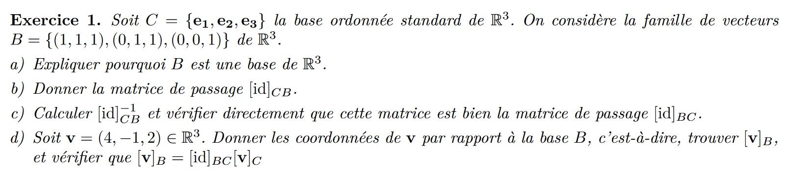
a) les vecteurs de B sont linéairement indépendant entre eux et leurs nombre = la dimmension de R^3
b) 
$$[id]_{CB}\begin{pmatrix}
1 & 0 & 0 \\
1 & 1 & 0 \\
1 & 1 & 1 \\
\end{pmatrix}$$ 
c)
$$\begin{pmatrix}
1 & 0 & 0 & 1 & 0 & 0\\
1 & 1 & 0 & 0 & 1 & 0\\
1 & 1 & 1 & 0 & 0 & 1\\
\end{pmatrix}$$ 
$$\begin{pmatrix}
1 & 0 & 0 & 1 & 0 & 0\\
0 & 1 & 0 & -1 & 1 & 0\\
0 & 1 & 1 & -1 & 0 & 1\\
\end{pmatrix}$$ 
$$\begin{pmatrix}
1 & 0 & 0 & 1 & 0 & 0\\
0 & 1 & 0 & -1 & 1 & 0\\
0 & 0 & 1 & 0 & -1 & 1\\
\end{pmatrix}$$ 
$$[id]_{BC}\begin{pmatrix}
1 & 0 & 0 \\
-1 & 1 & 0 \\
0 & -1 & 1 \\
\end{pmatrix}$$ 
$$[id]_{CB}*[id]_{BC}\begin{pmatrix}
1 & 0 & 0 \\
1 & 1 & 0 \\
1 & 1 & 1 \\
\end{pmatrix}\begin{pmatrix}
1 & 0 & 0 \\
-1 & 1 & 0 \\
0 & -1 & 1 \\
\end{pmatrix}=\begin{pmatrix}
1 & 0 & 0 \\
0 & 1 & 0 \\
0 & 0 & 1 \\
\end{pmatrix}=[id] $$ 
d)
$$[id]_{CB}*v_C=\begin{pmatrix}
1 & 0 & 0 \\
-1 & 1 & 0 \\
0 & -1 & 1 \\
\end{pmatrix}\begin{pmatrix}
4 \\
-1\\
2 \\
\end{pmatrix}=\begin{pmatrix}
4 \\
-5\\
3 \\
\end{pmatrix}=v_C$$
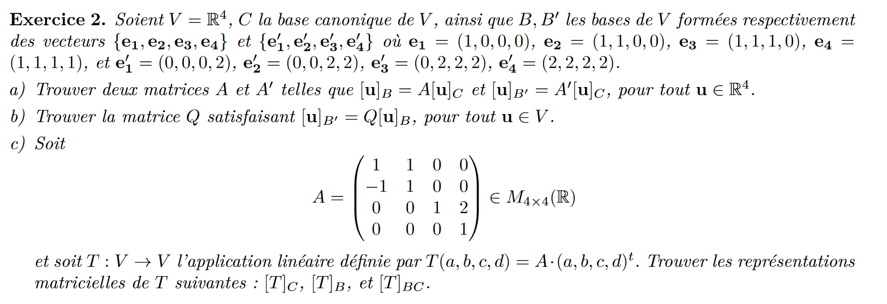

$$A^{-1}=\begin{pmatrix}
1 & 1 & 1 & 1 \\
0 & 1 & 1 & 1 \\
0 & 0 & 1 & 1 \\
0 & 0 & 0 & 1 \\
\end{pmatrix}$$
$$\begin{pmatrix}
1 & 0 & 0 & 0 & 1 & -1 & 0 & 0\\
0 & 1 & 0 & 0 & 0 & 1 & -1 & 0\\
0 & 0 & 1 & 0 & 0 & 0 & 1 & -1\\
0 & 0 & 0 & 1 & 0 & 0 & 0 & 1 \\
\end{pmatrix}$$
$$A=\begin{pmatrix}
1 & -1 & 0 & 0 \\
0 & 1 & -1 & 0 \\
0 & 0 & 1 & -1 \\
0 & 0 & 0 & 1 \\
\end{pmatrix}$$

$$B^{-1}=\begin{pmatrix}
0 & 0 & 0 & 2 \\
0 & 0 & 2 & 2 \\
0 & 2 & 2 & 2 \\
2 & 2 & 2 & 2 \\
\end{pmatrix}$$
$$\begin{pmatrix}
1 & 0 & 0 & 0 & 0 & 0 & -0.5 & 0.5 \\
0 & 1 & 0 & 0 & 0 & -0.5 & 0.5 & 0 \\
0 & 0 & 1 & 0 & -0.5 & 0.5 & 0 & 0 \\
0 & 0 & 0 & 1 & 0.5 & 0 & 0 & 0 \\
\end{pmatrix}$$
$$B=\begin{pmatrix}
0 & 0 & -0.5 & 0.5 \\
0 & -0.5 & 0.5 & 0 \\
-0.5 & 0.5 & 0 & 0 \\
0.5 & 0 & 0 & 0  \\
\end{pmatrix}$$

$$Q=\begin{pmatrix}
0 & 0 & -2 & 0 \\
0 & -2 & 0 & 0 \\
-2 & 0 & 0 & 0 \\
2 & 2 & 2 & 2 \\
\end{pmatrix}$$

$$T_C=\begin{pmatrix}
1 & 1 & 0 & 0 \\
-1& 1 & 0 & 0 \\
0 & 0 & 1 & 2 \\
0 & 0 & 0 & 1 \\
\end{pmatrix}$$

$$T_B=AT_CA^{-1}=\begin{pmatrix}
1 & -1 & 0 & 0 \\
0 & 1 & -1 & 0 \\
0 & 0 & 1 & -1 \\
0 & 0 & 0 & 1 \\
\end{pmatrix}\begin{pmatrix}
1 & 1 & 0 & 0 \\
-1& 1 & 0 & 0 \\
0 & 0 & 1 & 2 \\
0 & 0 & 0 & 1 \\
\end{pmatrix}\begin{pmatrix}
1 & 1 & 1 & 1 \\
0 & 1 & 1 & 1 \\
0 & 0 & 1 & 1 \\
0 & 0 & 0 & 1 \\
\end{pmatrix}=\begin{pmatrix}
1 & -1 & 0 & 0 \\
0 & 1 & -1 & 0 \\
0 & 0 & 1 & -1 \\
0 & 0 & 0 & 1 \\
\end{pmatrix}\begin{pmatrix}
1 & -1 & 0 & 0 \\
2 & 0 & 0 & 0 \\
2 & 0 & 1 & 0 \\
2 & 0 & 3 & 1 \\
\end{pmatrix}=\begin{pmatrix}
-1 & 0 & 0 & 2 \\
-1 & 0 & 0 & 0 \\
0 & -1 & -2 & 3 \\
0 & 0 & -1 & 1 \\
\end{pmatrix}$$
$$T_B=\begin{pmatrix}
-1 & 0 & 0 & 2 \\
-1 & 0 & 0 & 0 \\
0 & -1 & -2 & 3 \\
0 & 0 & -1 & 1 \\
\end{pmatrix}$$

$$T_{BC}=AT_C=\begin{pmatrix}
1 & -1 & 0 & 0 \\
0 & 1 & -1 & 0 \\
0 & 0 & 1 & -1 \\
0 & 0 & 0 & 1 \\
\end{pmatrix}\begin{pmatrix}
1 & 1 & 0 & 0 \\
-1& 1 & 0 & 0 \\
0 & 0 & 1 & 2 \\
0 & 0 & 0 & 1 \\
\end{pmatrix}=\begin{pmatrix}
2 & -1 & 0 & 0 \\
0 & 1 & 0 & 0 \\
0 & -1 & 1 & 0 \\
0 & -2 & 1 & 1 \\
\end{pmatrix}$$

$$T_{BC}=\begin{pmatrix}
2 & -1 & 0 & 0 \\
0 & 1 & 0 & 0 \\
0 & -1 & 1 & 0 \\
0 & -2 & 1 & 1 \\
\end{pmatrix}$$
SI erreur ici prendre temps pour comprendre matrice de passage
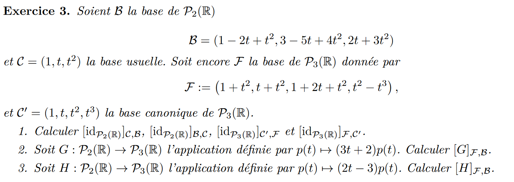
$$[id]_{CB}\begin{pmatrix}
1 & 3 & 0 \\
-2 & -5 & 2 \\
1 & 4 & 3 \\
\end{pmatrix}$$

$$[id]_{BC}\begin{pmatrix}
1 & 3 & 0 & 1 & 0 & 0 \\
-2 & -5 & 2 & 0 & 1 & 0 \\
1 & 4 & 3 & 0 & 0 & 1\\
\end{pmatrix}$$
$$[id]_{BC}\begin{pmatrix}
1 & 3 & 0 & 1 & 0 & 0 \\
0 & 1 & 2 & 2 & 1 & 0 \\
0 & 0 & 1 & -3 & -1 & 1\\
\end{pmatrix}$$

$$[id]_{BC}\begin{pmatrix}
 -23 & -9 & 6 \\
 8 & 3 & -2 \\
 -3 & -1 & 1\\
\end{pmatrix}$$

$$[id]_{C'F}\begin{pmatrix}
1 & 0 & 1 & 0 \\
0 & 1 & 2 & 0 \\
1 & 1 & 1 & 1 \\
0 & 0 & 0 & -1 \\
\end{pmatrix}$$

$$[id]_{FC'}\begin{pmatrix}
1 & 0 & 1 & 0 & 1 & 0 & 0 & 0 \\
0 & 1 & 2 & 0 & 0 & 1 & 0 & 0 \\
1 & 1 & 1 & 1 & 0 & 0 & 1 & 0 \\
0 & 0 & 0 & -1& 0 & 0 & 0 & 1 \\
\end{pmatrix}$$

$$[id]_{FC'}\begin{pmatrix}
0.5 & -0.5 & 0.5 & 0.5 \\
-1 & 0 & 1 & 1 \\
 0.5 & 0.5 & -0.5 & -0.5 \\
& 0 & 0 & 0 & -1 \\
\end{pmatrix}$$

$$G_c=\begin{pmatrix}
2 & 0 & 0  \\
3 & 2 & 0  \\
0 & 3 & 2  \\
0 & 0 & 3  \\
\end{pmatrix}$$
$$G_FB=[id]_{FC'}G_c'c[id]_{CB}$$
$$G_FB=\begin{pmatrix}
0.5 & -0.5 & 0.5 & 0.5 \\
-1 & 0 & 1 & 1 \\
 0.5 & 0.5 & -0.5 & -0.5 \\
& 0 & 0 & 0 & -1 \\
\end{pmatrix}\begin{pmatrix}
2 & 0 & 0  \\
3 & 2 & 0  \\
0 & 3 & 2  \\
0 & 0 & 3  \\
\end{pmatrix}\begin{pmatrix}
1 & 3 & 0 \\
-2 & -5 & 2 \\
1 & 4 & 3 \\
\end{pmatrix}$$

$$G_{FB}=\begin{pmatrix}
0.5 & -0.5 & 0.5 & 0.5 \\
-1 & 0 & 1 & 1 \\
 0.5 & 0.5 & -0.5 & -0.5 \\
0 & 0 & 0 & -1 \\
\end{pmatrix}\begin{pmatrix}
2 & 6 & 0  \\
-1 & -1 & 4  \\
-4 & -7 & 12  \\
3 & 12 & 9  \\
\end{pmatrix}$$

$$G_{FB}=\begin{pmatrix}
0 & 6 & 6.5\\
-3 & -1 & 21\\
1 & 0 & -8.5\\
-3 & 12 & -9  \\
\end{pmatrix}$$

$$H_c=\begin{pmatrix}
-3 & 0 & 0  \\
2 & -3 & 0  \\
0 & 2 & -3  \\
0 & 0 & 2  \\
\end{pmatrix}$$
$$H_FB=[id]_{FC'}H_c'c[id]_{CB}$$
$$H_FB=\begin{pmatrix}
0.5 & -0.5 & 0.5 & 0.5 \\
-1 & 0 & 1 & 1 \\
 0.5 & 0.5 & -0.5 & -0.5 \\
& 0 & 0 & 0 & -1 \\
\end{pmatrix}\begin{pmatrix}
-3 & 0 & 0  \\
2 & -3 & 0  \\
0 & 2 & -3  \\
0 & 0 & 2  \\
\end{pmatrix}\begin{pmatrix}
1 & 3 & 0 \\
-2 & -5 & 2 \\
1 & 4 & 3 \\
\end{pmatrix}$$

$$H_{FB}=\begin{pmatrix}
0.5 & -0.5 & 0.5 & 0.5 \\
-1 & 0 & 1 & 1 \\
 0.5 & 0.5 & -0.5 & -0.5 \\
0 & 0 & 0 & -1 \\
\end{pmatrix}\begin{pmatrix}
-3 & 9 & 0  \\
8 & 21 & -6  \\
-7 & -22 & -5  \\
2 & 8 & 6  \\
\end{pmatrix}$$

$$H_{FB}=\begin{pmatrix}
-8 & -13 & 3.5  \\
-2 & -23 & 1  \\
5 & 22 & -3.5  \\
-2 & -8 & -6  \\
\end{pmatrix}$$

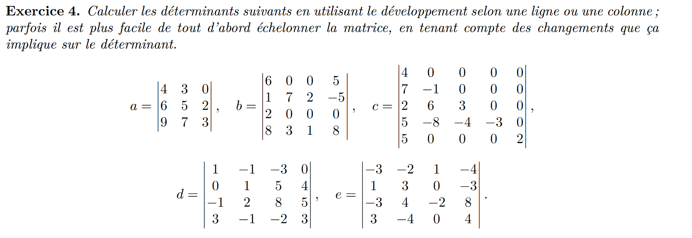
$$det(a)=\begin{pmatrix}
4 & 3 & 0 \\
0 & 5 & 2 \\
0 & 7 & 3 \\
\end{pmatrix}=4*(15-14)=4$$
$$det(b)=2*5*(7-6)=10$$
$$det(c)=2*(-3)*(3)*(-1)*(4)=4*18=72$$
$$det(d)=\begin{pmatrix}
1 & -1 & -3 & 0 \\
0 & 1 & 5 & 4 \\
-1 & 2 & 8 & 5 \\
3 & -1 & -2 & 3 \\
\end{pmatrix}=\begin{pmatrix}
1 & -1 & -3 & 0 \\
0 & 1 & 5 & 4 \\
0 & 0 & 0 & 1 \\
0 & 0 & -3 & 0 \\
\end{pmatrix}=\begin{pmatrix}
1 & -1 & -3 & 0 \\
0 & 1 & 5 & 4 \\
0 & 0 & -3 & 0 \\
0 & 0 & 0 & 1 \\
\end{pmatrix}$$
$$det(d)=(-1)(-3)=3$$
$$det(e)=\begin{pmatrix}
-3 & -2 & 1 & -4 \\
1 & 3 & 0 & -3 \\
-3 & 4 & -2 & 8 \\
3 & -4 & 0 & 4 \\
\end{pmatrix}=\begin{pmatrix}
-3 & -2 & 1 & 0 \\
1 & 3 & 0 & 0 \\
0 & 0 & -2 & 0 \\
3 & -4 & 0 & 0 \\
\end{pmatrix}$$
$$det(e)=0$$
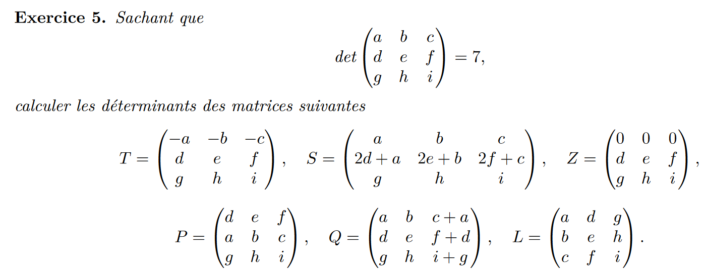
det(T)=-7
det(S)=14
det(Z)=0
det(P)=-7
det(Q)=7
det(L)=7
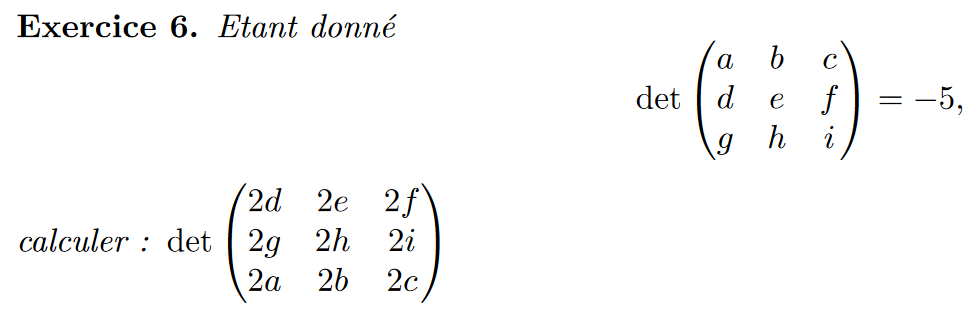
det = -5 * 2 * 2 * 2 * (-1)*(-1)=-40
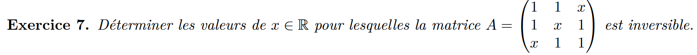
$$\begin{pmatrix}
1 & 1 & x \\
1 & x & 1 \\
x & 1 & 1 \\
\end{pmatrix}$$

$$\begin{pmatrix}
0 & 1-x & x-1 \\
1 & x & 1 \\
0 & 1-x² & 1-x \\
\end{pmatrix}$$
det(A)=-1*((1-x)(1-x)-(x-1)(1-x²))=0
det(A)=(x²-2x+1+x³+1-x²-x)=0
det(A)=(x³-3x+2)=0
la matrice est inversible si : 

$$x \in \R -\{1,-2\}$$

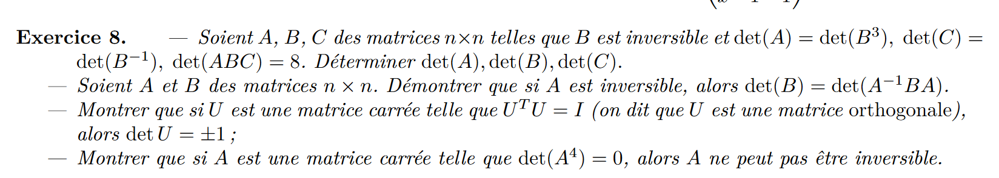
1)
$$det(ABC)=det(A)=det(BBB)=8$$
$$det(A)=8$$
$$det(B)=2$$
$$det(C)=0.5$$

2)
on sait que det(AB)=det(A)*det(B)
on sait que det(A)*det(A{⁻1})=1
on sait que la multiplication est commutative 
donc le determinant de B = au det(ABA^{-1})
3)
on sait que det(U^T)=det(U) et que 1=1*1 ou 1=(-1)(-1)
4)
le seul nombre qui fois lkui meme donne zero est zero donc le determiant de A = 0 odnc pas inverseible
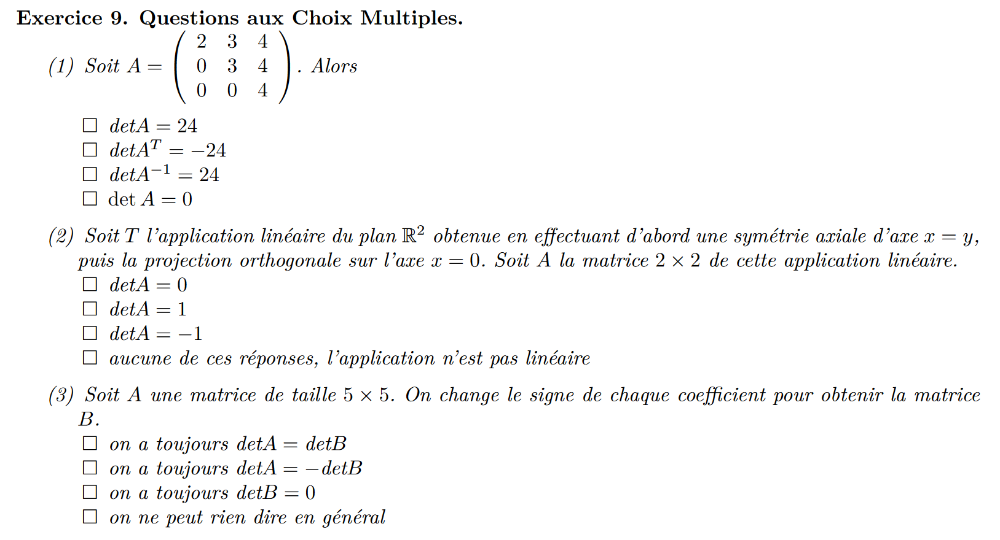
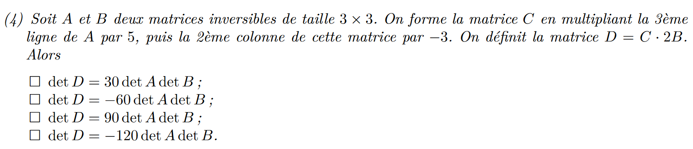
1)
$$detA=24$$
2)
$$detA=0$$
3)
$$detA=detB$$
4)
$$DetD=-120detAdetB$$
$$attention *2 \text{ une matrice n x n}= DetMat*2^n$$
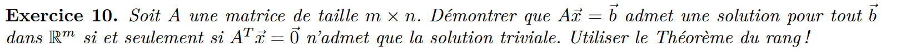
A est map un espace vers un autre.
b doit etre dans l'image de A,
si la transposé * x =0 alors A est carré
si A est carré et que sont rang = n et m
alors le noyau est nul
donc seul 0 vas vers 0
donc la solution est unique
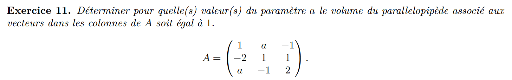
$$\begin{pmatrix}
1 & a & -1 \\
-2 & 1 & 1 \\
a & -1 & 2 \\
\end{pmatrix}$$
SARUS
$$detA =(2+a²-2)+4a+1+a$$
$$detA =a²+5a+1$$
$$detA =1=a²+5a+1$$
$$0=a²+5a+0$$
$$\frac{-5 \pm \sqrt{25}}{2}=a={}$$
$$\frac{-5 \pm 5}{2}=a\in\{0;-5\}$$

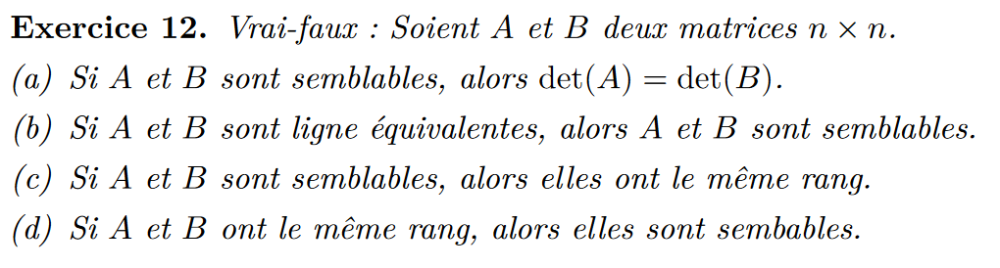
a) Vrai
b) Faux
c) Vrai
d) Faux