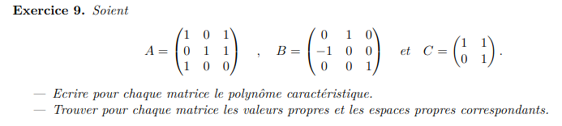

$$\begin{pmatrix}
4 & 0 & 2 & 0 & 1\\
0 & 4 & 0 & 2 & 1\\
1 & 0 & 5 & 0 & 1\\
0 & 1 & 0 & 5 & 1\\
1 & 0 & 2 & 0 & 4\\
\end{pmatrix}$$ 

$$\begin{pmatrix}
4-3 & 0 & 2 & 0 & 1\\
0 & 4-3 & 0 & 2 & 1\\
1 & 0 & 5-3 & 0 & 1\\
0 & 1 & 0 & 5-3 & 1\\
1 & 0 & 2 & 0 & 4-3\\
\end{pmatrix}$$ 

$$\begin{pmatrix}
1 & 0 & 2 & 0 & 1\\
0 & 1 & 0 & 2 & 1\\
1 & 0 & 2 & 0 & 1\\
0 & 1 & 0 & 2 & 1\\
1 & 0 & 2 & 0 & 1\\
\end{pmatrix}$$ 

$$\begin{pmatrix}
1 & 0 & 2 & 0 & 1\\
0 & 1 & 0 & 2 & 1\\
0 & 0 & 0 & 0 & 0\\
0 & 0 & 0 & 0 & 0\\
0 & 0 & 0 & 0 & 0\\
\end{pmatrix}$$

$$\begin{pmatrix}
4 & 0 & 2 & 0 & 1\\
0 & 4 & 0 & 2 & 1\\
1 & 0 & 5 & 0 & 1\\
0 & 1 & 0 & 5 & 1\\
1 & 0 & 2 & 0 & 4\\
\end{pmatrix} \times \begin{pmatrix}
a\\ b\\ c\\ d\\ e\\
\end{pmatrix}=\begin{pmatrix}
3a\\ 3b\\ 3c\\ 3d\\ 3e\\
\end{pmatrix}$$

La base de l'espace propre :
$$B_3=\{\begin{pmatrix}
0\\ 1\\ 0\\ -1\\ 1\\
\end{pmatrix}, \begin{pmatrix}
1\\ 0\\ -1\\ 0\\ 1\\
\end{pmatrix}\} $$

$$\begin{pmatrix}
-2 & 6/5 & 2\\
0 & -1 & 1\\
-5 & 5 & 3\\
\end{pmatrix}$$ 

$$\begin{pmatrix}
-2-t & 6/5 & 2\\
0 & -1-t & 1\\
-5 & 5 & 3-t\\
\end{pmatrix}$$ 

$$\begin{pmatrix}
-2-t & 6/5+t & 0\\
0 & -1-t & 1\\
-5 & 0 & 3-t\\
\end{pmatrix}$$ 
(-2-t)(-1-t)(3-t)-6-5t
(2+t)(1+t)(3-t)-6-5t
-t^3-3t^2-2t+3t^2+4t
-t^3+2t
t(2-t^2)
a)
$$ t(\sqrt(2)-t)(\sqrt(2)+t)$$
$$\{0;\sqrt2 ;-\sqrt2 \}$$
b)
0:
$$\begin{pmatrix}
8/5\\
1 \\
1 \\
\end{pmatrix}$$ 
-sqrt(2):
$$\begin{pmatrix}
-2-\sqrt2 & 6/5 & 2\\
0 & -1-\sqrt2 & 1\\
-5 & 5 & 3-\sqrt2\\
\end{pmatrix}$$ 
$$\begin{pmatrix}
\frac{-4\sqrt(2)-2}{5}\\
-\sqrt(2)-1\\
1\\
\end{pmatrix}$$ 
sqrt(2):
$$\begin{pmatrix}
-2+\sqrt2 & 6/5 & 2\\
0 & -1+\sqrt2 & 1\\
-5 & 5 & 3+\sqrt2\\
\end{pmatrix}$$ 
$$\begin{pmatrix}
\frac{4\sqrt(2)-2}{5}\\
\sqrt(2)-1\\
1\\
\end{pmatrix}$$
C)
A n'est pas inversible
d)
{0;2;2}
e)

$$2: $$ 
$$\{\begin{pmatrix}
\frac{4\sqrt(2)-2}{5}\\
\sqrt(2)-1\\
1\\
\end{pmatrix},\begin{pmatrix}
\frac{-4\sqrt(2)-2}{5}\\
-\sqrt(2)-1\\
1\\
\end{pmatrix} \}$$
$$0 : $$
$$\begin{pmatrix}
8/5\\
1 \\
1 \\
\end{pmatrix}$$ 

$$A=\begin{pmatrix}
5-t & 3\\
-1 & 1-t\\
\end{pmatrix}$$
$$DetA=(5-t)(1-t)+3=t^2-6t+8=(t-2)(t-4)$$
Valeurs propre de A : {4; 2}
Espace propre de A :
$$A=\begin{pmatrix}
5-4 & 3\\
-1 & 1-4\\
\end{pmatrix}$$

$$A=\begin{pmatrix}
1 & 3\\
-1 & -3\\
\end{pmatrix}$$

$$A=\begin{pmatrix}
1 & 3\\
0 & 0\\
\end{pmatrix}$$
$$B_2\{\begin{pmatrix}
3\\
-1\\
\end{pmatrix}\}$$
----
$$A=\begin{pmatrix}
5-2 & 3\\
-1 & 1-2\\
\end{pmatrix}$$

$$A=\begin{pmatrix}
1 & 1\\
0 & 0 \\
\end{pmatrix}$$

$$B_2\{\begin{pmatrix}
1\\
-1\\
\end{pmatrix}\}$$

----
valeur propre B :
$$(t+1)(t-4)(t-2)$$

$$B=\begin{pmatrix}
-1 & 0 & 1\\
-3 & 4 & 0 \\
0 & 0 & 2 \\
\end{pmatrix}$$
----
-1 : 
$$B=\begin{pmatrix}
0 & 0 & 1\\
-3 & 5 & 0 \\
0 & 0 & 3 \\
\end{pmatrix}$$

$$B=\begin{pmatrix}
-3 & 5 & 0 \\
0 & 0 & 1 \\
0 & 0 & 0 \\
\end{pmatrix}$$

$$B_{-1}=\begin{pmatrix}
5 \\
3\\
0\\
\end{pmatrix}$$
----
4:
$$B=\begin{pmatrix}
-5 & 0 & 1\\
-3 & 0 & 0 \\
0 & 0 & -2 \\
\end{pmatrix}$$

$$B=\begin{pmatrix}
-3 & 0 & 0 \\
0 & 0 & 1\\
0 & 0 & 0 \\
\end{pmatrix}$$

$$B_{4}=\begin{pmatrix}
0 \\
0 \\
0 \\
\end{pmatrix}$$
----
2:
$$B=\begin{pmatrix}
-3 & 0 & 1\\
-3 & 2 & 0 \\
0 & 0 & 0 \\
\end{pmatrix}$$

$$B=\begin{pmatrix}
-3 & 2 & 0 \\
0 & -2 & 1\\
0 & 0 & 0 \\
\end{pmatrix}$$

$$B_{2}=\begin{pmatrix}
2\\ -3\\ 0\\
\end{pmatrix},\begin{pmatrix}
0\\ 1\\ 2\\
\end{pmatrix}$$

a)
$$B'=\{p_0, p_2, p_3\}$$
$$B=\{q_1, q_2, q_3\}$$
$$W \text{ est engendré par les vecteur de } B ou B'$$
$$q_1=t^2+2$$
$$q_2=t^2-2$$
$$q_3=t^3+3$$

$$[Id]_{B'B}=\begin{pmatrix}
2 & -2 & 3\\
1 & 1 & 0\\
0 & 0 & 1\\
\end{pmatrix}$$

$$[Id]_{B'B'}=\begin{pmatrix}
1 & 0 & 0\\
0 & 1 & 0\\
0 & 0 & 1\\
\end{pmatrix}$$

$$[Id]_{BB} \text{ équivalente à } [Id]_{BB'} $$
donc les base sont égal

b)
$$[Id]_{B'B}=\begin{pmatrix}
2 & -2 & 3\\
1 & 1 & 0\\
0 & 0 & 1\\
\end{pmatrix}$$

$$[Id]_{BB'}=\begin{pmatrix}
2 & -2 & 3 & 1 & 0 & 0\\
1 & 1 & 0 & 0 & 1 & 0\\
0 & 0 & 1 & 0 & 0 & 1\\
\end{pmatrix}$$

$$[Id]_{BB'}=\begin{pmatrix}
1 & 0 & 0     & 0.25 & 0.5 & -0.75\\
0 & 1 & 0      & -0.25 & 0.5 & 0.75\\
0 & 0 & 1      & 0 & 0 & 1\\
\end{pmatrix}$$

$$[Id]_{BB'}=\begin{pmatrix}
0.25 & 0.5 & -0.75\\
-0.25 & 0.5 & 0.75\\
0 & 0 & 1\\
\end{pmatrix}$$
c)
$$p_B=\begin{pmatrix}
-1\\ 1\\ -2\\
\end{pmatrix}$$

$$q=(t+a)(t+b)(t+c)=(t+a)(t^2+(b+c)t+bc)=t^3+(a+b+c)t^2+(ab+ac+bc)t+abc$$
avec ab+ac+bc = 0
$$q_{B'}=\begin{pmatrix}
abc\\ (a+b+c)\\ 1\\
\end{pmatrix}$$
$$q_{B}=[Id]_{BB'}q_{B'}=\begin{pmatrix}
0.25 & 0.5 & -0.75\\
-0.25 & 0.5 & 0.75\\
0 & 0 & 1\\
\end{pmatrix}\begin{pmatrix}
-1\\ 1\\ -2\\
\end{pmatrix}=\begin{pmatrix}
1.75\\ -0.75\\ -2\\
\end{pmatrix}$$

$$\begin{pmatrix}
3a\\ 3a\\ 3a\\
\end{pmatrix}$$

1)
$$A-4I=\begin{pmatrix}
-1 & 0 & -1\\
2 & -1 & 1\\
-3 & 4 & 1\\
\end{pmatrix}$$
$$\begin{pmatrix}
-1 & 0 & -1\\
0 & -1 & -1\\
0 & 4 & 4\\
\end{pmatrix}$$
$$\begin{pmatrix}
1 & 0 &1\\
0 & 1 & 1\\
0 & 0 & 0\\
\end{pmatrix}$$
$$B_4=\{\begin{pmatrix}
1\\ 0\\ -1\\
\end{pmatrix},\begin{pmatrix}
0\\ 1\\ -1\\
\end{pmatrix}\}$$
2)

$$B=\begin{pmatrix}
3 & 7 & 9 \\
-4 & -5 & 1\\
2 & 4 & 4\\
\end{pmatrix}*
\begin{pmatrix}
4\\ -3\\ 1\\
\end{pmatrix}=\begin{pmatrix}
0\\ 0\\ 0\\
\end{pmatrix}$$
oui et la valeurs propre est 0
3)
$$C=\begin{pmatrix}
4-3 & 2 & 3\\
-1 & 1-3 & -3\\
2 & 4 & 9-3\\
\end{pmatrix}$$

$$C=\begin{pmatrix}
1 & 2 & 3\\
0 & 0 & 0\\
0 & 0 & 0\\
\end{pmatrix}$$
$$B_3=\{\begin{pmatrix}
3\\ 0\\ -1\\
\end{pmatrix},\begin{pmatrix}
0\\ 3\\ -2\\
\end{pmatrix}\}$$
la dimmension est 2 
la multiplicité géométrique est 2
4)
$$C=\begin{pmatrix}
1 & 2 & 3\\
1 & 2 & 3\\
1 & 2 & 3\\
\end{pmatrix}$$

$$C=\begin{pmatrix}
1-t & 2   & 3\\
1   & 2-t & 3\\
1   & 2   & 3-t\\
\end{pmatrix}$$

$$C=\begin{pmatrix}
-t & 6   & 0\\
t   & -t & 0\\
0   & t   & -t\\
\end{pmatrix}$$
-t(t^2-6t)
-t^2(t-6)
0,0 et 6
espace propre
multiplicité algébrique
multiplicité géométriuqe

0:
$$C=\begin{pmatrix}
1 & 2 & 3\\
0 & 0 & 0\\
0 & 0 & 0\\
\end{pmatrix}$$
$$B_3=\{\begin{pmatrix}
3\\ 0\\ -1\\
\end{pmatrix},\begin{pmatrix}
0\\ 3\\ -2\\
\end{pmatrix}\}$$
la multiplicité algébrique est 2
la multiplicité géométrique est 2
6:
$$C=\begin{pmatrix}
-5 & 2 & 3\\
1 & -4 & 3\\
1 & 2 & -3\\
\end{pmatrix}$$
$$C=\begin{pmatrix}
1 & -4 & 3\\
0 & 6 & -6\\
0 & -18 & 18\\
\end{pmatrix}$$
$$C=\begin{pmatrix}
1 & -4 & 3\\
0 & 6 & -6\\
0 & 0 & 0\\
\end{pmatrix}$$
$$C=\begin{pmatrix}
1 & -4 & 3\\
0 & 1 & -1\\
0 & 0 & 0\\
\end{pmatrix}$$
$$C=\begin{pmatrix}
1 & 0 & -1\\
0 & 1 & -1\\
0 & 0 & 0\\
\end{pmatrix}$$
$$B_3=\{\begin{pmatrix}
1\\ 1\\ -1\\
\end{pmatrix}$$
TOUJOURS POSER 3 paremetre
la multiplicité algébrique est 1
la multiplicité géométrique est 1

1)
Vrai
soit : 
$$\gamma, \lambda, \beta \text{ 3 valeurs propre de A}$$
$$det(I)=1 \to 1, 1, 1$$
$$det(-I)=-1  \to -1, -1, -1$$
$$det(-I*A)=-\gamma, -\lambda, -\beta$$
2)
faux
soit : 
$$\gamma, \lambda, \beta \text{ 3 valeurs propre de A}$$
$$det(I)=1 \to 1, 1, 1$$
$$det(-I)=-1  \to -1, -1, -1$$
$$det(-I*A)=-\gamma, -\lambda, -\beta$$
3)
Vrai
soit : 
$$A=\begin{pmatrix}
a & b & c \\
d & e & f \\
g & h & i \\
\end{pmatrix}$$

$$A^{-1}=\begin{pmatrix}
la forme inverse
\end{pmatrix}$$
$$\gamma=, \lambda=, \beta= \text{ 3 valeurs propre de A}$$
a partir de a b c d e f g h
alors
$$1/\gamma= ...$$
4)
faux,
$$A=\begin{pmatrix}
\gamma & 0 & 0 \\
0 & \lambda & 0\\
0 & 0 & \beta \\
\end{pmatrix}$$

$$A^{-1}=\begin{pmatrix}
1/\gamma & 0 & 0 \\
0 &1/ \lambda & 0\\
0 & 0 & 1/\beta \\
\end{pmatrix}$$
$$ 1/\gamma \not= \gamma$$
5)
Vrai sinon par inversible

1)
une valeur propre est 1
l'espace engenredé par 1 est la droite x = y =z
(invariant)

2)
1 est une valeur propre
l'espace de 1 est un plan guidé par les vecteur (2,1) et le vecteur (-1,2)
(parraléllèl et perpendiculaire a la transformation)

3)
1 est une valeur propre, son espace propre est le plan de projection
0 est une valeur propre, son espace propre est la droite perpendiculaire a l'axe de projection

$$A=\begin{pmatrix}
1-t & 0 & 1 \\
0 & 1-t & 1\\
1 & 0 & -t \\
\end{pmatrix}$$

$$A=\begin{pmatrix}
1-t+1/t & 0 & 0 \\
1/t & 1-t & 0\\
1 & 0 & -t \\
\end{pmatrix}$$

$$A=\begin{pmatrix}
1-t+1/t & 0 & 0 \\
1/t & 1-t & 0\\
1 & 0 & -t \\
\end{pmatrix}$$
$$-(t-t^2+1)(1-t)$$
$$(t^2-t-1)(1-t)$$
$$\frac{1\pm \sqrt{5}}{2};1$$

1:
$$A=\begin{pmatrix}
1 & 0 & 0 \\
0 & 0 & 1\\
0 & 0 & 0 \\
\end{pmatrix}$$
$$B_1=\{\begin{pmatrix}
0\\ 1\\ 0\\
\end{pmatrix}$$

\frac{1+ \sqrt{5}}{2}:
$$A=\begin{pmatrix}
\frac{1-\sqrt{5}}{2} & 0 & 1 \\
0 & \frac{1-\sqrt{5}}{2} & 1\\
0 & 0 & 0\\
\end{pmatrix}$$
$$B_1=\{\begin{pmatrix}
\frac{1+\sqrt{5}}{2}\\ \frac{1+\sqrt{5}}{2}\\ 1\\
\end{pmatrix}$$

\frac{1- \sqrt{5}}{2}:
$$A=\begin{pmatrix}
1-\frac{1- \sqrt{5}}{2} & 0 & 1 \\
0 & 1-\frac{1- \sqrt{5}}{2} & 1\\
1 & 0 & -\frac{1- \sqrt{5}}{2} \\
\end{pmatrix}$$
$$A=\begin{pmatrix}
1-\frac{1- \sqrt{5}}{2} & 0 & 1 \\
0 & 1-\frac{1- \sqrt{5}}{2} & 1\\
0 & 0 & -\frac{1- \sqrt{5}}{2}*1/(\frac{1+ \sqrt{5}}{2})\\
\end{pmatrix}$$
$$A=\begin{pmatrix}
1-\frac{1- \sqrt{5}}{2} & 0 & 1 \\
0 & 1-\frac{1- \sqrt{5}}{2} & 1\\
0 & 0 & \frac{(3-\sqrt{5})}{2}\\
\end{pmatrix}$$
$$B_1=\{\begin{pmatrix}
\frac{1+\sqrt{5}}{2}\\ \frac{1+\sqrt{5}}{2}\\ 1\\
\end{pmatrix}$$

(1-t)(1-t)-25=t²-2t-24=(-6+t)(4+t)
-4 et 6 sont des valeurs propres de A

B et C sont des basesde P2

$$[Id]_{CB}=\begin{pmatrix}
0.5 & 0 & 3/2 \\
-1 & 0 & 1.5 \\
0 & 0 & 1 \\
\end{pmatrix}$$

$$[Id]_{BC}=\begin{pmatrix}
0.5 & 0 & 3/2 \\
-1 & 0 & -9/8 \\
0 & 0 & 1 \\
\end{pmatrix}$$
3/2 et -9/8

0 est une valeurs propre de A

par réccurence
A²*A=A³
det(A²)*det(A)=det(A³)

A^{n-1}*A=A^{n}
det(A^{n-1})*det(A)=det(A^{n})